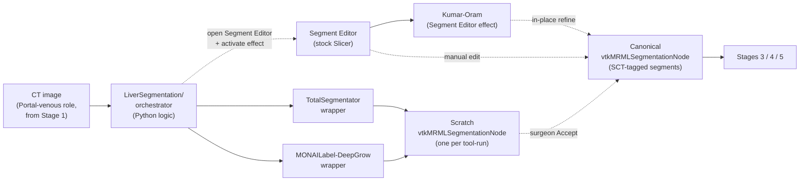

# 0024. Segmentation orchestration — Stage 2 per-structure micro-workflows

- **Status:** Proposed
- **Date:** 2026-05-21
- **Deciders:** R. Palomar
- **Diagrams:** inline below; see also [`Docs/architecture/gui-stage-flow.md`](https://github.com/ALive-research/Slicer-Liver/blob/preview/Docs/architecture/gui-stage-flow.md) for the cross-stage context.
- **PR:** <filled on merge>

## Context

Slicer-Liver v2.0.0's Stage 2 (Anatomy Definition) per
[ADR-0023](https://github.com/ALive-research/Slicer-Liver/blob/preview/Docs/adr/0023-unified-gui-stage-workflow.md)
covers the surgeon's workflow step upstream of resection planning:
segmenting the liver parenchyma, portal and hepatic veins, and any
tumors. The decision *what* — stitch existing tools (TotalSegmentator,
MONAILabel-DeepGrow, VMTK, Kumar-Oram-internal) rather than training
new models — was settled on 2026-05-14 in the segmentation-stitch
discussion. This ADR sharpens the contract: *which module hosts the
orchestration, which class calls each tool, where outputs land, how
SCT dispatch ties the stages together, and what the failure / refinement
loops look like*.

The constraints in play:

- Multiple per-structure workflows (Liver / Portal vein / Hepatic vein /
  Tumors), each with its own backend chain (TotalSegmentator alone for
  the liver parenchyma; TotalSegmentator + Kumar-Oram refinement for
  vessels; TotalSegmentator + MONAILabel-DeepGrow for tumors).
- Downstream stages (Stages 3, 4, 5) consume a *single canonical*
  `vtkMRMLSegmentationNode` with SCT-tagged segments, not a bag of
  per-target nodes.
- ADR-0011 names SCT triples as the canonical dispatch key, with
  per-tool `LabelToSCT.json` bridges already shipped under
  `Resources/Terminology/LabelToSCT/<Tool>.json` (the v2.0 path
  amended in PR #406's ADR-0011 §3 update).
- ADR-0012 explicitly defers the LayerDM display-node migration for
  segmentation outputs to v2.1; v2.0 uses stock Slicer Segmentation
  rendering.
- ADR-0013 reserves "Pipeline" for one Python class per display-node
  type. Segmentation orchestration is *not* a Pipeline in that sense.
- AI extensions (TotalSegmentator, MONAILabel) are heavy installs
  (multi-GB models, GPU recommended). Per ADR-0023 §"AI extension
  dependencies — lazy install", they are pip-installed on first use,
  not declared as `EXTENSION_DEPENDS`.
- Per ADR-0009's IEC 62366 relaxation, Slicer-Liver is research-tool-
  grade; surgeon clinical training is the validation surface, not
  automated gates.

The existing `LiverSegments/` module is *not* segmentation — it
computes Couinaud vascular territories from centerlines
(`vtkLiverSegmentsLogic::SegmentClassificationProcessing`). Per
ADR-0023, that module is renamed to `VascularTerritories/` (Stage 3),
freeing the conceptual space for a new module to host Stage 2.

## Decision

Slicer-Liver v2.0.0 ships a new scripted module **`LiverSegmentation/`**
(with the `Liver` prefix kept per maintainer preference, diverging
from the post-T2.7 prefix-drop convention applied to the Bezier-
surface class family in PRs #341/#345) that hosts a Python
**orchestrator** sequencing per-structure micro-workflows.

### Terminology (closed vocabulary)

| Term | Definition |
|------|------------|
| **tool** | External segmenter consumed via a Python wrapper (TotalSegmentator, MONAILabel-DeepGrow). |
| **effect** | Slicer Segment Editor effect (a `qSlicerSegmentEditorAbstractEffect` subclass) shipped by Slicer-Liver. v2.0 adds one: Kumar-Oram. See [ADR-0026](https://github.com/ALive-research/Slicer-Liver/blob/preview/Docs/adr/0026-segment-editor-effects.md) (forthcoming). |
| **stage** | Logical UX phase (Stage 2 = Anatomy Definition in [ADR-0023](https://github.com/ALive-research/Slicer-Liver/blob/preview/Docs/adr/0023-unified-gui-stage-workflow.md)). |
| **step** | A single tool invocation parameterised by SCT target + ROI. |
| **Pipeline** | Reserved for LayerDM display-side classes per [ADR-0013](https://github.com/ALive-research/Slicer-Liver/blob/preview/Docs/adr/0013-layerdm-pipeline-pattern.md). The orchestrator is **not** a Pipeline. |
| **orchestrator** | Python logic class that sequences steps, dispatches by SCT, owns transient state. |
| **scratch node** | Orchestrator-private `vtkMRMLSegmentationNode` holding a tool's pending output before surgeon Accept. |
| **canonical node** | The single `vtkMRMLSegmentationNode` Stage 2 publishes; downstream stages consume this. |
| **commit / Accept** | Surgeon-approved promotion: a scratch node's segments copy into the canonical node. |

### Architecture



Kumar-Oram is hosted as a Slicer Segment Editor *effect* rather than
an orchestrator-invoked Python wrapper. The orchestrator's vessel
card surfaces a "Refine in Segment Editor with Kumar-Oram" one-click
affordance that programmatically opens Segment Editor with the vessel
segment selected and the effect pre-activated (hybrid pattern per
[ADR-0026](https://github.com/ALive-research/Slicer-Liver/blob/preview/Docs/adr/0026-segment-editor-effects.md) — forthcoming). The effect remains accessible
standalone via Segment Editor's toolbar outside the orchestrated
flow — preserving the 2026-05-15 contingency-path commitment for
noisy-AI vessel cases.

### Per-structure micro-workflows

Stage 2's surgeon UI exposes four per-structure cards. Each card runs
its own micro-workflow:

| Structure | Tools (in order) | Notes |
|-----------|-----------------|-------|
| **Liver parenchyma** | TotalSegmentator → manual fixes (Segment Editor) → Accept | Single AI step; manual editing if AI mask is off. |
| **Portal vein** | TotalSegmentator (`liver_vessels`) → Accept → Kumar-Oram (Segment Editor effect) → manual fixes | Vessels uniquely benefit from Kumar-Oram's centerline-tracking refinement; the AI mask is the seed, not the answer. Kumar-Oram is a Slicer Segment Editor effect per [ADR-0026](https://github.com/ALive-research/Slicer-Liver/blob/preview/Docs/adr/0026-segment-editor-effects.md). The orchestrator's vessel card includes a "Refine with Kumar-Oram" button that opens Segment Editor with the segment selected + effect pre-activated. |
| **Hepatic vein** | TotalSegmentator (`liver_vessels`) → Accept → Kumar-Oram (Segment Editor effect) → manual fixes | Same chain as Portal vein, dispatched by SCT target. |
| **Tumors** | TotalSegmentator (tumor channel) → MONAILabel-DeepGrow refinement → manual fixes → Accept | Liver tumors are heterogeneous; DeepGrow's interactive point-click refinement earns its place. Multi-focal supported (N tumors per case). |

Invocation order across structures is **hinted, not enforced**.
TotalSegmentator-first is the default; surgeon may invoke Kumar-Oram
or DeepGrow standalone as a contingency (per the 2026-05-15 Kumar-Oram
decision: standalone is the noisy-AI fallback).

### Output contract

Stage 2 publishes **one canonical `vtkMRMLSegmentationNode`** per case,
with one segment per SCT-tagged structure (Liver 10200004; Portal vein
32764006; Hepatic vein 8993003; Mass 4147007). Per-tool intermediate
results live in scratch `vtkMRMLSegmentationNode`s under the
orchestrator's control; on surgeon Accept they merge into the canonical
node.

Downstream stages reference the canonical node via Slicer's standard
node-reference mechanism. No custom display node, no LayerDM Pipeline.
Stock `vtkMRMLSegmentationDisplayNode` handles rendering.

### Module layout

```
LiverSegmentation/
├── CMakeLists.txt
├── LiverSegmentation.py                  # Module + Widget + Logic (scripted module pattern)
├── ToolWrappers/
│   ├── TotalSegmentator.py
│   ├── MONAILabel.py
│   └── VMTK.py                           # used by Kumar-Oram effect for centerline extraction
├── Effects/
│   └── SegmentEditorKumarOramEffect.py   # qSlicerSegmentEditorAbstractEffect subclass; see ADR-0026
├── Resources/
│   └── UI/
│       └── LiverSegmentation.ui          # per-structure cards
└── Testing/
    └── Python/                            # invariant tests against v2.0 design (T5.4)
```

The per-tool wrappers each consume their respective
`LabelToSCT.json` bridge under `Resources/Terminology/LabelToSCT/`
(repo-root location, not `LiverSegmentation/Resources/`). Bridges
are extension-wide assets per ADR-0011 §3 (amended in PR #406).

### Lazy install for AI backends

Per [ADR-0023](https://github.com/ALive-research/Slicer-Liver/blob/preview/Docs/adr/0023-unified-gui-stage-workflow.md)
§"AI extension dependencies — lazy install":

- TotalSegmentator and MONAILabel are **not** declared as
  `EXTENSION_DEPENDS`. They install via `slicer.util.pip_install(...)`
  on first surgeon invocation of an AI feature.
- Each tool wrapper checks the import succeeds before use; on
  `ImportError`, prompts the surgeon with a confirmation dialog
  ("Install TotalSegmentator? ~XGB download + GPU recommended.").
- After successful install, the wrapper proceeds and remembers the
  install for the session.
- A settings panel under the Liver shell exposes pre-download and
  re-install affordances for surgeons going offline.
- `SlicerLayerDM` and `SlicerVMTK` remain hard `EXTENSION_DEPENDS`.

Slicer-Liver consumes the AI packages' Python APIs **directly** — it
does not require the upstream Slicer extensions for TotalSegmentator
or MONAILabel to be installed. Surgeon interacts via Slicer-Liver's
own UI, not via the upstream extensions' widgets.

### Failure paths

| Failure | Surgeon-facing handling |
|---------|------------------------|
| AI mask is visually wrong | Surgeon edits via Segment Editor (always one click away) or re-runs the tool with different parameters. |
| Kumar-Oram refinement diverges | Surgeon discards the scratch node (Reject); canonical state unchanged. |
| Tool produces a label outside the bridge file's coverage | Wrapper attaches `Unknown` to the orphan segment; UI surfaces a one-time mapping prompt rather than blocking. |
| AI install fails (network, disk, GPU absence) | Per-tool wrapper surfaces a clear error + the manual-edit path remains available. |

Scratch nodes from rejected runs are garbage-collected on module exit
or on Accept of a successor run for the same structure.

## Alternatives considered

### Alternative A — Orchestration as a LayerDM Pipeline

Treat the orchestrator as a `vtkMRMLLayerDMPipeline` subclass under
the LayerDM framework, mirroring the Stage 4 resection-surface
Pipeline pattern.

**Rejected because** [ADR-0013](https://github.com/ALive-research/Slicer-Liver/blob/preview/Docs/adr/0013-layerdm-pipeline-pattern.md)
reserves "Pipeline" for one Python class per display-node type, and
the orchestrator's output is a stock `vtkMRMLSegmentationNode` rendered
by the upstream `vtkMRMLSegmentationDisplayNode` — not a Slicer-Liver-
specific display surface. Forcing the Pipeline framing here violates
ADR-0013's coupling rule and would re-introduce the per-module-DM
anti-pattern that closed PR #366 (see memory
`feedback_layerdm_no_custom_dm.md`).

### Alternative B — Per-target Segmentation nodes (one per structure)

Stage 2 publishes four nodes: `vtkMRMLSegmentationNode` named "Liver",
"Portal vein", "Hepatic vein", "Tumors". Downstream stages reference
each individually.

**Rejected because** it forces downstream code to enumerate four refs
where one suffices; it complicates the scene's Subject Hierarchy under
ADR-0023's per-stage folder convention; and it diverges from Slicer's
established idiom (Segment Editor produces one Segmentation node
holding multiple segments). The scratch-and-Accept pattern preserves
the per-tool lifecycle the alternative wanted, while exposing a single
canonical node to downstream consumers.

### Alternative C — Hard `EXTENSION_DEPENDS` for TotalSegmentator + MONAILabel

Declare both AI extensions as required dependencies, matching the
SlicerLayerDM precedent in PR #368.

**Rejected because** the AI packages are multi-GB and assume GPU
availability. Forcing the install on every Slicer-Liver user
contradicts the v2.0.0 user-facing-leap framing: many surgeons and
researchers want the planning workflow without the AI overhead.
Lazy install preserves the AI capability for users who want it and a
lean install for users who do not.

### Alternative D — Auto-commit (no scratch + Accept)

Each AI tool's output writes directly into the canonical Segmentation
node, replacing the previous segment in-place.

**Rejected because** AI errors are common enough that a "did this
work?" review step is non-negotiable for clinical confidence — the
Accept step is the surgeon's audit gate. Auto-commit also leaves no
recovery path if a tool-run goes badly; with scratch nodes the
surgeon can reject and try alternatives without polluting the
canonical state.

### Alternative E — Enforced invocation order (TotalSegmentator before Kumar-Oram)

The orchestrator blocks Kumar-Oram if no TotalSegmentator output is
present; Kumar-Oram's UI is greyed until the prerequisite runs.

**Rejected because** the 2026-05-15 Kumar-Oram decision keeps
standalone Kumar-Oram available as the contingency for noisy AI.
Enforcement would close off that path. The UI surfaces the
recommended order via card layout (TotalSegmentator-first card on
top) without preventing alternative flows.

### Alternative F — `LiverSegments/` rename to host orchestration

Repurpose the existing `LiverSegments/` module for Stage 2 instead of
renaming it to `VascularTerritories/` (Stage 3) and creating a new
module.

**Rejected because** `LiverSegments/` carries existing Couinaud-
territory logic (`vtkLiverSegmentsLogic::SegmentClassificationProcessing`)
that is the substance of Stage 3, not Stage 2. Conflating the two
stages in one module name would confuse every contributor for years.
[ADR-0023](https://github.com/ALive-research/Slicer-Liver/blob/preview/Docs/adr/0023-unified-gui-stage-workflow.md)
already commits the rename direction.

### Alternative G — Kumar-Oram as an orchestrator-invoked Python wrapper

Originally drafted as `LiverSegmentation/ToolWrappers/KumarOram.py` —
the orchestrator's vessel card calls the wrapper directly, the wrapper
produces a scratch node, surgeon Accepts to canonical. Mirrors the
TotalSegmentator and MONAILabel wrapper pattern.

**Rejected because** Kumar-Oram is an *interactive vessel refinement*
algorithm that fits the Slicer Segment Editor effect contract
(`qSlicerSegmentEditorAbstractEffect`) much more naturally than a
one-shot wrapper: surgeon may want to iteratively place seeds, see
the centerline track in 3D, adjust, re-run. The wrapper pattern would
re-implement Segment Editor's existing interaction chrome (effect
toolbar, in-progress preview, accept/cancel buttons) inside the
orchestrator's vessel card — bespoke UX competing with the Slicer
surface surgeons already know.

The Segment Editor effect framing also opens the upstream-contribution
path per [ADR-0010](https://github.com/ALive-research/Slicer-Liver/blob/preview/Docs/adr/0010-accessibility-and-i18n.md)'s
"align with Slicer, contribute upstream" principle: a well-designed
Kumar-Oram effect could land in upstream Slicer's segmentation effects
extension. The orchestrator still drives the dominant case — the
vessel card includes a "Refine with Kumar-Oram" button that opens
Segment Editor with the segment selected + effect pre-activated
(hybrid pattern per [ADR-0026](https://github.com/ALive-research/Slicer-Liver/blob/preview/Docs/adr/0026-segment-editor-effects.md) — forthcoming) — while the standalone-effect
path remains available for the noisy-AI contingency.

## Consequences

### What becomes easier

- Stage 2 has one well-defined module home (`LiverSegmentation/`) with
  a clear public surface (one canonical `vtkMRMLSegmentationNode`).
- Downstream stages consume one node reference, not four.
- AI capability does not bloat the base install — surgeons opt in
  per-feature.
- Per-tool wrappers isolate upstream API churn (TotalSegmentator
  rev-bumps land in `ToolWrappers/TotalSegmentator.py` only).
- Per-structure micro-workflows let the surgeon's mental model match
  the UI surface (one card per structure, sequential refinement).
- Scratch-and-Accept gives the surgeon an explicit audit gate on AI
  output without losing recovery paths.

### What becomes harder

- The orchestrator must manage scratch-node lifecycle (creation, persistence,
  garbage collection on module exit or successor Accept).
- Tool-wrapper error handling has more failure modes to surface
  (network, GPU, model file, version mismatch).
- First-use install latency surprises new surgeons — the prompt-on-
  first-use UX must be clear about the wait.
- Per-tool `LabelToSCT.json` files must stay in sync as upstream tools
  evolve their output vocabulary (existing concern, not new).

### Follow-on work

- **Issue [#409](https://github.com/ALive-research/Slicer-Liver/issues/409)**
  — implement `LiverSegmentation/` per this ADR (the module skeleton +
  TotalSegmentator wrapper as the first end-to-end vertical slice).
- **Issue [#408](https://github.com/ALive-research/Slicer-Liver/issues/408)**
  — `LiverSegments/` → `VascularTerritories/` rename clears the
  conceptual space.
- Subsequent PRs add Kumar-Oram and MONAILabel-DeepGrow wrappers
  iteratively.
- A settings panel under the Liver shell (a sub-affordance of
  [ADR-0023](https://github.com/ALive-research/Slicer-Liver/blob/preview/Docs/adr/0023-unified-gui-stage-workflow.md)
  §Stage 6) exposes installed-AI-backend status + pre-download
  for offline use.

## Conformance

Reviewable invariants that signal this decision is honoured:

- `LiverSegmentation/` exists as a scripted module under the repo root.
- `LiverSegmentation/LiverSegmentation.py` (or equivalent) hosts the
  orchestrator class; tool wrappers live under
  `LiverSegmentation/ToolWrappers/`.
- Grep `EXTENSION_DEPENDS` in `LiverSegmentation/CMakeLists.txt`
  finds no entry for `TotalSegmentator` or `MONAILabel`.
- Grep for `slicer.util.pip_install` in `LiverSegmentation/ToolWrappers/`
  finds the lazy-install code paths.
- No new `vtkMRML*DisplayNode` subclass for segmentation output;
  Stage 2 uses stock `vtkMRMLSegmentationDisplayNode`.
- The orchestrator's published output is a single
  `vtkMRMLSegmentationNode` per case. Grep for orchestrator's
  `AddNewNodeByClass("vtkMRMLSegmentationNode", ...)` should find
  exactly one canonical-node-creation call path (scratch nodes are
  also `vtkMRMLSegmentationNode` instances but are flagged as scratch
  via a node attribute or hidden Subject Hierarchy folder).
- Subject Hierarchy "Anatomy" folder (per ADR-0023's Subject Hierarchy
  convention) collects all Stage 2 nodes.
- `LiverSegmentation/Effects/` exists and contains
  `SegmentEditorKumarOramEffect.py` (a `qSlicerSegmentEditorAbstractEffect`
  subclass per [ADR-0026](https://github.com/ALive-research/Slicer-Liver/blob/preview/Docs/adr/0026-segment-editor-effects.md)).
- Grep for `qSlicerSegmentEditorAbstractEffect` (or its Python wrapper
  `AbstractScriptedSegmentEditorEffect`) under `LiverSegmentation/Effects/`
  finds the Kumar-Oram effect class.
- The orchestrator's vessel-card "Refine with Kumar-Oram" button
  programmatically opens Segment Editor with the vessel segment
  selected and the Kumar-Oram effect pre-activated — grep for the
  effect-activation call path (`setActiveEffectByName("KumarOram")`
  or equivalent) in `LiverSegmentation.py`.

## References

- [ADR-0002 — Migrate to SlicerLayerDM](https://github.com/ALive-research/Slicer-Liver/blob/preview/Docs/adr/0002-migrate-to-slicerlayerdm.md). Display logic lives in LayerDM Pipelines; the orchestrator is *not* a Pipeline and produces stock-rendered output.
- [ADR-0004 — Python/C++ boundary](https://github.com/ALive-research/Slicer-Liver/blob/preview/Docs/adr/0004-python-cpp-boundary.md). The orchestrator and tool wrappers are Python; no new C++ MRML node classes in v2.0.
- [ADR-0011 — SCT terminology dispatch](https://github.com/ALive-research/Slicer-Liver/blob/preview/Docs/adr/0011-sct-terminology-dispatch.md). Per-tool `LabelToSCT.json` bridges drive the dispatch; §3 path examples were amended in PR #406 to reflect the actual `Resources/Terminology/LabelToSCT/` location.
- [ADR-0012 — LayerDM migration v2.0 scope](https://github.com/ALive-research/Slicer-Liver/blob/preview/Docs/adr/0012-layerdm-migration-v2-scope.md). LiverSegments (now VascularTerritories) and LiverVolumetry LayerDM display-node migrations remain deferred to v2.1.0.
- [ADR-0013 — LayerDM Pipeline pattern](https://github.com/ALive-research/Slicer-Liver/blob/preview/Docs/adr/0013-layerdm-pipeline-pattern.md). Pipeline = one Python class per display-node type. The orchestrator's output is a stock Segmentation node; no per-module Pipeline.
- [ADR-0023 — Unified GUI / six-stage surgeon workflow](https://github.com/ALive-research/Slicer-Liver/blob/preview/Docs/adr/0023-unified-gui-stage-workflow.md). Stage 2 section + AI lazy-install decision + module renames.
- [ADR-0026 — Segment Editor effects in Slicer-Liver](https://github.com/ALive-research/Slicer-Liver/blob/preview/Docs/adr/0026-segment-editor-effects.md) (forthcoming). Codifies the Segment Editor effect pattern with Kumar-Oram as the first instance — and supersedes the 2026-05-15 Kumar-Oram PKS subnote's "LayerDM Pipeline + Python orchestration" framing.
- Tracker [issue #305](https://github.com/ALive-research/Slicer-Liver/issues/305) — v2.0.0 release tracker, T5.1.
- Issue [#413](https://github.com/ALive-research/Slicer-Liver/issues/413) — this ADR's tracking issue.
- Issue [#409](https://github.com/ALive-research/Slicer-Liver/issues/409) — `LiverSegmentation/` module implementation.

---

*AI-assisted authorship: this ADR was drafted with help from Anthropic's Claude (Opus 4.7, `claude-opus-4-7`) via Claude Code, drawing on the 2026-05-21 segmentation-orchestration planner output + the maintainer-resolution section appended to it and the Stage 2 section of ADR-0023.*
