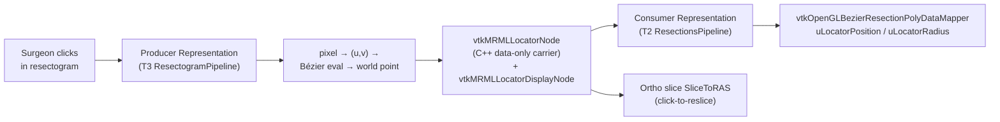

# 0025. Locator Architecture

- **Status:** Accepted
- **Date:** 2026-06-11
- **Deciders:** Rafael Palomar
- **Diagrams:** inline below (mermaid).
- **PR:** <filled on merge>

## Context

In Slicer-Liver's resection-planning surface, the surgeon works in two
linked views simultaneously: the 3D scene showing the Bézier resection
surface over the liver, and the 2D **resectogram** — a flattened
parametric image of that same surface. A recurring usability need is a
**locator**: a visual marker that ties a point in one view to the
corresponding point in the other, and that can drive the orthogonal
slice views to the picked anatomy ("click-to-reslice").

The forces in play:

- **No new display infrastructure.** [ADR-0013](https://github.com/ALive-research/Slicer-Liver/blob/preview/Docs/adr/0013-layerdm-pipeline-pattern.md)
  reserves the term *Pipeline* for one Python class per display-node
  type, and §5 fixes the registration surface to exactly three calls:
  `RegisterNodeClass`, the upstream LayerDM displayable-manager
  `RegisterInFactory`, and the Pipeline factory creator. A previous
  attempt to add a bespoke `vtkMRMLLiverBezier*DisplayableManager3D`
  (PR #366) was **closed without merge** for re-introducing the
  per-module-DM anti-pattern. The locator must surface through the
  *existing* T2 (resections) and T3 (resectogram) Pipelines, not a new
  one.
- **Data-only node discipline.** [ADR-0014](https://github.com/ALive-research/Slicer-Liver/blob/preview/Docs/adr/0014-livermarkups-dissolution.md)
  amendment "Fourth layer" and
  [ADR-0023](0023-unified-gui-stage-workflow.md) amendment
  "Wrapper-vs-carrier pattern" establish that MRML nodes carrying state
  are **C++ data-only carriers** — no display or interaction logic on
  the node itself.
- **Naming convention.** Per the T2.7 closed-vocabulary convention
  (the prefix-drop applied to the Bézier surface class family in PRs
  #341/#345), new MRML classes drop the `Liver` prefix.
- **Persistence model.** The locator marks *presence* of a picked
  point, not a continuously-streamed live position. Slicer's
  `vtkMRMLCrosshairNode` is the precedent: it persists the fact that a
  crosshair exists and its mode, round-tripping through
  `Copy` / `WriteXML` / `ReadXMLAttributes`, while the transient
  cursor position is not the persisted contract.
- **Existing shader mechanism.** The resection surface is rendered by
  `vtkOpenGLBezierResectionPolyDataMapper`
  (`LiverResections/VTKWidgets/`), which already injects uniforms such
  as `uResectionMargin` into the fragment shader via the
  `ReplaceShaderValues` / `SetMapperShaderParameters` pair. A locator
  marker can ride the *same* proven mechanism rather than introducing a
  new rendering path.
- **Exact parametric mapping is available.** The resectogram is a 1:1
  image of the Bézier `(u, v)` parameter domain. A resectogram pixel
  maps to a `(u, v)` pair maps to a world point by direct Bézier
  surface evaluation — an *exact* correspondence, with no geometric
  search required.
- **Scope boundary.** [ADR-0012](https://github.com/ALive-research/Slicer-Liver/blob/preview/Docs/adr/0012-layerdm-migration-v2-scope.md)
  keeps the resection-planning surface in v2.0 scope but **defers
  cross-module locator unification** (vessel-ops hover, slice-view
  producers, segmentation/volumetry highlight) to v2.1.0.

### Disambiguation — this is *not* the VascularTerritories `Locator`

`vtkSlicerVascularTerritoriesLogic` already owns a member literally
named `Locator`
(`VascularTerritories/Logic/vtkSlicerVascularTerritoriesLogic.h`):

```cpp
vtkSmartPointer<vtkKdTreePointLocator> Locator;
```

That is a **geometric spatial-search structure** (a k-d tree used by
`FindClosestPoint` during Couinaud-territory classification) and has
**nothing to do** with the UI Locator this ADR introduces. Future
readers must not conflate the two: one is a search acceleration
structure, the other is a user-facing cross-view marker.

## Decision

Slicer-Liver v2.0 introduces a single new MRML node,
**`vtkMRMLLocatorNode`**, a **C++ data-only carrier** (per ADR-0014)
with **no `Liver` prefix** (per T2.7), surfaced through
**Representations added to the existing LayerDM Pipelines** — and
explicitly **no new Pipeline or DisplayableManager class**.

### The node

- `vtkMRMLLocatorNode` (`.h`/`.cxx`) holds the picked-point state and
  a reference to its display node. It carries no display or interaction
  code.
- A single **`vtkMRMLLocatorDisplayNode`** for v2.0 (radius, colour,
  visibility). Any per-view / per-representation display-node split is
  deferred to v2.1.
- **Persistence = presence, not live position**, mirroring
  `vtkMRMLCrosshairNode`: `Copy`, `WriteXML`, and `ReadXMLAttributes`
  round-trip the *presence* of a locator (and its display config), not
  a continuously-updated coordinate. Re-loading a scene restores that a
  locator exists; the live position is re-derived from interaction.

### Registration surface (ADR-0013 §5 — only the first call)

Of the three registration calls ADR-0013 §5 enumerates, **only
`RegisterNodeClass`** is added (for `vtkMRMLLocatorNode` and its
display node). There is **no** new displayable-manager
`RegisterInFactory` and **no** new Pipeline factory creator — the
locator is realised as Representations *inside* Pipelines that already
exist:

- **Consumer Representation** in the **T2 ResectionsPipeline** — reads
  the locator's world point and feeds the resection-surface shader
  (below).
- **Producer Representation** in the **T3 ResectogramPipeline** — turns
  a resectogram interaction into a `(u, v)` parameter and a world point,
  and writes it onto the `vtkMRMLLocatorNode`.

### Producer — exact 1:1 `(u, v)` mapping (no picker)

The resectogram producer maps a resectogram pixel to a Bézier
`(u, v)` parameter pair, then to a world point by **direct Bézier
surface evaluation**. Because the resectogram *is* the parameter-domain
image, this correspondence is exact. There is **no `vtkCellPicker`**
in the producer path (see Alternatives).

### Click-to-reslice interaction

Clicking in the resectogram updates the orthogonal slice view's
`SliceToRAS` so the slice passes through the picked world point. The
locator node is the carrier of that world point; the slice update is
driven by the consumer side observing the node.

### Rendering — extend the existing Bézier shader

The consumer extends the existing
`vtkOpenGLBezierResectionPolyDataMapper` fragment shader with added
**`uLocatorPosition`** and **`uLocatorRadius`** uniforms, injected via
the same `ReplaceShaderValues` / `SetMapperShaderParameters` pattern
that already carries `uResectionMargin` and friends. The locator marker
**displaces the existing corner-marker shader block**; removal of the
corner marker itself is tracked separately (see issue #380, v2.1) and
is out of scope here.

### Data-flow



## Alternatives considered

### Alternative A — `vtkCellPicker`-based producer

The original plan derived the world point by casting a ray from the
resectogram interaction onto the surface geometry with a
`vtkCellPicker`.

**Rejected because** it is fragile: picking depends on tessellation
density, camera/projection state, and surface fold-over, and returns a
geometric approximation rather than the true parameter point. The
resectogram is already the `(u, v)` parameter-domain image, so the
direct pixel → `(u, v)` → Bézier-evaluation mapping is **exact** and
state-independent. The 2026-05-21 grilling pass resolved this in favour
of the `(u, v)` mapping; the picker approach in the earlier plan is
superseded.

### Alternative B — A shared "leaf-kit" library for v2.0

Build the locator as a wrapped shared leaf-kit now — mirroring the
`vtkSlicerSubjectHierarchyFolders` precedent (merged in #454) with the
[ADR-0004](https://github.com/ALive-research/Slicer-Liver/blob/preview/Docs/adr/0004-python-cpp-boundary.md)
reasoned-exception pattern — so multiple modules could produce locator
state from day one.

**Rejected for v2.0 because** it over-builds a single-surface feature.
v2.0 has exactly one producer (the resectogram) and one consumer (the
resection surface). A kit is the *right shape for v2.1* (see
Consequences / cross-module unification) but adopting it now adds
library plumbing with no second consumer to justify it.

### Alternative C — Reuse `vtkMRMLCrosshairNode`

Surface the locator by repurposing Slicer's existing
`vtkMRMLCrosshairNode`.

**Rejected because** the crosshair has **global, scene-singleton
sharing semantics** — one crosshair for the whole application. The
locator is **per-resection**: a scene may hold several resections, each
with its own locator. The crosshair is borrowed only as the
*persistence-model precedent* (presence, not live position), not as the
node itself.

### Alternative D — Per-module status quo (no shared node)

Leave each module to grow its own ad-hoc locator marker.

**Rejected because** that is precisely the duplication problem this ADR
exists to prevent. A single `vtkMRMLLocatorNode` gives one carrier that
the v2.1 cross-module unification can grow producers and consumers
against, rather than reconciling N divergent bespoke markers later.

## Consequences

### What becomes easier

- One carrier (`vtkMRMLLocatorNode`) the whole locator story hangs off;
  the v2.1 cross-module unification has a clean seam to grow from.
- Reuses the existing T2/T3 Pipelines and the proven Bézier-shader
  uniform mechanism — no new displayable manager, sidestepping the
  PR #366 trap entirely.
- The exact `(u, v)` mapping removes picker fragility from the
  resectogram interaction.

### What becomes harder

- The producer and consumer Representations must coordinate through the
  node without either side acquiring display/interaction state the node
  should own (the data-only discipline must hold under review).
- The shader gains another uniform pair; the corner-marker block it
  displaces remains in the shader until #380 removes it, so the two
  must coexist cleanly in the interim.

### Where the seams show

- `vtkMRMLLocatorNode` holds presence state it must persist correctly;
  the round-trip is the conformance pin below.
- `vtkOpenGLBezierResectionPolyDataMapper` gains `uLocatorPosition` /
  `uLocatorRadius` handling alongside the existing `uResectionMargin`
  family.

### Relationship to the v2.1 cross-module unification

This ADR is the **design that informs** the cross-module locator
unification that ADR-0012 anticipates for v2.1. The likely v2.1 shape
is a **wrapped shared leaf-kit** mirroring the
`vtkSlicerSubjectHierarchyFolders` precedent (#454) with the ADR-0004
reasoned-exception pattern, hosting cross-module producers (vessel-ops
hover, slice-view producers, segmentation/volumetry highlight) and an
eventual per-view display-node split. v2.0 deliberately does **not**
adopt the kit — `vtkMRMLLocatorNode` plus two Representations is the
minimal shape for the single v2.0 surface, and the kit decision is left
to the v2.1 ADR.

### Follow-on work

Implementation is **broken into separate issues authored against this
ADR** — this is a decision record, not an implementation. The expected
slices: the `vtkMRMLLocatorNode` + display-node pair; the resectogram
producer Representation in the T3 Pipeline; the consumer Representation
+ shader uniforms in the T2 Pipeline; and the click-to-reslice wiring.
The corner-marker removal (issue #380) and the v2.1 cross-module
unification ADR are separate, later deliverables.

## Conformance

Invariants that signal this decision is honoured, tagged by how each is
enforced:

- **[test]** — pinned by an automated test; a regression turns CI red.
- **[review]** — a convention upheld at code review (mostly *absence*
  properties; an automated "X is absent" test is low-value and
  intentionally not written).
- **[future]** — belongs to a later deliverable.

- **[test]** Bézier surface evaluation at a known `(u, v)` matches the
  expected world-space point — the exact 1:1 mapping invariant the
  producer relies on.
- **[test]** Click-to-reslice updates the orthogonal slice's
  `SliceToRAS` so it passes through the picked world point.
- **[test]** The producer → `vtkMRMLLocatorNode` → consumer chain
  delivers the locator world point to the mapper as the
  `uLocatorPosition` shader uniform.
- **[test]** `vtkMRMLLocatorNode` round-trips **presence** (not live
  position) through `Copy` / `WriteXML` / `ReadXMLAttributes`.
- **[review]** Exactly one `vtkMRMLLocatorNode` `.h`/`.cxx` pair (plus
  its display node). No `vtkMRMLLocatorPipeline`, no
  `vtkMRMLLocatorDisplayableManager`, no `vtkMRMLLiverLocator`
  (prefix-drop per T2.7). Of the ADR-0013 §5 calls, only
  `RegisterNodeClass` is added.
- **[future]** v2.1 cross-module producers (vessel-ops hover, slice-view
  producers, segmentation/volumetry highlight) and corner-marker removal
  (issue #380).

## References

- [ADR-0003 — Testability as an architectural invariant](https://github.com/ALive-research/Slicer-Liver/blob/preview/Docs/adr/0003-testability-invariant.md). The conformance pins above are authored test-first per the project's invariant-test discipline.
- [ADR-0004 — Python/C++ boundary](https://github.com/ALive-research/Slicer-Liver/blob/preview/Docs/adr/0004-python-cpp-boundary.md). `vtkMRMLLocatorNode` is C++; the reasoned-exception pattern named here is the precedent the v2.1 leaf-kit would follow.
- [ADR-0012 — LayerDM migration v2.0 scope](https://github.com/ALive-research/Slicer-Liver/blob/preview/Docs/adr/0012-layerdm-migration-v2-scope.md). Keeps the resection-planning locator in v2.0 scope; defers cross-module locator unification to v2.1.0.
- [ADR-0013 — LayerDM Pipeline pattern](https://github.com/ALive-research/Slicer-Liver/blob/preview/Docs/adr/0013-layerdm-pipeline-pattern.md). §5 registration surface; the locator adds only `RegisterNodeClass`, no new Pipeline or displayable manager (the PR #366 trap).
- [ADR-0014 — LiverMarkups dissolution](https://github.com/ALive-research/Slicer-Liver/blob/preview/Docs/adr/0014-livermarkups-dissolution.md). Amendment "Fourth layer" — the data-only carrier discipline `vtkMRMLLocatorNode` follows.
- [ADR-0023 — Unified GUI / six-stage surgeon workflow](0023-unified-gui-stage-workflow.md). Amendment "Wrapper-vs-carrier pattern"; Stage 4 resection-planning surface hosts the locator.
- [ADR-0027 — Invariant-test-first v2 implementation](0027-invariant-test-first-v2-implementation.md). The implementation slices author the [test] conformance pins before production code.
- Upstream `vtkMRMLCrosshairNode` — persistence-model precedent (presence, not live position) borrowed without reusing the node (global-singleton semantics are wrong for a per-resection locator).
- `VascularTerritories/Logic/vtkSlicerVascularTerritoriesLogic.h` — the unrelated `vtkKdTreePointLocator Locator` member (a spatial-search structure, *not* this UI Locator).
- `LiverResections/VTKWidgets/vtkOpenGLBezierResectionPolyDataMapper.cxx` — the `ReplaceShaderValues` / `SetMapperShaderParameters` uniform mechanism the locator extends.
- Issue #380 — corner-marker removal (v2.1); the locator marker displaces the corner-marker shader block in the interim.
- Issue #414 — this ADR's tracking issue (T5.3).

---

*AI-assisted authorship: this ADR was drafted with help from Anthropic's Claude (Opus 4.8, `claude-opus-4-8`) via Claude Code, drawing on the T5.3 planner output and the 2026-05-21 grilling pass that resolved the producer mapping in favour of the exact `(u, v)` approach.*
