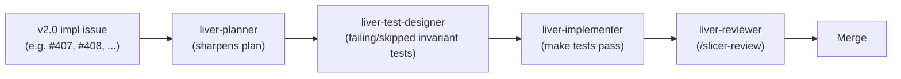

# 0027. Invariant-test-first discipline for v2.0 implementation

- **Status:** Accepted
- **Date:** 2026-05-21
- **Deciders:** R. Palomar
- **Diagrams:** inline below.
- **PR:** <filled on merge>

## Context

Slicer-Liver v1 shipped with roughly 40 % C++ code coverage,
concentrated in `LiverResections` after the v2.0 T2 work landed (PR
#330 characterisation tests, PR #357 edge-case stress tests). The
other modules — `LiverSegments`, `LiverVolumetry`, the top-level
`Liver` scripted module — were effectively untested. The maintainer
flagged this on 2026-05-21 ahead of the v2.0 implementation push:
*"Test coverage sits at 40 %... 2.0 should come with good coverage
testing."*

The supporting machinery already exists:

- [ADR-0003 — Testability invariant](https://github.com/ALive-research/Slicer-Liver/blob/preview/Docs/adr/0003-testability-invariant.md). Every behaviour-affecting change ships with a test that pins the invariant.
- [ADR-0008 — Testing strategy](https://github.com/ALive-research/Slicer-Liver/blob/preview/Docs/adr/0008-testing-strategy.md). Four-layer taxonomy (unit / module / workflow / C++ low-level); pytest primary; ctkTest secondary; characterisation discipline.
- [ADR-0021 — Coverage measurement](https://github.com/ALive-research/Slicer-Liver/blob/preview/Docs/adr/0021-coverage-measurement.md). gcovr + coverage.py + Codecov diff-coverage signal (informational, non-blocking in first cut).
- The `liver-test-designer` agent — *"Invariant-test-first designer for Slicer-Liver. Given a sharpened plan from liver-planner, writes test skeletons (failing/skipped) that pin the behavioural invariants of the change BEFORE implementation."*
- The maintainer's memory rule from 2026-05-19 (refined 2026-05-21): *"Agent briefs for behaviour-affecting code changes must require an invariant test (red→green) before the implementation. The test must pin the specific invariant relevant to the change, not just any invariant."*
- PR #294 (`vtkMRMLLiverResectionStorageRoundTripTest`) is the canonical example — pinned the `.lrp.fcsv` round-trip behaviour *before* any LayerDM migration touched the storage path.
- Tracker [issue #305](https://github.com/ALive-research/Slicer-Liver/issues/305) T5.4 was reframed in the 2026-05-21 grilling pass from *"characterise every v2.1-bound module before it gets rewritten"* (waste — most modules are being rewritten in v2.0) to *"write invariant tests against v2.0 design via `liver-test-designer`"*.

What is **not** established: enforcement. The memory rule has been
on the books since 2026-05-19 but not visibly enforced — PR reviews
do not gate on "test commit predates implementation commit"; the
`liver-test-designer` agent has not been used in the implementation
flow yet (it was authored but not exercised). The v2.0 implementation
push (issues #407, #408, #409, #410, #411, #412 + future
implementation sub-issues of #413 and #414) is the moment to
operationalise the discipline.

## Decision

Every v2.0 implementation PR follows the **planner → test-designer →
implementer → reviewer** agent sequence:



For each behaviour-affecting commit:

1. **The test commit comes first.** Either as the first commit of the
   implementation PR, or as a sibling PR that lands before the
   implementation PR. Failing or skipped tests are both acceptable
   shapes for the initial test commit; the implementation commit
   flips them to passing.
2. **The test pins the specific invariant.** Not "any" invariant —
   the one the change makes true. A test that passes on both the
   broken and the fixed branch is wrong-shape per ADR-0003 and the
   2026-05-21 refinement of the memory rule. (See PR #357's #355
   pin-tightening for the canonical lesson: the initial pin asserted
   "test passes on either branch", caught in `/slicer-review`,
   tightened to "test fails-against-broken, passes-against-fixed".)
3. **`liver-test-designer` is the canonical entry point.** Per-issue
   agent dispatch sequences the four steps; the test-designer step
   is non-skippable for any issue tagged `behaviour-affecting`
   (effectively every v2.0 implementation issue).
4. **`/slicer-review` checks the test-commit-precedes-implementation
   invariant.** Reviewer surfaces violations as a blocker before
   flip-to-Ready.

### Scope

Applies to every PR landing under tracker #305's T5 phase (v2.0
implementation): #407, #408, #409, #410, #411, #412, plus the future
implementation sub-issues of #413 (LiverSegmentation + Kumar-Oram
effect per ADR-0024 / ADR-0026) and #414 (locator architecture per
forthcoming ADR-0025).

Out of scope:

- **Documentation-only PRs** (ADR drafts, architecture-doc updates) —
  no behaviour change; no invariant test needed. Examples: PRs #406,
  #418, #419, #420, #421, #422 themselves.
- **STYLE: PRs** (clang-format-driven whole-file reformats, copyright-
  year additions) — no behaviour change; no invariant test needed.
  Per ADR-0016 grandfathering.
- **Pre-existing v1 surfaces preserved as-is** — characterisation
  tests already model this case (PR #294); the rule there is "pin
  what exists before it changes". When v2.0 deliberately walks away
  from a v1 surface, see "Invariant tests against v2.0 design"
  below.

### Test target — v2.0 design, not v1 behaviour

Per the 2026-05-21 reframing of T5.4 in tracker #305: tests target
*what v2.0 does*, not *what v1 did*, when the module is being
rewritten. Pinning v1 behaviour we are deliberately walking away
from is wasted work. Concretely:

- `vtkMRMLAbstractTerritoriesNode` + subclasses (#407) — tests pin
  the polymorphic interface contract from ADR-0023, not whatever
  `vtkLiverSegmentsLogic::SegmentClassificationProcessing` did in v1.
- `.lrp.json` schema v3 (#411) — tests pin v3 round-trip + the v2→v3
  fallback. The v2 round-trip test from PR #361 stays as a regression
  check on the fallback path.
- `LiverSegmentation/` module (#409) — tests pin scratch + Accept
  lifecycle, lazy `pip_install` prompt behaviour, canonical-vs-scratch
  node discrimination. No prior v1 surface to characterise — it is a
  new module.
- Liver-shell sidebar (#410) — tests pin per-stage `isComplete()`
  query contract + clickable switching. `Liver/Liver.py`'s prior
  long-scroll layout is being replaced, not preserved.

PR #294's `.lrp.fcsv` round-trip test stays as the model for
**preserved** v1 surfaces (the storage path is intentionally
characterised before any LayerDM migration touches it). For
**rewritten** surfaces, the test-first discipline applies *to the
new design*.

### Agent sequence per issue — explicit briefs

Each v2.0 implementation issue's Acceptance section will be updated
(separate follow-up) to spell out the agent dispatch:

```
## Acceptance

1. liver-planner sharpens this issue's plan against the ADR set
   referenced above (skip if the ADR already provides sufficient
   sharpening).
2. liver-test-designer writes failing/skipped invariant tests that
   pin the v2.0 design contract from the cited ADRs.
3. liver-implementer makes the tests pass.
4. liver-reviewer (/slicer-review) verifies:
   - Test commit predates the implementation commit.
   - Tests pin the specific invariant (fail-against-broken,
     pass-against-fixed).
   - Implementation conforms to the cited ADRs.
5. Maintainer flips Ready and merges.
```

The dispatch can be parallelised across multiple issues (each issue
runs through its own four-agent pipeline) but the per-issue order is
non-skippable.

## Alternatives considered

### Alternative A — Pure TDD (write-fail-make-pass per micro-step)

Strict TDD as practised in many web/backend codebases — every
function call site or method body lands behind a failing test that
exercises it directly. Tests guide the micro-design of each method.

**Rejected because** Slicer-Liver's surface mixes Qt widget chrome
(hard to TDD purely — widget tests need the Slicer harness), VTK
mappers (testable only end-to-end with rendering), MRML node
lifecycle (testable but with significant boilerplate), and pure
Python orchestration logic (TDD-natural). A strict per-method-TDD
rule fits the orchestration logic and the algorithm libraries
(per [ADR-0015](https://github.com/ALive-research/Slicer-Liver/blob/preview/Docs/adr/0015-cpp-algorithm-library.md)) but adds friction to widget+mapper work that is best
exercised through integration / characterisation tests.

The invariant-test-first framing of this ADR captures the spirit
("test the behaviour-affecting invariant before the code lands")
without forcing per-method TDD where it does not fit.

### Alternative B — Test-after (the v1 default)

Implementation lands first; tests follow when they follow. v1's de
facto state.

**Rejected because** the v1 outcome — 40 % coverage concentrated in
one module, several modules effectively untested, regressions
detected only at integration time — is the problem this ADR is
trying to solve. Test-after is what got Slicer-Liver here.

### Alternative C — Coverage-threshold gate (block PRs below N%)

Block merge of any PR that drops project-wide coverage below a
configured threshold (ADR-0021 already has the diff-coverage signal
plumbed; turning the informational gate into a blocking gate is a
small config flip).

**Rejected for v2.0 first cut** because thresholds incentivise
quantity over quality. A surgeon-writing-a-passing-test that doesn't
pin the actual invariant satisfies a coverage gate but defeats the
purpose. Diff-coverage stays informational per ADR-0021's first-cut
stance; the enforcement happens at the per-PR review level (does
this test pin the *specific* invariant?) not the threshold level.

ADR-0021's coverage gate may flip to blocking in a later cut once
v2.0 has shown stable invariant-test discipline; that decision can
amend ADR-0021 separately.

### Alternative D — Codify only via memory feedback (no ADR)

The existing memory rule `feedback_agent_brief_test_first_for_behaviour_change.md`
already says the right thing. Promote-and-enforce via the rule alone
without a public ADR.

**Rejected because** memory rules are not review-blockable. A `/slicer-review`
synthesis can cite a memory rule only if the reviewer happens to load
it; for v2.0's six-implementation-issue push (plus future locator-
and-segmentation-orchestration implementation work), the discipline
needs the public surface an ADR provides. The memory rule stays in
force; ADR-0027 *promotes* it.

## Consequences

### What becomes easier

- Six v2.0 implementation issues + future implementation sub-issues
  ship with comprehensive invariant tests by construction — no
  test-after retrofit needed.
- `/slicer-review` synthesis has a concrete shape-of-PR check to
  apply (commit order; test pins the specific invariant).
- `liver-test-designer` agent gets real usage; the agent contract
  matures via the v2.0 push.
- Coverage % rises as a side effect — without becoming the proxy
  for design correctness.
- v2.0's substantial rewrite arrives with a meaningful test surface
  on every new module + class.

### What becomes harder

- Workflow rigour: every behaviour-affecting commit needs a
  preceding test commit. Force-pushing combined commits or rebasing
  the test commit after the implementation commit is a violation;
  reviewer must check.
- `liver-test-designer` agent surface needs to be ready for prime
  time — including handling Slicer-harness ctkTests, not just
  pure-Python pytest tests. Untested surfaces of the agent get
  surfaced during v2.0 dispatch.
- Some surfaces (Qt widget visuals, VTK rendering correctness) are
  intrinsically hard to pin via invariant tests; the discipline
  document needs to say what counts as "good-enough invariant" for
  those cases, possibly by surfacing characterisation tests on
  data-state rather than on pixels.

### Follow-on work

- **Per-issue Acceptance updates** for #407, #408, #409, #410,
  #411, #412 to spell out the four-agent dispatch contract.
- A small **PR template addition** so any future implementation PR
  includes a checkbox "test commit precedes implementation commit"
  + cites the relevant ADRs.
- `liver-reviewer`'s synthesis prompt to add a top-of-checklist
  question: *"Does the test commit predate the implementation
  commit, and do the tests pin the specific invariant?"*.

## Conformance

Reviewable invariants that signal this decision is honoured on a
given PR:

- The PR's commit log shows a test commit dated before the first
  implementation commit (or a sibling PR landed earlier whose
  diff added the tests).
- The test names + bodies pin the specific invariant the
  implementation makes true. Reviewer (`/slicer-review`) verifies
  by reading the tests against the ADR-cited invariant.
- The test fails against the branch *before* the implementation
  commit (or, for skipped tests, the skip lifts at the
  implementation commit).
- The PR description names the agent sequence used (planner →
  test-designer → implementer → reviewer) or, when sub-steps were
  inlined by the maintainer, says so explicitly.
- The reviewer's `/slicer-review` synthesis includes a
  test-first-discipline pass/fail bullet.
- For pure-doc PRs (ADR drafts, architecture diagrams, STYLE:
  reformats), the rule does not apply and the PR description says
  so (e.g., "DOC-only PR; no invariant tests required per ADR-0027
  §Scope").

## References

- [ADR-0003 — Testability invariant](https://github.com/ALive-research/Slicer-Liver/blob/preview/Docs/adr/0003-testability-invariant.md). The foundational rule this ADR operationalises.
- [ADR-0008 — Testing strategy](https://github.com/ALive-research/Slicer-Liver/blob/preview/Docs/adr/0008-testing-strategy.md). Test taxonomy + framework choices.
- [ADR-0021 — Coverage measurement](https://github.com/ALive-research/Slicer-Liver/blob/preview/Docs/adr/0021-coverage-measurement.md). The coverage signal; this ADR does not turn it into a blocking gate.
- [ADR-0023 — Unified GUI / six-stage surgeon workflow](https://github.com/ALive-research/Slicer-Liver/blob/preview/Docs/adr/0023-unified-gui-stage-workflow.md). The v2.0 design that the tests pin.
- [ADR-0024 — Segmentation orchestration](https://github.com/ALive-research/Slicer-Liver/blob/preview/Docs/adr/0024-segmentation-orchestration.md). Stage 2 contract.
- [ADR-0026 — Segment Editor effects](https://github.com/ALive-research/Slicer-Liver/blob/preview/Docs/adr/0026-segment-editor-effects.md). Kumar-Oram effect contract.
- Tracker [issue #305](https://github.com/ALive-research/Slicer-Liver/issues/305) — T5.4 reframed 2026-05-21 to "invariant tests against v2.0 design".
- PR [#294](https://github.com/ALive-research/Slicer-Liver/pull/294) — `vtkMRMLLiverResectionStorageRoundTripTest`, canonical example of characterisation pinning before refactor.
- PR [#357](https://github.com/ALive-research/Slicer-Liver/pull/357) — edge-case stress tests + the #355 pin-tightening lesson (initial pin passed on both branches; tightened to fail-against-broken, pass-against-fixed).
- Memory `feedback_agent_brief_test_first_for_behaviour_change.md` (2026-05-19, refined 2026-05-21) — the rule this ADR promotes to public-surface policy.

---

*AI-assisted authorship: this ADR was drafted with help from Anthropic's Claude (Opus 4.7, `claude-opus-4-7`) via Claude Code, in response to the maintainer's 2026-05-21 question on TDD discipline for v2.0 implementation given v1's low coverage starting point.*
