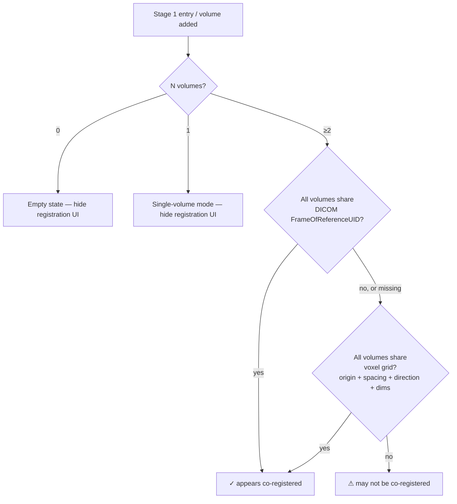

# 0029. Stage 1 — case-setup functional contract

- **Status:** Proposed
- **Date:** 2026-05-22
- **Deciders:** R. Palomar
- **Diagrams:** inline below.
- **PR:** <filled on merge>

## Context

[ADR-0023](https://github.com/ALive-research/Slicer-Liver/blob/preview/Docs/adr/0023-unified-gui-stage-workflow.md) §Stage 1 sketched Case Setup at the UI level: load volumes (DICOM + non-DICOM), tag roles, optionally register, arrange the layout, hand off to Stage 2. The `Docs/architecture/ui-stage-1-case-setup.md` follow-up (PR #422) drew the panel mockups. Neither pinned the *underlying functional contract*: how does Slicer-Liver decide whether two volumes are registered? What's the registration tool? How does the dominant single-volume case differ from the rare multi-phase case?

The maintainer surfaced this 2026-05-22:

> *"How do we detect whether two images are registered or not? We need to account for the possibility that we have only one Portal-venous phase image. BRAINSFit is probably not good at liver images? Elastix will require installation as a dependency or Superbuild inclusion. I'm not sure these aspects are well covered."*

Three under-specified concerns:

1. **Co-registration detection algorithm** — the UI shows a "✓ appears registered" / "⚠ may not be co-registered" badge; the underlying check was unspecified.
2. **Single-volume dominance** — most research datasets (LiTS, 3D-IRCADb, etc.) ship single-phase; many clinical workflows use one Portal-venous phase. v2.0's UI mockups over-emphasised the multi-phase ceremony.
3. **Registration tool + dependency policy** — BRAINSFit is rigid-only and weak on inter-phase liver deformation. Elastix is better but lives in a separate `SlicerElastix` extension (C++-wrapped; can't pip-install). Slicer-Liver had no settled stance on either bundling or recommending.

The constraints on the solution space:

- Slicer-Liver v2.0 is *research-tool-grade* per [ADR-0009](https://github.com/ALive-research/Slicer-Liver/blob/preview/Docs/adr/0009-ux-and-design-discipline.md)'s IEC 62366 relaxation — surgeon judgement is the validation surface; we don't enforce registration.
- v2.0's dependency policy (per [ADR-0023](https://github.com/ALive-research/Slicer-Liver/blob/preview/Docs/adr/0023-unified-gui-stage-workflow.md) §"AI extension dependencies" + [ADR-0024](https://github.com/ALive-research/Slicer-Liver/blob/preview/Docs/adr/0024-segmentation-orchestration.md) Alternative H) bounds lazy-pip-install to AI tools that consume as a Python package with no external runtime. Registration tools that ship as separate Slicer extensions (C++-wrapped) fall outside that envelope.
- The 2026-05-14 stitch decision and ADR-0023 already commit to *thin orchestration over stock Slicer tools* (TotalSegmentator as a consumer; Segment Editor as the manual-edit surface; no bespoke Slicer-Liver wrappers for upstream-provided functionality).

## Decision

Stage 1's functional contract for v2.0:

### 1. Co-registration detection algorithm

The registration-status badge in the Stage 1 panel is driven by a soft heuristic:

Concretely:

- If all volumes carry the same `DICOM:FrameOfReferenceUID` attribute (DICOM-loaded volumes do; NIfTI/NRRD/MetaImage don't) → ✓.
- Otherwise, compare voxel grids: `vtkImageData::GetOrigin()` + `GetSpacing()` + `vtkMRMLScalarVolumeNode::GetIJKToRASDirectionMatrix()` + `GetImageData()->GetDimensions()`. Exact match across all volumes → ✓.
- Anything else → ⚠.

This is detection, not validation. The badge is soft — surgeon's eyeball is the final judge. Stage 2 is never blocked by the badge.

### 2. Single-volume case as the default

Stage 1's UI is **progressive disclosure** keyed on volume count:

| Volume count | Stage 1 UI shape |
|--------------|------------------|
| 0 | Empty state — `[Load …]` buttons; Stage 2 sidebar entry remains pending |
| 1 | "Volume" single-row section + role dropdown + layout selector. No manifest table. No registration UI. No 2-up layout option. |
| ≥ 2 | "Volume manifest" table + per-row role dropdown + registration-status banner + 2-up layout option in the Layout selector |

The single-volume path is the **dominant case**. Research datasets and many clinical acquisitions ship as one Portal-venous-phase CT. The multi-volume machinery (manifest table, registration banner, 2-up comparison layout) is for the richer-data case, not the default.

### 3. No bundled registration in v2.0

Slicer-Liver does **not** ship in-extension registration UI or tooling in v2.0. The registration-status banner is *detection-only*:

- When ⚠, the banner expands to a short hint: *"Volumes may not be co-registered. Use Slicer's Registration module category (BRAINSFit / installed extensions like SlicerElastix or SlicerANTs) before continuing if registration is needed."*
- **No `[Run registration]` button.** No `EXTENSION_DEPENDS` on `SlicerElastix` or `SlicerANTs`. No Slicer-Liver-side Python wrapper around `itk-elastix`.
- Surgeon picks the registration tool that fits their data (rigid same-breath-hold multi-phase CT → BRAINSFit suffices; different breath-holds or research data → `SlicerElastix`/`SlicerANTs` deformable; manual transform → `Transforms` module).

Rationale (parallel to [ADR-0024 Alternative H](https://github.com/ALive-research/Slicer-Liver/blob/preview/Docs/adr/0024-segmentation-orchestration.md) — MONAILabel drop):

- Registration is not core to v2.0's value proposition (planning + volumetry on already-acquired imaging). It's a *preparation* step.
- The dominant single-volume case doesn't need registration at all.
- Tools that fit liver-specific needs (deformable registration via Elastix or ANTs) are C++-wrapped Slicer extensions; can't follow the lazy-pip-install pattern; would force `EXTENSION_DEPENDS` weight on every Slicer-Liver install for a step most cases skip.
- Slicer's stock Registration module category already exposes the relevant tools — Slicer-Liver duplicating that surface would violate [ADR-0010](https://github.com/ALive-research/Slicer-Liver/blob/preview/Docs/adr/0010-accessibility-and-i18n.md)'s "align with Slicer, contribute upstream" principle.

### 4. Future-revisit gate

The no-bundled-registration stance is **revisitable** in v2.1+ if either:

- A clinical-evidence push surfaces that surgeons consistently skip the manual-registration step and produce bad plans because of it (registration becomes a clinical safety concern, not a workflow convenience).
- A server-less, pip-installable deformable registration tool emerges that fits the lazy-install pattern (e.g., a future `itk-elastix` Python package that handles the relevant liver cases without the full Slicer-Elastix C++ wrapper). The maintainer's existing `itk-elastix` route is the candidate.

Either path lands as its own ADR; v2.0 ships without.

## Alternatives considered

### Alternative A — Ship `SlicerElastix` as hard `EXTENSION_DEPENDS`

Declare `SlicerElastix` required; surgeon always has deformable registration available; Slicer-Liver Stage 1 invokes it via a `[Run registration]` button.

**Rejected because** `SlicerElastix` is a substantial install (C++ Elastix binary + Slicer extension wrapper). The dominant single-volume case doesn't need it; forcing it on everyone for a sometimes-needed preparation step contradicts the v2.0 lean-install framing. Also: BRAINSFit (Slicer-bundled, rigid) is often sufficient for clinical same-breath-hold multi-phase CT — committing to deformable as the default overshoots the common need.

### Alternative B — Ship a Slicer-Liver Python wrapper around `itk-elastix`

Pip-install `itk-elastix` (the ITK Python binding for Elastix) on first Stage 1 use; expose a Slicer-Liver-side `[Run registration]` button that drives it.

**Rejected for v2.0** because it adds a new substantial subsystem to Stage 1 — wrapper code, parameter UI, error handling, scratch-output management. v2.0's Stage 1 is already busy enough with load + role-tagging + layout; piling registration on top is over-scope. v2.1+ may revisit this if the case emerges; the future-revisit gate above keeps it open.

### Alternative C — Recommend BRAINSFit, defer deformable registration

Stage 1 banner suggests BRAINSFit specifically. No SlicerElastix dependency.

**Rejected because** BRAINSFit is rigid/affine only and weak on inter-phase liver deformation. Recommending it as *the* tool misleads surgeons whose data needs deformable registration. The no-recommendation stance (point at Slicer's Registration module category broadly) keeps the surgeon's tool choice open and honest.

### Alternative D — Image-similarity detection for the registration badge

Compute mutual information / normalised cross-correlation at sample points to decide whether two volumes are aligned.

**Rejected because** expensive (sampling + similarity computation per volume pair) and unreliable as a yes/no signal — similarity scores have no sharp threshold for "registered vs not". The voxel-grid + FrameOfReferenceUID heuristic is cheaper and binary in nature (matches or doesn't); the soft badge framing acknowledges that detection isn't validation.

### Alternative E — Multi-phase manifest as the default UI

Keep the multi-volume manifest table visible always (one row in the dominant case); don't progressive-disclose.

**Rejected because** the single-volume case is so common that an always-visible manifest with one row looks like UI debt. The single-row "Volume" section communicates the load-and-tag job more cleanly when nothing else is there.

## Consequences

### What becomes easier

- v2.0's Stage 1 ships lean — three UI sections (Load / Volume(s) / Layout), no registration sub-UI to build or test.
- The single-volume dominant case has a tight UI (one row, no progressive-disclosure overhead).
- Slicer-Liver's `EXTENSION_DEPENDS` list stays minimal — no `SlicerElastix`, no `SlicerANTs`, no Elastix binary in the install footprint.
- Surgeons retain full freedom on registration tool choice — appropriate to a research-tool-grade extension.

### What becomes harder

- Surgeons not familiar with Slicer's Registration module category may not realise it exists or how to use it. The Stage 1 hint banner mitigates this minimally; documentation in the user guide covers it more thoroughly.
- The registration-detection heuristic doesn't catch cases where volumes are *almost* aligned (sub-voxel mismatch). Surgeon must eyeball.
- v2.1+ revisit may need to retrofit the registration affordance into the existing Stage 1 panel — but the panel is small enough that adding a section is straightforward when the time comes.

### Follow-on work

- **Per-PR amendment to `ui-stage-1-case-setup.md`** — already landed in PR #422 (commit `4d3066a`).
- **Implementation of the detection heuristic** — pure Python; lives in the `Liver` shell's Stage 1 section logic. Invariant test per [ADR-0027](https://github.com/ALive-research/Slicer-Liver/blob/preview/Docs/adr/0027-invariant-test-first-v2-implementation.md): given a scene with 2 volumes sharing voxel grids, detection returns `appears-registered`; given a scene with 2 volumes of different grids, detection returns `may-not-be-co-registered`.
- **v2.0 user guide section** on registration — short, points at Slicer's Registration module category, mentions which tools fit which cases (BRAINSFit for same-breath-hold multi-phase rigid; SlicerElastix / SlicerANTs for deformable).

## Conformance

Reviewable invariants that signal this decision is honoured:

- `Liver/CMakeLists.txt` does NOT declare `SlicerElastix`, `SlicerANTs`, or any registration-tool extension as `EXTENSION_DEPENDS`.
- Grep for `[Run registration]`, `registerVolumes`, `BRAINSFit`, `Elastix` in `Liver/Liver.py` finds no Slicer-Liver invocation (only hint-banner text mentioning Slicer's stock module category).
- Stage 1 panel has no clickable affordance that invokes a registration tool.
- The registration-detection heuristic test passes (per ADR-0027 — test commit lands before the implementation commit on whichever PR implements Stage 1's logic).
- Single-volume case: Stage 1's UI shows the "Volume" single-row section, not the manifest table — verifiable via the `Liver.py` widget's conditional logic + a Python wrapper test.

## References

- [ADR-0009 — UX and design discipline](https://github.com/ALive-research/Slicer-Liver/blob/preview/Docs/adr/0009-ux-and-design-discipline.md). Research-tool-grade positioning; IEC 62366 relaxation.
- [ADR-0010 — Accessibility and i18n](https://github.com/ALive-research/Slicer-Liver/blob/preview/Docs/adr/0010-accessibility-and-i18n.md). "Align with Slicer, contribute upstream" — Slicer-Liver doesn't duplicate stock Slicer surfaces.
- [ADR-0023 — Unified GUI / six-stage surgeon workflow](https://github.com/ALive-research/Slicer-Liver/blob/preview/Docs/adr/0023-unified-gui-stage-workflow.md). Stage 1 UI commitment.
- [ADR-0024 — Segmentation orchestration](https://github.com/ALive-research/Slicer-Liver/blob/preview/Docs/adr/0024-segmentation-orchestration.md). Alternative H — parallel rationale for dropping MONAILabel (client/server external runtime → out of v2.0 scope).
- [ADR-0027 — Invariant-test-first discipline](https://github.com/ALive-research/Slicer-Liver/blob/preview/Docs/adr/0027-invariant-test-first-v2-implementation.md). Stage 1 logic implementation follows this gate.
- 2026-05-14 PKS stitch subnote — Stage 1 was loosely framed at the time; this ADR sharpens.

---

*AI-assisted authorship: this ADR was drafted with help from Anthropic's Claude (Opus 4.7, `claude-opus-4-7`) via Claude Code in response to the maintainer's 2026-05-22 question on Stage 1's underlying functional contract — registration detection, single-volume dominance, and dependency policy.*
