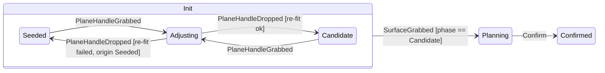

# 0035. Resection init choreography as an explicit state machine

- **Status:** Accepted
- **Date:** 2026-07-13
- **Deciders:** Rafael Palomar
- **Amends:** [ADR-0019](0019-resection-state-machine.md) (adds the
  `Init` interior and a single-writer transition discipline; the
  `Init → Planning → Confirmed` skeleton and its irreversibility stand
  unchanged).  Interaction siting per
  [ADR-0032](0032-v2-interaction-via-layerdm-pipeline-seam.md) /
  [ADR-0033](0033-control-polygon-display-aspect.md) is untouched.
- **PR:** _filled in on merge_

## Context

The v1-parity slicing-plane initialization is a **composite** of two
coordinated display concepts: the init handles + shader contour (on
`LiverBezierSurfacePipeline`) and the candidate Bézier surface + control
polygon (on `BezierPlanningRepresentation` +
`ControlPolygonPipeline`).  The loop: dropping a plane handle *generates*
a manipulable candidate surface; grabbing a plane handle again hides the
candidate while the contour follows; the **first grab of the candidate
surface** is the `Init → Planning` commit — no button.  In v1 this was
two `vtkAbstractWidget`s with hand-wired event coordination.

The first v2 implementation coordinated the composite through **two
boolean carrier attributes** (`InitCandidateReady`, `InitHandleDrag`)
plus a raw `SetState(Planning)` inside `ControlPolygonPipeline`'s press
handler.  It works, but review identified structural debt:

1. **The booleans secretly encode a state machine.**  `Seeded`,
   `Adjusting`, `Candidate` are mutually exclusive phases; two
   independent booleans admit meaningless combinations and force every
   reader to re-derive the phase from a two-flag predicate duplicated
   across pipelines.
2. **Transition authority is distributed.**  Any code can `SetState` or
   poke an attribute; ADR-0019's irreversibility is enforced only by
   convention and tests.  The composite choreography (hide on grab,
   re-fit on drop, retire on commit) is spread across three interaction
   handlers in two files.
3. **Transient state persists.**  MRML node attributes serialize into
   saved scenes; a scene saved mid-drag reloads with the drag flag stuck
   raised and the candidate hidden until the next gesture.
4. **`LiverBezierSurfacePipeline.commit()` went dead.**  The commit
   gesture moved to the control polygon's press; the old one-shot
   ring-extraction boundary (`commit()` + `_pending_extraction`) has no
   callers, and the extraction boundary factually moved to the drag
   *release* (the per-drop re-fit).

## Decision

### 1. The `Init` state gains an explicit interior (hierarchical FSM)

- **`Seeded`** — auto-seeded handles + shader contour only.
- **`Adjusting`** — a plane-handle drag is in flight; the candidate (if
  any) hides while the contour follows.  *Transient*: not a resting
  state.
- **`Candidate`** — a re-fit grid is up as a manipulable candidate
  surface, rendered alongside the handles + contour.

The phase is carried on the shared carrier node as **one** string
attribute, `LiverResections.InitPhase`, with values `Seeded`,
`Candidate`, and — transiently — `Adjusting+<origin>` where `<origin>`
is the resting phase the drag started from.  Encoding the origin makes a
failed re-fit restore the correct resting phase (a drag from `Candidate`
whose drop cannot re-fit still *has* the previous fitted grid), and it
makes stale persistence self-healing (§3).  An unset attribute reads as
`Seeded` (pre-machine carriers).

### 2. Single writer: `ResectionStateMachine.request()`

A pure-Python module `LiverResectionsLib/ResectionStateMachine.py`
(Python-side logic per
[ADR-0004](https://github.com/ALive-research/Slicer-Liver/blob/preview/Docs/adr/0004-python-cpp-boundary.md))
owns the transition table:

| event | guard | transition + action |
|---|---|---|
| `PlaneHandleGrabbed` | `State == Init`, not in flight | phase → `Adjusting+<origin>` |
| `PlaneHandleDropped` | `State == Init`, in flight | run the injected `refit` action; phase → `Candidate` on success, `<origin>` on failure — one `Modified` batch |
| `SurfaceGrabbed` | `State == Init`, phase == `Candidate` | `SetState(Planning)` (the ADR-0019 irreversible commit) |

Rules:

- **Pipelines never write the phase attribute or call `SetState` for
  these transitions directly** — they translate raw VTK gestures into
  domain events and call `request(carrier, event, ...)`.  Illegal
  transitions return `False` and mutate nothing.
- **Actions are injected, not imported.**  The drop's grid re-fit lives
  on the Pipeline (it needs the ring extractor + target weakref);
  `request()` receives it as a callable and runs it inside the machine's
  `StartModify`/`EndModify` batch, so a drop is exactly one reconcile.
- **The machine mutates, pipelines observe.**  It never touches actors
  or renderers; state reaches pixels only through the existing
  `Modified → reconcile` flow.  It is a module of functions over the
  node, not a per-view object — pipeline instances are per-view and must
  not each hold a copy of transition authority.
- Readers use the machine's accessors (`candidate_active`,
  `in_flight`, `resting_phase`) — the phase predicate exists once.

### 3. Scene-load normalization

`Adjusting+<origin>` is transient interaction state; a scene saved
mid-drag must not reload hidden.  `normalize(carrier)` collapses a stale
in-flight phase back to its encoded origin; Pipelines call it once when
they adopt a carrier (`SetDisplayNode`), which can never race a live
drag (a drag cannot span carrier adoption).

### 4. The extraction boundary is the drop, `commit()` is deleted

The per-drop re-fit (ring extraction → PCA → 4×4 grid) *is* the
CPU-extraction boundary: never per mouse-move / per reconcile tick
(per-frame feedback stays the shader's job), exactly once per handle
drop.  The dead `commit()` method and its `_pending_extraction` flag are
removed; ADR-0019's "one-shot extraction at commit" constraint is
superseded by "extraction at the drop boundary" — the commit itself
(`SurfaceGrabbed`) is a pure state flip.

## Alternatives considered

- **Keep the two boolean attributes.**  Works today, but every new
  composite phase multiplies flag combinations and duplicated
  predicates; rejected as a state machine in denial.
- **A C++ enum field on `vtkMRMLBezierSurfaceNode`.**  Schema'd and
  compiled, but requires wrapping + rebuild for every choreography
  iteration while the init UX is still settling.  Deferred: the
  attribute + machine API is the contract; promoting the storage to a
  typed field later does not change any call site.
- **A generic FSM framework (or Qt's `QStateMachine`).**  The whole
  machine is one table and ~60 lines; a framework adds dependency and
  indirection for three transitions.  Rejected (revisit only if a second
  concept grows a comparable interior).
- **Hosting the machine inside a Pipeline.**  Rejected: pipelines are
  per-view instances — n copies of transition authority and no story for
  cross-pipeline events (the commit is raised by a *different* pipeline
  than the one owning the init visuals).

## Consequences

- The composite choreography reads as a table in one module;
  interaction handlers shrink to event translation.
- Illegal transitions (`SurfaceGrabbed` without a candidate, double
  grabs, commits from `Planning`) are refused centrally instead of by
  scattered guards.
- The two-boolean channel, its duplicated predicate, and the
  mid-drag-persistence wart are gone.
- Any future init mode with its own interior (e.g. DistanceSpheroid
  growing a candidate phase) extends the table, not the reconcile.

## Conformance

- [test] The transition table (grab/drop/surface-grab, guards, origin
  restore on failed re-fit) is pinned by the bare-layer unit suite
  `Testing/Python/unit/test_resection_state_machine.py`.
- [test] A drop is exactly one `Modified` on the carrier (batching pin).
- [test] `normalize()` collapses a stale `Adjusting+<origin>` to its
  origin; launched pins cover the composite dispatch reading
  `candidate_active` and the polygon press committing via
  `SurfaceGrabbed`.
- [test] Ring extraction runs zero times per Init reconcile tick and
  exactly once per drop (`test_resections_ring_extraction_boundary.py`).
- [review] No new `SetState` / `InitPhase`-attribute writes outside
  `ResectionStateMachine` — transition authority stays single-writer.
- [future] Promote `InitPhase` to a typed C++ field once the init UX
  stabilizes; extend the table if DistanceSpheroid gains an interior.
