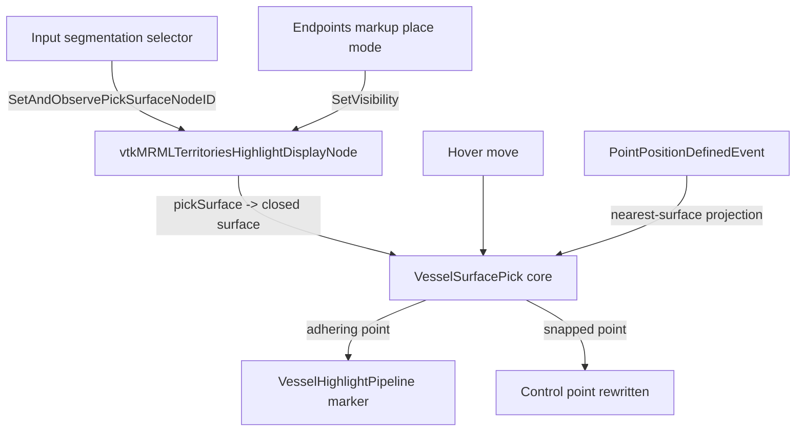

# 0036. Vessel-adhering highlight is a separate instance, not the resection locator

- **Status:** Superseded by [ADR-0037](0037-vascular-territories-off-markups.md)
- **Date:** 2026-07-14
- **Deciders:** Rafael Palomar
- **Relates to:** [ADR-0025](0025-locator-architecture.md) (reuses the
  pick-core / cell-locator pattern and the data-only display-node
  template), [ADR-0013](https://github.com/ALive-research/Slicer-Liver/blob/preview/Docs/adr/0013-displayable-manager-strategy.md)
  (the LayerDM Pipeline pattern — one Pipeline per display-node type, no
  per-module displayable managers), and
  [ADR-0033](0033-control-polygon-display-aspect.md) (the hover
  discipline the highlight follows).
- **PR:** _filled in on merge_

## Context

The VascularTerritories module lets a surgeon annotate liver vascular
territories by placing endpoint markers on a vessel tree.  Two usability
gaps made that placement error-prone:

1. **No hover feedback.**  Nothing told the surgeon whether the cursor was
   over the vessel surface before clicking, so endpoints frequently landed
   in empty space next to the vessel.
2. **Placed points floated off the surface.**  A defined endpoint kept the
   raw picked world position, which — for a surface the surgeon meant to
   annotate — is almost never exactly on the mesh.

The natural instinct is to reuse the resection **locator**
(`vtkMRMLLocatorNode` + its pick core), which already solves "a marker
that clings to a surface under the cursor" for the resection workflow
(ADR-0025).  Cross-module reuse of the locator is the subject of the
planned unification tracked as issue #572.

The question this ADR settles: **should the vessel highlight reuse the
resection locator node, or stand up its own instance?**

## Decision

The vessel-adhering highlight is a **separate instance** with its own
data-only MRML display node — `vtkMRMLTerritoriesHighlightDisplayNode` —
and its own Python LayerDM Pipeline (`VesselHighlightPipeline`).  It does
**not** reuse `vtkMRMLLocatorNode`.

It **reuses the ADR-0025 patterns, not the ADR-0025 node**:

- the pure-VTK pick core (`VesselSurfacePick`, a `vtkCellLocator` built
  lazily and invalidated on the surface's `MTime`) is the same shape as the
  resection pick core;
- the display node is data-only per ADR-0013 §5 (it carries the transient
  adhering point + a `pickSurface` reference to the input segmentation and
  holds no rendering logic);
- rendering lives in a Python Pipeline keyed on the display-node type
  (ADR-0013 §1), created through the LayerDM factory creator — no custom
  displayable manager.

**Ray-picking against the segmentation closed surface is acceptable here.**
The pick target is the input segmentation's closed-surface mesh (every
segment appended into one `vtkPolyData`).  Ray/mesh intersection nearest
the ray origin gives the hover point; the nearest-surface projection gives
the snap target when no ray hit is available (at placement time).  A
liver-scale vessel tree is a modest mesh and the pick is per-hover /
per-click, not per-frame, so a `vtkCellLocator` ray cast is well within
budget — the same tradeoff ADR-0025 already accepted for the resection
locator.

**Lifecycle.**  One persistent, scene-resident highlight display node is
created lazily and reused for the module's lifetime.  Its `pickSurface`
reference tracks the input-segmentation selector; its `Visibility` gates
the Pipeline's paint and is raised only while the endpoints markup is in
place mode.  Outside placement the marker never paints, so it cannot
compete with plain camera interaction; the ADR-0033 hover discipline
(claim the move as a side effect, then decline it) keeps even the live
marker from stealing camera gestures.

**Snap-on-place.**  The widget observes `PointPositionDefinedEvent` on the
endpoints markup and rewrites the just-placed control point to its
nearest-surface projection, reusing the same pick core and the same
surface-resolution seam the hover uses.  A raw (un-snapped) point is kept
only when there is no mesh at all.  A re-entrancy latch guards the
reposition (which itself fires `Modified`), so exactly one net reposition
happens per placed point.

## Consequences

- **Positive.**  The highlight ships without waiting on the cross-module
  locator unification (#572); the two workflows evolve independently; the
  vessel highlight carries only the fields it needs and none of the
  resection-locator baggage (reslice consumers, planning-surface roles).
- **Positive.**  The pick math and the surface-resolution helper are shared
  by hover and snap through one seam (`VesselHighlightWiring`), so the two
  paths cannot drift apart.
- **Negative / accepted.**  There are now two surface-clinging-marker
  implementations in the extension (the resection locator and this
  highlight).  This is the deliberate cost of not blocking on #572.
- **Future.**  The vessel highlight is a **candidate consumer** of the
  #572 cross-module locator unification.  If and when a shared locator
  abstraction lands, this display node + Pipeline may migrate onto it —
  but the highlight **must not block on that work**, and #572 must not be
  scoped as a prerequisite for it.

## Conformance

- The highlight display node is data-only: it holds no rendering logic and
  carries the transient adhering point + `pickSurface` reference only.
  [test: `TerritoriesNodeWrapperTest` round-trip; review]
- The highlight is rendered by a Python Pipeline keyed on its display-node
  type via the LayerDM factory creator — no per-module displayable manager
  (ADR-0013 §5). [review]
- A placed endpoint lands on the referenced segmentation's closed surface;
  with no surface it is left raw; the snap repositions exactly once.
  [test: `test_vessel_snap_and_wiring`]
- The hover declines bare mouse moves (ADR-0033) so camera interaction is
  untouched; the adhering appearance itself is eyeball-gated. [test:
  `test_vessel_highlight_pipeline`; future: interactive `:0` eyeball pass]
