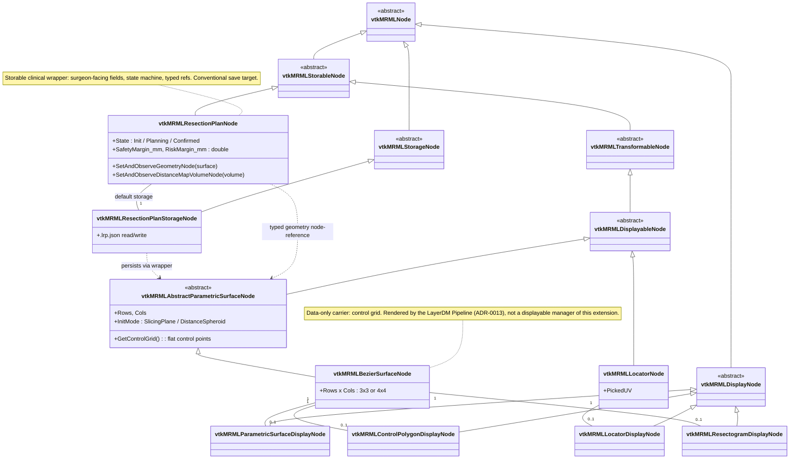

# Slicer-Liver MRML node hierarchy — current state (2026-07-14)

Descriptive snapshot of the MRML class graph for the `LiverResections`
module as it exists today on `preview`. This file documents *what is*,
not what should be — see
[`adr/0014-livermarkups-dissolution.md`](../adr/0014-livermarkups-dissolution.md)
for the migration that produced this shape and
[`target-mrml-node-hierarchy.md`](target-mrml-node-hierarchy.md) for
the target the remaining work (v2.1 NURBS sibling) still adds to.

The `LiverMarkups` module and its Markups-derived node family
(`vtkMRMLMarkupsBezierSurfaceNode`, the slicing/distance-contour init
nodes and their display nodes) are **dissolved** per ADR-0014 step 8.
The v1 three-node assembly recorded in
[ADR-0001](../adr/0001-resection-three-node-assembly.md) is preserved
only in that ADR's historical record.

## Reading guide

- **Solid arrows** (`<|--`): UML inheritance — child class points to its
  parent. Read *"vtkMRMLStorableNode is a vtkMRMLNode"*.
- **Dashed arrows** (`..>`): associations / typed node references that
  do not imply ownership. The wrapper-vs-carrier split is held together
  by these.
- **`1 -- 0..1`** lines: the default display/storage node pairing.
- Top-level abstract classes (`<<abstract>>`) come from Slicer core and
  are included only as orientation; they are not maintained in
  Slicer-Liver.

## Module grouping (read top-to-bottom)

1. **Slicer core base classes** — external; for reference only.
2. **Clinical wrapper + storage** — `vtkMRMLResectionPlanNode` owns the
   surgeon-facing fields and the resection state machine; its storage
   node owns the `.lrp.json` file (plan-rooted storage).
3. **Parametric-surface carrier family** — the abstract base plus the
   Bezier concrete carrier; the v2.1 NURBS sibling lands next to it per
   [ADR-0018](../adr/0018-nurbs-extension-surface.md).
4. **Display nodes** — flat, per-aspect (surface / control polygon /
   resectogram), consumed by the LayerDM Pipeline + Representations
   per ADR-0013; no per-module displayable managers.
5. **Cross-view locator** — the ADR-0025 locator node pair.

## What changed relative to the 2026-05-13 snapshot

- `LiverMarkups` (module, `vtkMRMLMarkupsBezierSurface*`,
  `vtkMRMLMarkupsSlicingContour*`, `vtkMRMLMarkupsDistanceContour*`,
  logic, widgets) — **removed** (ADR-0014 step 8).  The reusable
  VTK classes (`vtkBezierSurfaceSource`,
  `vtkMultiTextureObjectHelper` and the custom OpenGL mappers)
  relocated to `LiverResections/VTKWidgets/` (ADR-0014 §3).
- `vtkMRMLLiverResectionNode` + CSV storage — **retired** in favour of
  the wrapper-vs-carrier pair above (T2.7 rename + ADR-0014
  §"Fourth layer").
- `vtkMRMLLiverResectionsDisplayableManager2D` — **retired**; slice
  and 3D rendering route through SlicerLayerDM Pipelines
  (ADR-0002, ADR-0013).
