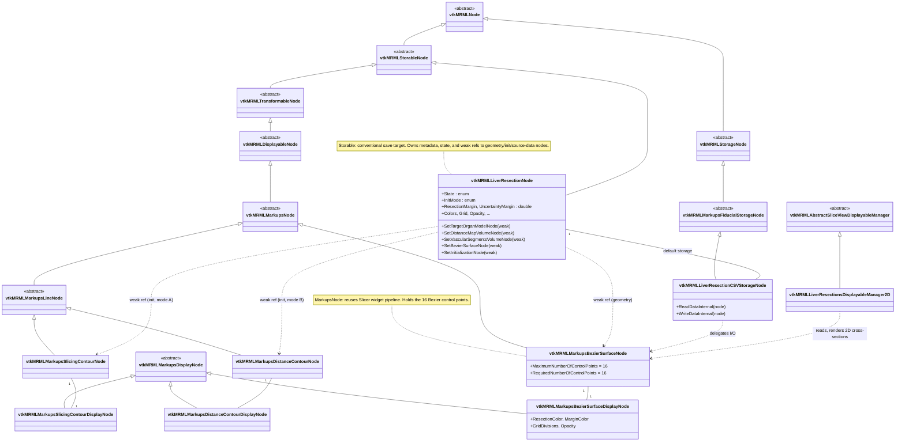

# Slicer-Liver MRML node hierarchy — current state (2026-05-13)

Descriptive snapshot of the MRML class graph for the `LiverResections` and
`LiverMarkups` modules as it exists today on `preview`. This file documents
*what is*, not what should be — see [`adr/0001-resection-three-node-assembly.md`](../adr/0001-resection-three-node-assembly.md)
for the historical rationale behind the current shape.

## Reading guide

- **Solid arrows** (`<|--`): UML inheritance — child class points to its
  parent. Read *"vtkMRMLStorableNode is a vtkMRMLNode"*.
- **Dashed arrows** (`..>`): associations / weak references that do not
  imply ownership. The three-node resection assembly is held together by
  these.
- **`1 -- 1`** lines: composition. The default node pair created together
  (e.g. a content node and its default storage node).
- Top-level abstract classes (`<<abstract>>`) come from Slicer core and
  are included only as orientation; they are not maintained in
  Slicer-Liver.

## Module grouping (read top-to-bottom)

1. **Slicer core base classes** — external; for reference only.
2. **LiverResections.MRML** — the resection content node and its storage
   node.
3. **LiverMarkups.MRML** — the geometry node (BezierSurface) and the two
   initialization-mode nodes (Slicing / Distance contour), each with
   their display nodes.
4. **Three-node resection assembly** — the cross-package associations
   that make a single resection (Initialization + Geometry + Content);
   see [ADR-0001](../adr/0001-resection-three-node-assembly.md).
5. **LiverResections.MRMLDM** — the slice-view displayable manager that
   reads the geometry node and renders 2D cross-sections.
