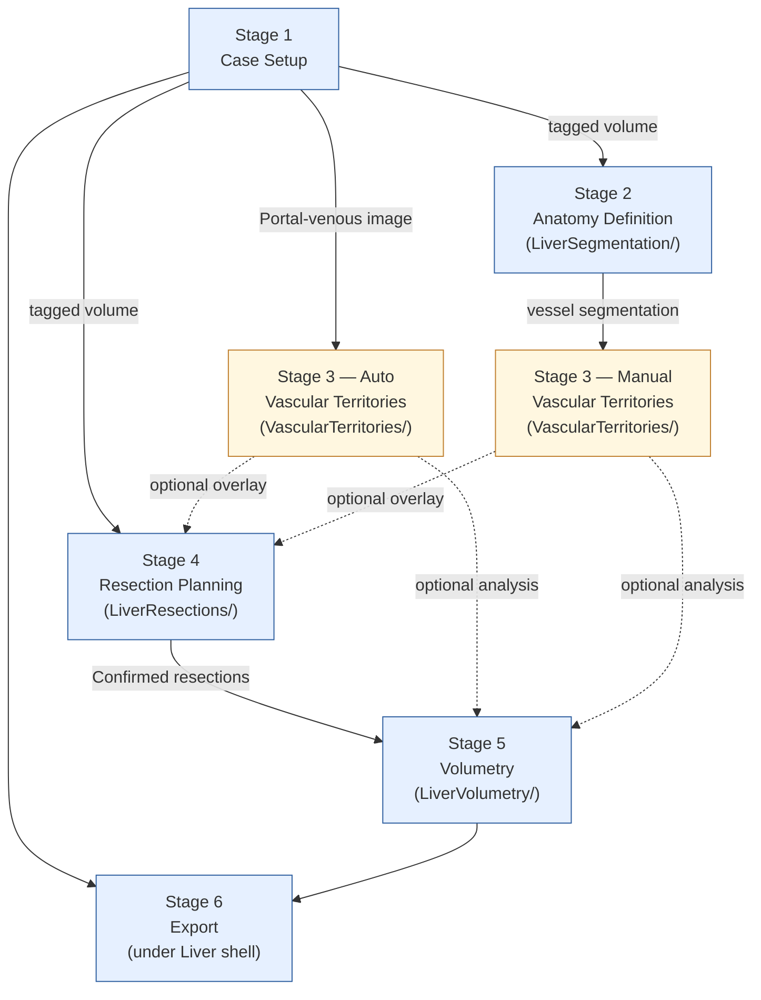
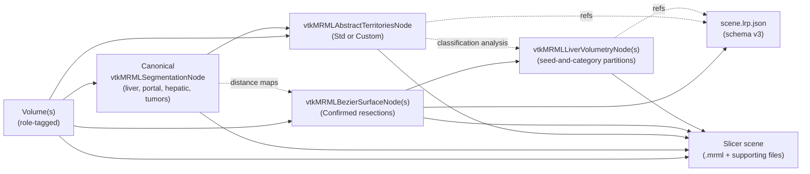

# GUI stage flow — six-stage surgeon workflow

Reference companion to [ADR-0023][adr-0023]. Shows the v2.0.0
six-stage workflow taxonomy, the dependency graph between stages,
the per-stage state-indicator semantics, and the cross-stage data
flow.

[adr-0023]: ../adr/0023-unified-gui-stage-workflow.md
[adr-0009]: ../adr/0009-ux-and-design-discipline.md
[adr-0012]: ../adr/0012-layerdm-migration-v2-scope.md

## Stage dependency graph

Which stages are gated on which. Drives the per-stage state
indicators (✓ done / ● current / ○ pending) in the vertical sidebar
of the Liver shell.

Solid arrows are hard dependencies (stage cannot start without the
upstream output). Dashed arrows are optional consumers (the stage
runs without the upstream input, surfaces a "no overlay / no per-
segment table" state if the input is missing).

Notable shapes:

- **Stage 3 has two independent paths.** Auto depends only on
  Stage 1; Manual depends on Stage 2. A surgeon taking the Auto
  path can skip Stage 2's vessel segmentation entirely.
- **Stage 4 does not depend on Stage 3.** A surgeon can plan a
  non-anatomic resection without computing any territories — the
  classification overlay just disables in that case.
- **Stage 5 depends on Stage 4** (resection surfaces become
  barriers for the seed-and-category partition). Pure volumetry
  without resections is a v2.1+ extension.

## Per-stage state-indicator semantics

The Liver shell's vertical sidebar shows each stage with a state
indicator. Per the ADR's "Conformance" section, each stage exposes
a `isComplete()`-style query driving the indicator.

| Indicator | Meaning |
|-----------|---------|
| ○ pending | Prerequisites not met OR stage not yet visited |
| ● current | Stage is the surgeon's current focus |
| ✓ done    | Stage's primary output produced at least once |

For Stage 3 specifically, "done" can be satisfied by either the
Auto path or the Manual path (or both — they coexist as separate
`vtkMRMLAbstractTerritoriesNode` subclass instances).

## Cross-stage data flow

What flows between stages.

Notable flows:

- **Distance maps** are auto-triggered background infrastructure on
  Stage 4 entry. They consume the canonical Segmentation (tumor +
  portal + hepatic structures) and produce three signed-distance
  fields used as shader uniforms on the resection surface. Not
  persisted with the scene; transient per the 2026-05-14 decision.
- **Classification refs in `.lrp.json`** are scene-local node IDs
  per [ADR-0023][adr-0023]'s sidecar-only stance. Cross-machine
  resolution is v2.1+.

## Module ownership per stage

| Stage | Module | Notes |
|-------|--------|-------|
| 1 — Case Setup | `Liver/` (shell-level affordance) | Wraps Slicer's stock DICOM + Load Data + ScreenCapture |
| 2 — Anatomy Definition | `LiverSegmentation/` (new module) | Orchestrates TotalSegmentator + Kumar-Oram + MONAILabel-DeepGrow + Segment Editor |
| 3 — Vascular Territories | `VascularTerritories/` (renamed from `LiverSegments/`) | Two tabs (Auto / Manual) producing `vtkMRMLAbstractTerritoriesNode` subclass instances |
| 4 — Resection Planning | `LiverResections/` | Resection table + state machine + Bezier widget + resectogram view registration |
| 5 — Volumetry | `LiverVolumetry/` | Seed-and-category partition workbench with Confirmed resections as barriers |
| 6 — Export | `Liver/` (section under the shell) | Wraps `.lrp.json` storage node + Slicer's File ▸ Save Data + ScreenCapture |

The Liver shell hosts the vertical sidebar that navigates between
these per-module surfaces and owns Stages 1 + 6 as native shell
affordances. The Resectogram view (a separate Slicer custom layout
registered by `LiverResections/`) is invoked from Stage 4's per-
resection detail panel, not as its own stage.

## See also

- [ADR-0023 — Unified GUI / six-stage surgeon workflow](../adr/0023-unified-gui-stage-workflow.md) — the design decision this diagram realises.
- [Territories class hierarchy](territories-class-hierarchy.md) — the `vtkMRMLAbstractTerritoriesNode` class graph consumed by Stages 3, 4, and 5.
- [ADR-0009 — UX and design discipline](../adr/0009-ux-and-design-discipline.md) — per-PR UX review gate that the stages-and-sidebar shape grades against.
- [ADR-0012 — LayerDM migration v2.0 scope](../adr/0012-layerdm-migration-v2-scope.md) — which per-module rewrites are in v2.0 vs deferred to v2.1.
