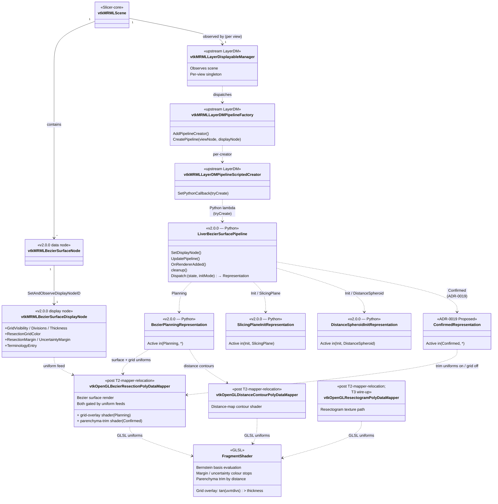

# Rendering pipeline — LayerDM dispatch through to shader uniforms

Reference companion to [ADR-0013][adr-0013] §5 + [ADR-0018][adr-0018].
Shows the data flow from the moment a `vtkMRMLBezierSurfaceNode`
lands in the scene to the point a custom OpenGL mapper writes
framebuffer pixels.  Two views: a **class diagram** of the C++ /
Python types involved + a **sequence diagram** of the runtime
dispatch.

[adr-0013]: ../adr/0013-layerdm-pipeline-pattern.md
[adr-0014]: ../adr/0014-livermarkups-dissolution.md
[adr-0018]: ../adr/0018-nurbs-extension-surface.md

## Class structure

The class diagram shows:

- **Scene → display node → Pipeline**: the scene owns data + display
  nodes; `vtkMRMLLayerDisplayableManager` observes scene events and
  uses the factory to instantiate one Pipeline per `(view,
  display node)` pair.
- **Pipeline → Representation**: one Pipeline owns four
  Representations (v2.0.0 + ADR-0019); dispatch table on
  `(ResectionState, InitializationMode)` picks one active at a time.
- **Representation → custom OpenGL mapper**: each Representation
  owns a (small) set of mappers; the mappers live under
  `LiverResections/VTKWidgets/` post T2-mapper-relocation.
- **Mapper → fragment shader**: each mapper feeds uniforms to a
  GLSL fragment shader that does the actual pixel work.  The
  display node's fields (`GridVisibility`, `GridDivisions`,
  `ResectionMargin`, …) wire into the uniform binds.

## Sequence

## What lands when

| Element                                          | Status                       |
|--------------------------------------------------|------------------------------|
| `vtkMRMLBezierSurfaceNode` + display + storage   | ✓ landed (PRs #341/#348/#350/#361) |
| `vtkSlicerLiverResectionsLogic::RegisterNodes()` | ✓ landed (PR #364)            |
| `vtkMRMLLayerDisplayableManager::RegisterInDefaultViews()` | ✓ landed (PR #369) |
| `vtkMRMLLayerDMPipelineFactory::AddPipelineCreator(...)`   | ✓ landed (PR #369) |
| `LiverBezierSurfacePipeline` (lifecycle, dispatch)         | ✓ landed (PR #354 + #369) |
| `BezierPlanningRepresentation` (with generic mapper)       | ✓ landed (PR #354)  |
| `SlicingPlaneInitRepresentation`                           | ✓ landed (PR #358)  |
| `DistanceSpheroidInitRepresentation`                       | ✓ landed (PR #359)  |
| Custom OpenGL mappers (`vtkOpenGLBezierResectionPolyDataMapper`, …) | ⏳ **T2-mapper-relocation** |
| Display-node fields → mapper uniforms              | ⏳ T2-mapper-relocation |
| Fragment-shader grid overlay                       | ⏳ T2-mapper-relocation |
| Parenchyma-trim shader (Confirmed state)           | ⏳ T2-mapper-relocation + ADR-0019 |
| Resectogram texture path                           | ⏳ T3 |

## Notes

- The upstream `vtkMRMLLayerDisplayableManager` is **generic** — it
  hosts Pipelines without per-module specialisation.  Slicer-Liver
  does NOT subclass it ([ADR-0002][adr-0002] migration commitment;
  rule captured in the project's no-custom-DM memory).
- Pipeline creators are registered as **scripted Python callbacks**
  via `vtkMRMLLayerDMPipelineScriptedCreator` — see PR #369's
  `registerPipelineCreator()` for the canonical invocation.
- The dispatch axis is **display-node class** for the factory and
  **(state, initMode) for the Pipeline's internal Representation
  table**.  ADR-0018 §3 commits sibling Pipelines (not a third axis)
  for the future Bezier vs NURBS divergence.
- Today's Representations attach a **generic** `vtkPolyDataMapper`;
  the custom OpenGL mappers under `LiverMarkups/VTKWidgets/` swap
  in during **T2-mapper-relocation**.

[adr-0002]: ../adr/0002-migrate-to-slicerlayerdm.md
