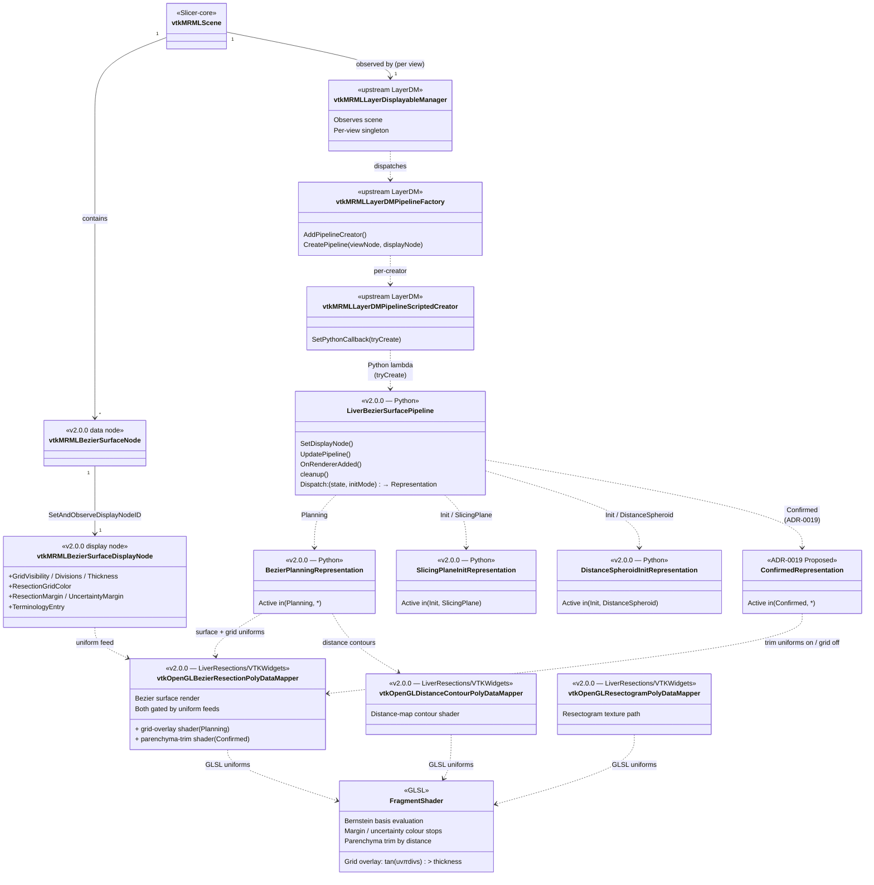
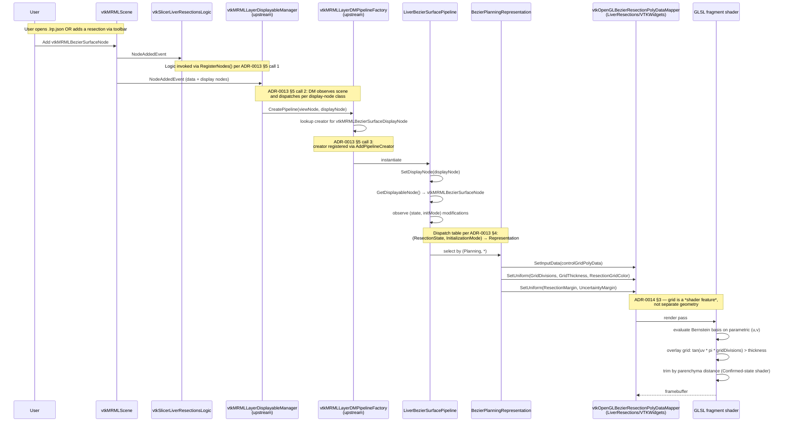

# Rendering pipeline — LayerDM dispatch through to shader uniforms

Reference companion to [ADR-0013][adr-0013] §5 + [ADR-0018][adr-0018]
+ [ADR-0022][adr-0022].  Shows the data flow from the moment a
`vtkMRMLBezierSurfaceNode` lands in the scene to the point a custom
OpenGL mapper writes framebuffer pixels.  Two views: a **class
diagram** of the C++ / Python types involved + a **sequence
diagram** of the runtime dispatch.  v2.1 extends with a NURBS
sibling Pipeline + a single tess-shader mapper covering both
surface types — see "v2.1 NURBS sibling" below.

[adr-0013]: ../adr/0013-layerdm-pipeline-pattern.md
[adr-0014]: ../adr/0014-livermarkups-dissolution.md
[adr-0018]: ../adr/0018-nurbs-extension-surface.md
[adr-0020]: ../adr/0020-gpu-tessellation.md
[adr-0022]: ../adr/0022-nurbs-v2-1-design.md

## Class structure

The class diagram shows:

- **Scene → display node → Pipeline**: the scene owns data + display
  nodes; `vtkMRMLLayerDisplayableManager` observes scene events and
  uses the factory to instantiate one Pipeline per `(view,
  display node)` pair.
- **Pipeline → Representation**: one Pipeline owns four
  Representations (v2.0.0 + ADR-0019); dispatch table on
  `(ResectionState, InitializationMode)` picks one active at a time.
- **Representation → custom OpenGL mapper**: each Representation
  owns a (small) set of mappers; the mappers live under
  `LiverResections/VTKWidgets/` (relocated there, ADR-0014 §3).
- **Mapper → fragment shader**: each mapper feeds uniforms to a
  GLSL fragment shader that does the actual pixel work.  The
  display node's fields (`GridVisibility`, `GridDivisions`,
  `ResectionMargin`, …) wire into the uniform binds.

## Sequence

## What lands when

| Element                                          | Status                       |
|--------------------------------------------------|------------------------------|
| `vtkMRMLBezierSurfaceNode` + display + storage   | ✓ landed (PRs #341/#348/#350/#361) |
| `vtkSlicerLiverResectionsLogic::RegisterNodes()` | ✓ landed (PR #364)            |
| `vtkMRMLLayerDisplayableManager::RegisterInDefaultViews()` | ✓ landed (PR #369) |
| `vtkMRMLLayerDMPipelineFactory::AddPipelineCreator(...)`   | ✓ landed (PR #369) |
| `LiverBezierSurfacePipeline` (lifecycle, dispatch)         | ✓ landed (PR #354 + #369) |
| `BezierPlanningRepresentation` (drives the real mapper)    | ✓ landed (PR #354; real-mapper wiring in the #493/#501 cutover) |
| `SlicingPlaneInitRepresentation`                           | ✓ landed (PR #358)  |
| `DistanceSpheroidInitRepresentation`                       | ✓ landed (PR #359)  |
| Custom OpenGL mappers (`vtkOpenGLBezierResectionPolyDataMapper`, …) | ✓ landed — relocated to `LiverResections/VTKWidgets/` (ADR-0014 §3); a hard requirement (#498) |
| Display-node fields → mapper uniforms              | ✓ landed (#493/#501 cutover) |
| Fragment-shader grid overlay                       | ✓ landed (#493/#501 cutover) |
| Parenchyma-trim shader (Confirmed state)           | ⏳ `ConfirmedRepresentation` still on a generic mapper — custom relocation not yet landed (ADR-0019) |
| Resectogram texture path                           | ◐ real 2D mapper + wrapper-sourced distance-shading inputs landed (#509); the `FlattenedSurfaceRepresentation` GL texture-bind gate is still open |
| v1 markups Bézier render + node + legacy `.lrp.fcsv` load  | ✓ fully retired (#493 / PR #512) |

## Notes

- The upstream `vtkMRMLLayerDisplayableManager` is **generic** — it
  hosts Pipelines without per-module specialisation.  Slicer-Liver
  does NOT subclass it ([ADR-0002][adr-0002] migration commitment;
  rule captured in the project's no-custom-DM memory).
- Pipeline creators are registered as **scripted Python callbacks**
  via `vtkMRMLLayerDMPipelineScriptedCreator` — see PR #369's
  `registerPipelineCreator()` for the canonical invocation.
- The dispatch axis is **display-node class** for the factory and
  **(state, initMode) for the Pipeline's internal Representation
  table**.  ADR-0018 §3 commits sibling Pipelines (not a third axis)
  for the future Bezier vs NURBS divergence.
- The Representations drive their **real** custom OpenGL mappers
  (`vtkOpenGLBezierResectionPolyDataMapper`, the contour + resection-2D
  mappers), relocated to `LiverResections/VTKWidgets/` (ADR-0014 §3) and
  now a hard requirement — a resolver miss raises rather than silently
  degrading to a generic `vtkPolyDataMapper` (#498).  The lone exception
  is `ConfirmedRepresentation`, whose parenchyma-trim mapper has not been
  relocated yet and remains a generic `vtkPolyDataMapper`.

[adr-0002]: ../adr/0002-migrate-to-slicerlayerdm.md

## v2.1 NURBS sibling (deferred — per [ADR-0022][adr-0022])

[ADR-0018][adr-0018] §3 commits a `LiverNurbsSurfacePipeline` sibling
to `LiverBezierSurfacePipeline`, registered with the LayerDM
pipeline factory against `vtkMRMLNurbsSurfaceDisplayNode`.
[ADR-0022][adr-0022] fills in the v2.1 specifics:

- **Data node trio** (per [ADR-0022][adr-0022] Decision 1):
  `vtkMRMLNurbsSurfaceNode` + `vtkMRMLNurbsSurfaceDisplayNode` +
  `vtkMRMLNurbsSurfaceStorageNode`, peer to the Bezier trio — no
  shared abstract parent.  Field roster includes `DegreeU`,
  `DegreeV`, `KnotsU`, `KnotsV`, `Weights` alongside the shared
  `Rows`, `Cols`, `ControlGrid`, `State`, `InitMode`.
- **Sibling Pipeline + Representation** (per [ADR-0018][adr-0018]
  §3): `LiverNurbsSurfacePipeline` + `NurbsPlanningRepresentation`.
  `ConfirmedRepresentation` ([ADR-0019][adr-0019]) and the init-mode
  Representations are **shared** across Bezier and NURBS — the
  parenchyma trim is a uniform-controlled fragment-shader `discard`
  independent of surface type, and the surgeon's init input is
  representation-agnostic.
- **Single tess-shader mapper** (per [ADR-0022][adr-0022] Decision 4
  + [ADR-0020][adr-0020]): one
  `vtkOpenGLParametricSurfaceMapper` subclassing
  `vtkOpenGLPolyDataMapper`; a `surfaceType` shader variant picks
  between Bernstein evaluation (Bezier) and de Boor + rational
  weight division (NURBS) in the TES stage.  Vertex shader, tess
  control shader, and fragment shader are shared between the two
  variants — only TES diverges.  The new mapper replaces
  `vtkOpenGLBezierResectionPolyDataMapper` for **both** surface
  types as part of [ADR-0020][adr-0020]'s paired Bezier+NURBS GPU
  migration.
- **Pipeline factory dispatch** stays on display-node class — exact
  sibling dispatch, no SafeDownCast cascade.  Each Pipeline
  constructs the shared single mapper class with the right
  `SetSurfaceType(Bezier|NURBS)` initialisation.
- **CPU evaluator** (`vtkLiverNurbsSurfaceSource`, per
  [ADR-0022][adr-0022] Decision 3 — custom-atop-Eigen) stays
  reachable for downstream algorithms (distance map, resectogram,
  exports per [ADR-0015][adr-0015]) and as the reference for the
  CPU-vs-GPU characterisation tests pinning tess-mapper output to
  the CPU evaluator's `(u, v)` mapping.

The v2.0.0 class + sequence diagrams above stay accurate for the
v2.0.0 Bezier path.  The v2.1 expansion to a NURBS sibling +
single-class shader-variant mapper lands as part of the
[ADR-0020][adr-0020] enabler PR (NURBS-5 in the
[ADR-0022][adr-0022] rollout plan); the architecture diagrams in
this file are updated then.

[adr-0015]: ../adr/0015-cpp-algorithm-library.md
[adr-0019]: ../adr/0019-resection-state-machine.md
