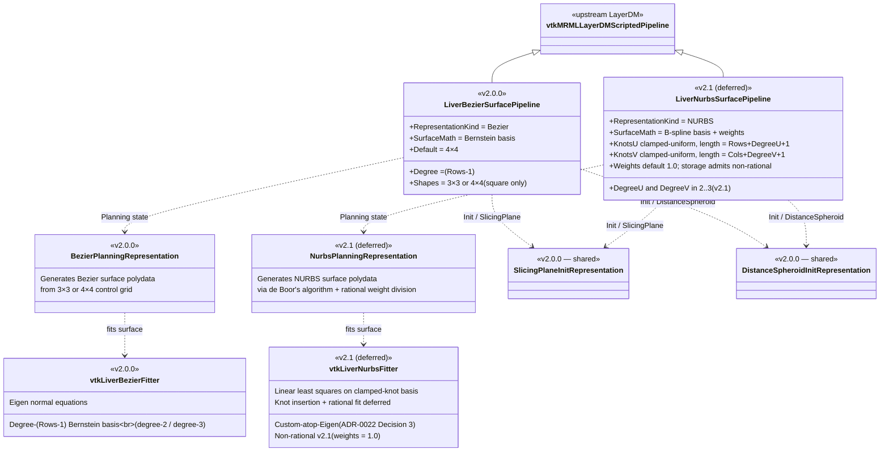

# Surface representation taxonomy — Bezier ↔ NURBS

Reference companion to [ADR-0018][adr-0018] and [ADR-0022][adr-0022].
Shows the sibling-Pipeline + sibling-Representation + sibling-Fitter
taxonomy that lands in v2.0.0 (Bezier-only) and extends in v2.1
(NURBS), with the schema-v3 field roster per [ADR-0022][adr-0022]
Decision 2.

[adr-0018]: ../adr/0018-nurbs-extension-surface.md
[adr-0022]: ../adr/0022-nurbs-v2-1-design.md
[adr-0013]: ../adr/0013-layerdm-pipeline-pattern.md
[adr-0015]: ../adr/0015-cpp-algorithm-library.md

## Class taxonomy

## Mathematical model contrast

| Aspect              | Bezier (v2.0.0)                          | NURBS (v2.1 Proposed)                                 |
|---------------------|------------------------------------------|-------------------------------------------------------|
| Basis               | Bernstein polynomials                    | B-spline (with weights → rational B-spline)           |
| Degree              | Implicit from control polygon: `(Rows-1) × (Cols-1)` | Independent per axis: `DegreeU`, `DegreeV` |
| Knots               | Implicit (uniform)                       | Explicit per axis (`KnotsU`, `KnotsV`); clamped       |
| Weights             | Uniform (1.0 per control point; non-rational) | Per control point (`Weights[i, j]`); rational    |
| Control polygon     | `{3×3, 4×4}` square-only (default 4×4)   | M × N (no default; surgeon-chosen)                    |
| Local control       | Full surface depends on every control point | Locally bounded by `DegreeU+1 × DegreeV+1` span     |
| Evaluation          | Direct Bernstein polynomial sum          | de Boor's algorithm (recursive) + weight division     |
| Conic-section repro | Approximation                            | Exact (circles, ellipses, hyperbolas via weights)     |
| Continuity at knots | C∞ (single Bezier patch)                 | C^(DegreeU-1) at internal knots                       |

## NURBS branch — `.lrp.json` schema-v3 fields

Per [ADR-0022][adr-0022] Decision 2 the storage schema bumps from v2
to v3 with a top-level `surfaceType: "Bezier" | "NURBS"` discriminator.
When `surfaceType == "NURBS"` the following NURBS-specific fields
appear alongside the v2 shape:

| Field | JSON type | Length / constraint | Meaning |
|---|---|---|---|
| `surfaceType` | string | `"NURBS"` (or `"Bezier"`; absent → implicit Bezier) | top-level discriminator |
| `rows` | int | `rows ≥ degreeU + 1` | per-axis control-point count |
| `cols` | int | `cols ≥ degreeV + 1` | per-axis control-point count |
| `degreeU` | int | `2 ≤ degreeU ≤ 3` in v2.1 | per-axis basis degree |
| `degreeV` | int | `2 ≤ degreeV ≤ 3` in v2.1 | per-axis basis degree |
| `knotsU` | array&lt;double&gt; | `len = rows + degreeU + 1`; non-decreasing; clamped at both ends | U-direction knot vector |
| `knotsV` | array&lt;double&gt; | `len = cols + degreeV + 1`; non-decreasing; clamped at both ends | V-direction knot vector |
| `weights` | array&lt;double&gt; | `len = rows * cols`; strictly positive | per-control-point rational weights (default `1.0`) |
| `controlGrid` | array&lt;double&gt; | `len = 3 * rows * cols` | row-major xyz control-point coordinates (same shape as Bezier) |

Reader compat is backward to v1 (implicit 4×4 Bezier) and v2
(explicit Bezier shape).  Bezier writes always omit
`degreeU` / `degreeV` / `knotsU` / `knotsV` / `weights` (they have
no meaning for the Bernstein basis).  See [ADR-0022][adr-0022]
Decision 2 for the full reader/writer compat matrix +
validation-rule enumeration.

## What is shared, what is sibling

**Shared across v2.0.0 + v2.1:**

- The dispatch contract for `(ResectionState, InitializationMode)`
  per [ADR-0013][adr-0013] §4.
- The init-mode Representations (`SlicingPlaneInitRepresentation` +
  `DistanceSpheroidInitRepresentation`) — the surgeon's input is
  representation-agnostic; surface fitting only differs **after**
  Init data is committed.
- The widget — `vtkLiverBezierWidget` (per [ADR-0014][adr-0014] §3)
  manipulates an M×N control polygon regardless of the underlying
  Bezier-vs-NURBS math.  The ring-group taxonomy generalises (see
  `control-grid-grouping.md`); the manipulation events fire the same
  way for both representations.  v2.1 may add NURBS-specific events
  (e.g., "edit weight at corner" for rational weights) but the core
  positional manipulation is shared.

[adr-0014]: ../adr/0014-livermarkups-dissolution.md

**Sibling (separate for v2.0.0 vs v2.1):**

- Data + display + storage MRML node trios.
- Pipeline classes.
- Planning-state Representations.
- Surface fitters under `LiverResections/Algorithm/` (per
  [ADR-0015][adr-0015]).
- `.lrp.json` schema (v2 carries Bezier-only fields; v3 adds the
  NURBS extension fields when `representationKind == "Nurbs"`).

## Why sibling, not polymorphic

See [ADR-0018][adr-0018] §"Why sibling Pipelines, not a polymorphic third
axis" for the design-decision narrative.  Short form: the Pipeline
factory dispatches on **display-node class**; sibling display-node
types give exact-class dispatch with no SafeDownCast cascade.

## Out of scope of this diagram

- Trimmed NURBS, subdivision surfaces, T-splines.  Excluded by
  [ADR-0018][adr-0018]'s "Out of scope" list.
- The render-time data flow (Pipeline → Mapper → shader) — see
  `rendering-pipeline.md`.
- The widget control-grid grouping math — see
  `control-grid-grouping.md`.
- The data-node field roster — see `target-mrml-node-hierarchy.md`.
