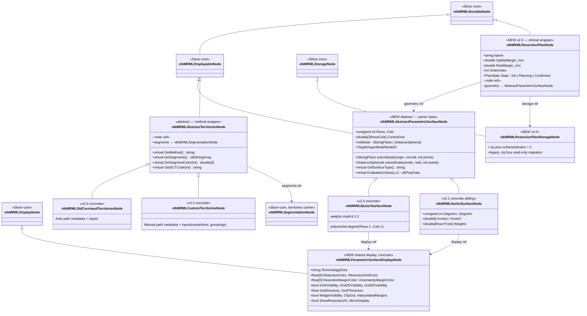
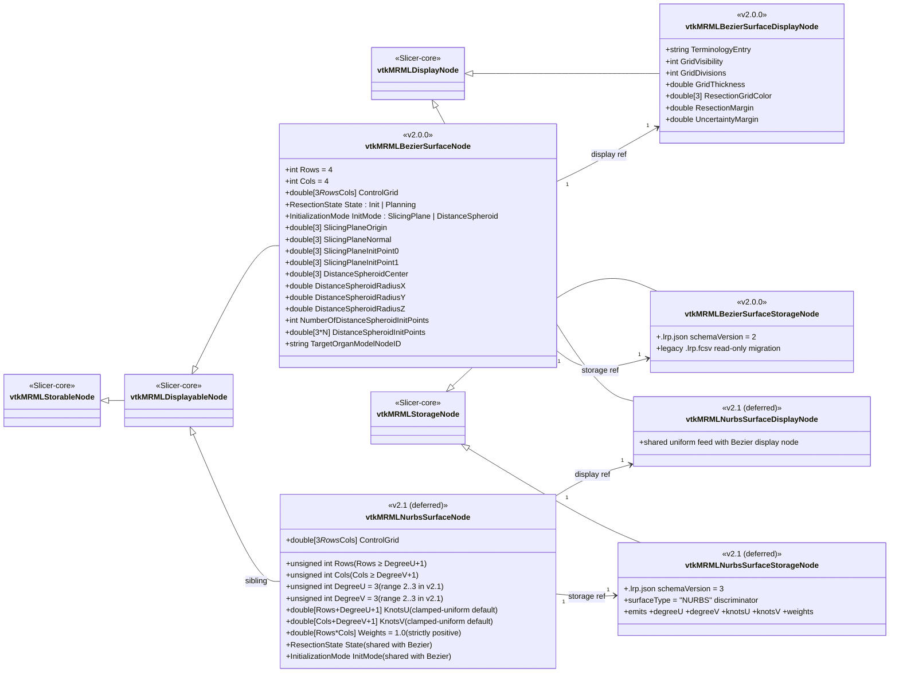

# Target MRML node hierarchy — post-T2 + ADR-0018 / ADR-0022 extension surface

Reference companion to [ADR-0018][adr-0018] and [ADR-0022][adr-0022].
Shows the post-T2 parametric-surface family
(`vtkMRMLBezierSurfaceNode` trio) with the v2.0.0 variable-size
commitment + the v2.1 NURBS sibling extension surface
(field-roster details per [ADR-0022][adr-0022] Decision 1).

[adr-0018]: ../adr/0018-nurbs-extension-surface.md
[adr-0022]: ../adr/0022-nurbs-v2-1-design.md
[adr-0014]: ../adr/0014-livermarkups-dissolution.md
[adr-0015]: ../adr/0015-cpp-algorithm-library.md
[adr-0001]: ../adr/0001-resection-three-node-assembly.md
[adr-0023]: ../adr/0023-unified-gui-stage-workflow.md

## Amendments

- **2026-05-25 — Wrapper-vs-carrier pattern; abstract parametric
  surface base; plan node; shared display class.**  The
  sibling-based hierarchy below is **superseded** by the diagram in
  the next section ("Target hierarchy — 2026-05-25 amendment").  The
  amendment lands four concurrent shifts authored in
  [ADR-0014][adr-0014] amendment "Fourth layer: clinical/method
  wrapper" and [ADR-0023][adr-0023] amendment "Wrapper-vs-carrier
  pattern":

  1. **Abstract parametric surface base**:
     `vtkMRMLAbstractParametricSurfaceNode` is the carrier base; Bezier
     and NURBS become concrete subclasses, not siblings.  ADR-0018's
     "Why a single data type per representation kind, not a parent
     class" framing inverts: the polymorphic substitutability the
     plan node needs requires a shared base.
  2. **`vtkMRMLResectionPlanNode` (NEW)**: the *clinical wrapper* that
     holds surgeon-facing fields (name, Safety + Risk margins,
     ordering, plan state) and references the abstract surface via
     a typed `geometry` node-reference role.  Restores the v1
     `vtkMRMLLiverResection*` clinical layer that T2.7's retirement
     otherwise orphans.
  3. **Shared display class**: `vtkMRMLBezierSurfaceDisplayNode`
     renames to `vtkMRMLParametricSurfaceDisplayNode` and is shared
     by both Bezier + NURBS concretes (Slicer Markups precedent).
     **Drops** the scalar `ResectionMargin` / `UncertaintyMargin`
     fields the v2.0 plan draft tucked there; those move to the
     plan node.  Retains margin **colors** only.
  4. **Plan-rooted storage**: `vtkMRMLBezierSurfaceStorageNode`
     retires in favour of `vtkMRMLResectionPlanStorageNode` which
     owns the `.lrp.json` file.  The abstract surface becomes
     **non-storable** (no default storage node).

  The territories family (`vtkMRMLAbstractTerritoriesNode` + two
  concrete subclasses) follows the same wrapper-vs-carrier pattern,
  wrapping a `vtkMRMLSegmentationNode` carrier — see
  [`territories-class-hierarchy.md`](territories-class-hierarchy.md)
  for the family diagram.  Both families appear in the amended
  hierarchy below.

## Target hierarchy — 2026-05-25 amendment

### Notes — 2026-05-25 amendment

- **Abstract carrier base instead of siblings.** The pre-amendment
  diagram (preserved below for historical record) committed to
  Bezier and NURBS as siblings without a shared parent.  The
  wrapper-vs-carrier pattern requires the plan node to reference a
  polymorphic surface type — that forces a shared abstract base.
  ADR-0018's "Why a single data type per representation kind"
  framing inverts on this point.
- **Single shared display class** mirrors Slicer's
  `vtkMRMLMarkupsDisplayNode` serving 8+ markup subclasses.  No
  abstract display base until a per-surface-type display field
  appears.
- **Surface is non-storable.**  `CreateDefaultStorageNode()` returns
  `nullptr` on `vtkMRMLAbstractParametricSurfaceNode`.  Surface
  bulk data persists through `vtkMRMLResectionPlanStorageNode`
  (the wrapper owns the storage).
- **Margin scalars live on the plan node, not the display node.**
  The display node carries margin **colors** only.
- **Territories wrap a `vtkMRMLSegmentationNode`** (Slicer-core
  carrier).  Segment masks persist through the segmentation's own
  `.seg.nrrd` storage, not through `.lrp.json`.  See
  [`territories-class-hierarchy.md`](territories-class-hierarchy.md).
- **Plan ↔ Territories**: no node reference.  Per
  [ADR-0023][adr-0023] amendment, plans do not reference
  territories or partitions or UI stage state.  Visual co-existence
  is the only coupling.

## Pre-amendment hierarchy (historical record)

The diagram + notes below predate the 2026-05-25 amendment and are
preserved as historical record. See "Target hierarchy — 2026-05-25
amendment" above for the current target.

## Notes

- **Sibling, not subclass.** Per [ADR-0018][adr-0018] §"Why a single data
  type per representation kind, not a parent class", the NURBS trio
  parallels the Bezier trio without a shared parent.  Field-level
  duplication (`Rows`, `Cols`, `ControlGrid`, `State`, `InitMode`) is
  intentional — it preserves Slicer's "peer types, no geometry-parent"
  convention (`vtkMRMLModelNode` and `vtkMRMLMarkupsNode` are
  parallel; this trio is parallel for the same reasons).
- **Default for the Bezier node is 4×4** ([ADR-0018][adr-0018] §1).
  v2.0.0 admits `(Rows, Cols) ∈ {(3, 3), (4, 4)}` only — square-only,
  two shapes; per-setter validation rejects other values with
  `vtkErrorMacro`.  Arbitrary M×N is NURBS-territory and lands with
  `vtkMRMLNurbsSurfaceNode` in v2.1.  Legacy `.lrp.fcsv` files (per
  [ADR-0014][adr-0014] §5's migration path) implicitly load as 4×4.
- **Legacy `vtkMRMLLiverResection*` nodes** (the pre-rename / pre-T2
  family) are retired by **T2.7**.  They do not appear here.
- **NURBS-specific fields** (`DegreeU`, `DegreeV`, `KnotsU`, `KnotsV`,
  `Weights`) live ONLY on `vtkMRMLNurbsSurfaceNode`; the Bezier node
  has no degree field (always polynomial degree `Rows-1` × `Cols-1`)
  and no weights (uniform rational coefficients are implicit Bezier).
- **Field defaults + ranges** on `vtkMRMLNurbsSurfaceNode` come from
  [ADR-0022][adr-0022] Decision 1: `DegreeU` / `DegreeV` default to
  `3` (cubic NURBS, surgical-planning canonical), admitted range
  `{2, 3}` in v2.1; `Weights` default to all `1.0` (non-rational /
  B-spline degenerate case); `KnotsU` / `KnotsV` default to a
  clamped-uniform vector of length `Rows + DegreeU + 1` (resp.
  `Cols + DegreeV + 1`).  Per-control-point editable weights are
  out of scope for the v2.1 UI per [ADR-0022][adr-0022] "Out of
  scope".
- **Storage schema v3** per [ADR-0022][adr-0022] Decision 2 adds a
  top-level `surfaceType: "Bezier" | "NURBS"` discriminator;
  Bezier-side storage stays at the v2 field roster (no degree,
  knots, or weights emitted).
- The data → display node reference is the
  `SetAndObserveDisplayNodeID` standard Slicer relationship.  The
  data → storage node reference is `SetAndObserveStorageNodeID` per
  [ADR-0001][adr-0001].

## Out of scope of this diagram

- The LayerDM Pipeline + Representation taxonomy — see
  `surface-representation-taxonomy.md`.
- The render-time data flow (Pipeline → Mapper → shader) — see
  `rendering-pipeline.md`.
- The widget control-grid grouping math — see
  `control-grid-grouping.md`.
- Trimmed NURBS, subdivision surfaces — out of scope per
  [ADR-0018][adr-0018]'s "Out of scope" section.
