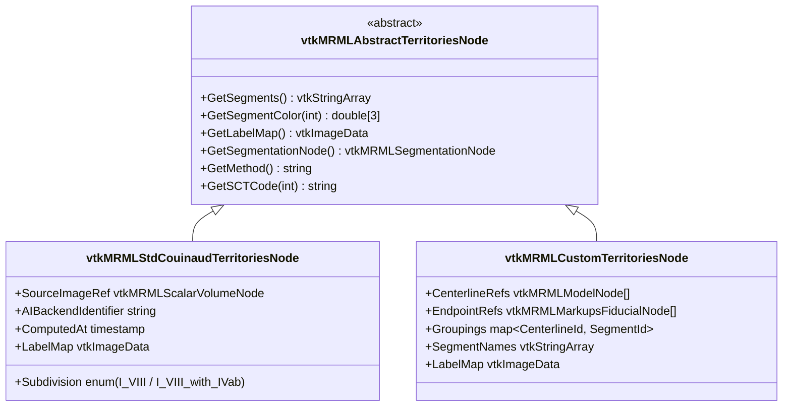

# Territories class hierarchy — `vtkMRMLAbstractTerritoriesNode`

Reference companion to [ADR-0023][adr-0023] Decision §"Class
abstraction for territories". Shows the v2.0.0 territories
node-class hierarchy that unifies the Stage 3 Auto path (AI
inference) and Manual path (VMTK-extracted centerlines grouped into
segments) at the node-type level without forcing a shared data
model.

[adr-0023]: ../adr/0023-unified-gui-stage-workflow.md
[adr-0004]: ../adr/0004-python-cpp-boundary.md
[adr-0011]: ../adr/0011-sct-terminology-dispatch.md

## Class diagram

The base class exposes only what downstream consumers need
(Stage 4's classification overlay, Stage 5's per-segment volume
analysis). Subtype-specific state stays on the concrete subclass.

## Why two subtypes rather than one node with a `method` enum

The 2026-05-15 volumetry-framework PKS note proposed one
`vtkMRMLLiverVolumetryNode` for all territory and volumetry use
cases, with a `method` attribute discriminating Couinaud vs
resection vs custom. The 2026-05-21 grilling pass (Q11) retracted
this:

- **Auto and Manual hold genuinely different data.** Auto holds
  only the source image ref + AI backend identifier + the output
  labelmap. Manual holds centerlines, endpoints, groupings — none
  of which the Auto path produces. A single node class with
  optional fields for each variant becomes a sparsely-populated
  bag.
- **Slicer's node-type filter on `qMRMLNodeComboBox`** is the
  natural mechanism for "show me a territories node, polymorphic
  on subtype." A `method` attribute would require custom filter
  logic.
- **Subject Hierarchy organisation** can use the concrete subclass
  name as part of the per-row label naming convention ("Auto
  Couinaud (2026-05-21)" / "Custom — Patient-specific watershed").

## Polymorphic interface

All downstream consumers use the abstract base. No `dynamic_cast`
or method-string branching.

| Consumer | Interface method used | Notes |
|----------|-----------------------|-------|
| Stage 4 overlay | `GetSegments()`, `GetSegmentColor(i)`, `GetSegmentationNode()` | Renders the segmentation in 3D + slice views with the classification colours |
| Stage 5 per-segment table | `GetSegments()`, `GetLabelMap()` | Intersects with the resection-volumetry partition to produce per-segment-vs-per-resection volumes |
| `.lrp.json` writer | reference + `GetMethod()` | Schema v3 stores the node ID + subtype discriminator |
| Subject Hierarchy | reference + concrete subclass | Folder placement under "Vascular Territories"; naming follows the subtype |

## Python/C++ boundary

Per [ADR-0004][adr-0004], MRML node classes are C++ data-only.
Method bodies in the data nodes do not encode business logic —
they expose stored state. Logic that interprets the territories
(e.g., "compute per-segment intersection with a resection
partition") lives in Python modules' Logic classes.

## SCT terminology binding

`GetSCTCode(int)` returns the SCT triple for a given segment
index, per [ADR-0011][adr-0011]'s dispatch alphabet:

- `vtkMRMLStdCouinaudTerritoriesNode` returns the 10 Couinaud SCT
  triples (Caudate 71133005, II 277956007, III 277957003, …) — see
  the SlicerLiver-private terminology JSON.
- `vtkMRMLCustomTerritoriesNode` returns SCT triples *if* the
  surgeon opted-in to tagging segments (per the Stage 3 Manual
  tab's `[⋯ → Tag with SCT…]` per-segment menu item). Otherwise
  returns an empty string — downstream consumers fall back to the
  segment name.

## Persistence

Both subtypes serialise via the MRML scene's standard XML
mechanism + their respective storage nodes (TBD; either a single
`vtkMRMLAbstractTerritoriesStorageNode` with subtype-aware reading,
or per-subtype storage nodes). Schema v3 of `.lrp.json` stores
only a *reference* (scene-local node ID + subtype discriminator),
not the full content — the full content lives in the scene's
companion `.mrml`.

## See also

- [ADR-0023 — Unified GUI / six-stage surgeon workflow](../adr/0023-unified-gui-stage-workflow.md) — Decision §"Class abstraction for territories" + Conformance entries grepping for the class names.
- [GUI stage flow](gui-stage-flow.md) — where these classes plug into the workflow.
- [ADR-0004 — Python / C++ boundary](../adr/0004-python-cpp-boundary.md) — why these are C++ data-only.
- [ADR-0011 — SCT terminology dispatch](../adr/0011-sct-terminology-dispatch.md) — segment-vocabulary contract these nodes honour.
