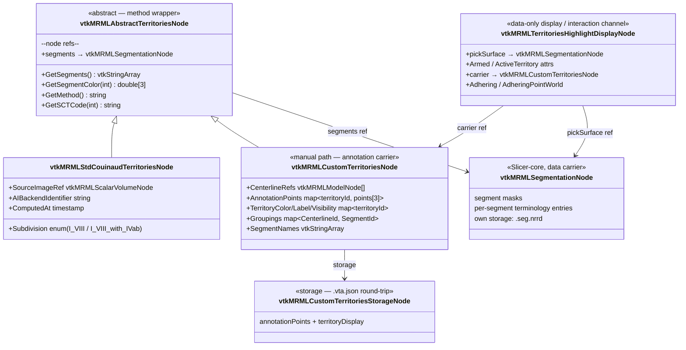

# Territories class hierarchy — `vtkMRMLAbstractTerritoriesNode`

Reference companion to [ADR-0023][adr-0023] Decision §"Class
abstraction for territories". Shows the v2.0.0 territories
node-class hierarchy that unifies the Stage 3 Auto path (AI
inference) and Manual path (VMTK-extracted centerlines grouped into
segments) at the node-type level without forcing a shared data
model.

[adr-0023]: ../adr/0023-unified-gui-stage-workflow.md
[adr-0004]: ../adr/0004-python-cpp-boundary.md
[adr-0011]: ../adr/0011-sct-terminology-dispatch.md

## Class diagram

Annotation moved **off Slicer markups** ([ADR-0037][adr-0037]): the
manual path's endpoints are now an own ordered per-territory
`AnnotationPoints` carrier on `vtkMRMLCustomTerritoriesNode` (with a
per-territory colour/label/visibility display slot), round-tripped by
`vtkMRMLCustomTerritoriesStorageNode` (`.vta.json`). Placement, edit, and
the cross-view adhering highlight run through LayerDM scripted pipelines
(`TerritoryPlacementPipeline` for 3D views, `TerritorySlicePipeline` for
slice views) keyed on the data-only `vtkMRMLTerritoriesHighlightDisplayNode`,
which also carries the shared arm/active/carrier interaction state
([ADR-0013][adr-0013] one Pipeline per display-node type; [ADR-0032][adr-0032]
interaction via the Pipeline seam).

[adr-0037]: ../adr/0037-vascular-territories-off-markups.md
[adr-0013]: https://github.com/ALive-research/Slicer-Liver/blob/preview/Docs/adr/0013-layerdm-pipeline-pattern.md
[adr-0032]: ../adr/0032-v2-interaction-via-layerdm-pipeline-seam.md

The base class exposes only what downstream consumers need
(Stage 4's classification overlay, Stage 5's per-segment volume
analysis). Subtype-specific state stays on the concrete subclass.

The **segment masks** do not live on the territories node. They
live in the referenced `vtkMRMLSegmentationNode` (Slicer-core),
reached via the typed `segments` node-reference role. This is the
*wrapper-vs-carrier* pattern authored in
[ADR-0014][adr-0014] amendment "Fourth layer: clinical/method
wrapper" (2026-05-25): the territories node is the **method
wrapper** carrying SCT alphabet + method-specific inputs; the
segmentation node is the **canonical data carrier**.

Earlier drafts of this hierarchy carried a `LabelMap vtkImageData`
field on both concrete subclasses + a `GetLabelMap()` accessor on
the abstract base, duplicating what the referenced
`vtkMRMLSegmentationNode` already provides. The 2026-05-25
amendment to [ADR-0023][adr-0023] tightens the interface: the
labelmap accessor is **dropped**; callers reach a binary labelmap
representation via
`GetSegmentationNode()->GetBinaryLabelmapRepresentation(...)`.

## Why two subtypes rather than one node with a `method` enum

The 2026-05-15 volumetry-framework PKS note proposed one
`vtkMRMLLiverVolumetryNode` for all territory and volumetry use
cases, with a `method` attribute discriminating Couinaud vs
resection vs custom. The 2026-05-21 grilling pass (Q11) retracted
this:

- **Auto and Manual hold genuinely different data.** Auto holds
  only the source image ref + AI backend identifier + the output
  labelmap. Manual holds centerlines, endpoints, groupings — none
  of which the Auto path produces. A single node class with
  optional fields for each variant becomes a sparsely-populated
  bag.
- **Slicer's node-type filter on `qMRMLNodeComboBox`** is the
  natural mechanism for "show me a territories node, polymorphic
  on subtype." A `method` attribute would require custom filter
  logic.
- **Subject Hierarchy organisation** can use the concrete subclass
  name as part of the per-row label naming convention ("Auto
  Couinaud (2026-05-21)" / "Custom — Patient-specific watershed").

## Polymorphic interface

All downstream consumers use the abstract base. No `dynamic_cast`
or method-string branching.

| Consumer | Interface method used | Notes |
|----------|-----------------------|-------|
| Stage 4 overlay | `GetSegments()`, `GetSegmentColor(i)`, `GetSegmentationNode()` | Renders the segmentation in 3D + slice views with the classification colours |
| Stage 5 per-segment table | `GetSegments()`, `GetSegmentationNode()` | Intersects the segmentation's binary labelmap representation with the resection-volumetry partition to produce per-segment-vs-per-resection volumes |
| Subject Hierarchy | reference + concrete subclass | Folder placement under "Vascular Territories"; naming follows the subtype |

The `.lrp.json` writer is **not** in this table: per the
[ADR-0023][adr-0023] 2026-05-25 amendment "Wrapper-vs-carrier
pattern", `.lrp.json` files carry plan + surface only — they do
not reference territories at all.

## Python/C++ boundary

Per [ADR-0004][adr-0004], MRML node classes are C++ data-only.
Method bodies in the data nodes do not encode business logic —
they expose stored state. Logic that interprets the territories
(e.g., "compute per-segment intersection with a resection
partition") lives in Python modules' Logic classes.

## SCT terminology binding

`GetSCTCode(int)` returns the SCT triple for a given segment
index, per [ADR-0011][adr-0011]'s dispatch alphabet:

- `vtkMRMLStdCouinaudTerritoriesNode` returns the 10 Couinaud SCT
  triples (Caudate 71133005, II 277956007, III 277957003, …) — see
  the SlicerLiver-private terminology JSON.
- `vtkMRMLCustomTerritoriesNode` returns SCT triples *if* the
  surgeon opted-in to tagging segments (per the Stage 3 Manual
  tab's `[⋯ → Tag with SCT…]` per-segment menu item). Otherwise
  returns an empty string — downstream consumers fall back to the
  segment name.

## Persistence

The **segment masks** persist via the referenced
`vtkMRMLSegmentationNode`'s standard storage path (`.seg.nrrd` via
`vtkMRMLSegmentationStorageNode`). The territories wrapper itself
carries only method metadata — small enough that its own persistence
either rides the MRML scene's standard XML mechanism (lightweight
`WriteXML` per Slicer convention) or, if a dedicated storage proves
useful for surgeon-to-surgeon hand-off of method-specific inputs
(custom-path centerline refs + groupings), a small per-subtype
storage node carrying only that metadata.

`.lrp.json` files do **not** carry any territories reference per the
[ADR-0023][adr-0023] 2026-05-25 amendment "Wrapper-vs-carrier
pattern". Cross-machine plan transfer no longer carries a stable-ID
resolution problem for territories — they are scene-level state
that does not travel with `.lrp.json`.

## See also

- [ADR-0023 — Unified GUI / six-stage surgeon workflow](../adr/0023-unified-gui-stage-workflow.md) — Decision §"Class abstraction for territories" + Conformance entries grepping for the class names.
- [GUI stage flow](gui-stage-flow.md) — where these classes plug into the workflow.
- [ADR-0004 — Python / C++ boundary](../adr/0004-python-cpp-boundary.md) — why these are C++ data-only.
- [ADR-0011 — SCT terminology dispatch](../adr/0011-sct-terminology-dispatch.md) — segment-vocabulary contract these nodes honour.
