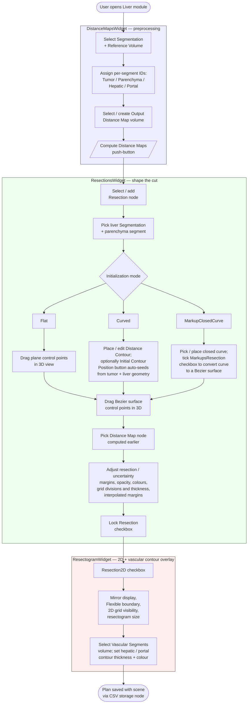
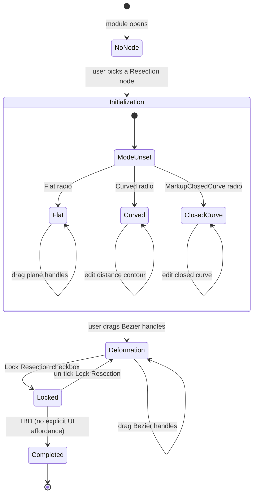

# LiverResections — current-state user workflow

Snapshot of the resection-planning user workflow as it exists today on
`preview`.  Documents *what is*, not what should be.  See
[`adr/0009-ux-and-design-discipline.md`](../../adr/0009-ux-and-design-discipline.md)
for why these diagrams matter and the gate they sit behind from v2.0.0
onward.

The resection-planning UI is not a single module — the LiverResections
C++ module contributes MRML nodes (`vtkMRMLLiverResectionNode` and its
storage / displayable managers) and logic, while the user-facing widget
is hosted in the **Liver** scripted module (`Liver.py`), which loads
three Qt Designer panels in sequence: `DistanceMapsWidget`,
`ResectionsWidget`, `ResectogramWidget`.  This file documents that
combined surface as the user experiences it.

## What this module does for the user

The user plans a liver resection by (1) computing distance maps from a
multi-label segmentation that encodes tumor, parenchyma, hepatic vein
and portal vein, (2) creating a resection node and shaping a cutting
surface with one of three initialisation modes (Flat, Curved,
MarkupClosedCurve), then (3) inspecting the planned cut interactively
in 3D and — optionally — in a 2D "resectogram" view that flattens the
cutting surface and overlays vascular contours.  The user adjusts
resection and uncertainty margins, grid visualisation, and per-resection
colours; the resection node persists the choice so it survives scene
save/load.

## Workflow diagram

Notes on the flow:

- The three sub-panels are visually stacked in a single module panel;
  the diagram orders them by the path a *first-time* user typically
  follows.  An experienced user may revisit panels out of order — the
  UI does not enforce a sequence.
- `Compute Distance Maps` becomes enabled only when the tumor,
  parenchyma, and output-distance-map selectors are all set.  Hepatic
  and portal selectors are optional inputs (their presence sets
  `TextureNumComps` on the resection node so the shader can render
  vascular contours).
- The `Initial Contour Position` push-button in the Curved branch
  auto-seeds the two control points of a `vtkMRMLMarkupsDistanceContourNode`
  from the centres of mass of the tumor and liver and a camera-cross
  vector — this is the only place in the workflow where the camera
  orientation feeds back into the model state.
- The `MarkupsResection` checkbox is a one-shot conversion from a
  generic Slicer closed curve into a Bezier resection surface; it
  reports completion via a modal `QMessageBox.information` dialog.

## Resection state machine

`vtkMRMLLiverResectionNode` exposes two enums that the widget reacts to:

- `ResectionState` ∈ {`Initialization`, `Deformation`, `Completed`}
  (declared in `vtkMRMLLiverResectionNode.h`).
- `InitializationMode` ∈ {`Flat`, `Curved`} (the `ClosedCurveButton`
  radio is a third UI mode but reuses the Curved/MarkupClosedCurve
  code paths rather than introducing a new enum value).

Reading guide:

- The transition into `Deformation` is implicit: there is no "Done with
  initialisation" button.  The widget hides the initialisation markup
  and shows the Bezier markup when the user clicks into the Bezier
  control points, driven by `ShowBezierSurfaceMarkupFromResection` and
  `HideInitializationMarkupFromResection` calls in
  `onResectionNodeChanged` / `onRadioButtonState`.
- `Locked` is not a distinct enum value — it is the conjunction of
  `WidgetVisibility == false` and `ClipOut == true`, both driven by the
  `ResectionLockCheckBox` and `Resection2DCheckBox`.
- The `Completed` state in the enum is declared but the path from
  `Locked` / `Deformation` to `Completed` is not surfaced by the
  current Liver.py widget; persistence happens implicitly when the
  scene is saved via `vtkMRMLLiverResectionCSVStorageNode`.

## Known gaps / pain points observed during survey

- **No explicit completion step.**  The `Completed` ResectionState
  exists in the enum but no widget control transitions into it; users
  cannot tell from the UI whether the current plan is "draft" or
  "final".
- **Mode-radio overlap.**  Three radio buttons (Flat, Curved,
  MarkupClosedCurve) map to two `InitializationMode` enum values plus
  a third path that mutates the Bezier surface directly from a Slicer
  closed curve.  The relationship between radio label and underlying
  enum is non-obvious.
- **`ClosedCurveButton` is disabled in the .ui file** (`enabled=false`
  property) but the handler `onRadioButtonState` still branches on
  `rdbutton.text == "MarkupClosedCurve"`.  Whether the mode is meant
  to be reachable today is unclear — TBD — clarify with maintainer.
- **Auto-seed couples model to view.**  `onDefiningStartingContourPosition`
  reads camera `ViewUp` / `ViewPlaneNormal` to place the distance
  contour.  This conflates view state with model state — the same
  scene saved and re-opened from a different camera angle would
  produce a different seed contour if the user re-clicked the button.
- **Repeated UI-state mirroring.**  `onResectionNodeChanged` updates
  ~15 widgets under `blockSignals(True/False)` guards; every checkbox
  that mirrors a resection-node bool (`ResectionLockCheckBox`,
  `Resection2DCheckBox`, `FlexibleBoundaryCheckBox`) is set three or
  four times in the same handler.  The redundancy is harmless but
  signals the absence of a parameter-node-driven binding pattern.
- **`onResection2DChanged` has a fall-through `else` that calls
  `SetShowResection2D` on a `None` resection node** — would raise an
  AttributeError if reached.  The code path is guarded by the surrounding
  `if self._currentResectionNode is not None` so it appears unreachable;
  flagging because the structure is suspicious.
- **Modal confirmation dialogs after long-running operations.**
  `Compute Distance Maps` and the Bezier conversion both pop a
  `QMessageBox.information` modal on completion; on a 4-panel surgical
  workstation this can land on a different monitor than the module
  panel and block the workflow until dismissed.
- **Hidden side effect on render-window renderers.**  The widget
  inspects `renderWindow().GetRenderers()` and assumes the 5th renderer
  (index 4) is the 2D resectogram overlay; it removes that renderer
  directly when the user un-ticks Resection2D.  This couples UI state
  to layout-manager internals.
- **`Grid2DVisibility` / `Grid3DVisibility` styled with raw stylesheet
  strings** point at PNG assets via `format()`-built paths; no fallback
  if the icons are missing.
- **No undo for resection edits.**  Dragging Bezier handles mutates the
  resection node directly; the scene undo stack is not engaged.
- **Typo `VsacularSegmentsGroupBox`** in `ResectogramWidget.ui` — the
  group-box object name is misspelled (and the Python handler matches
  the typo).  Cosmetic but ossifies into the API.
