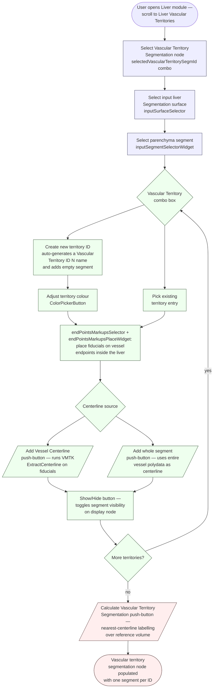
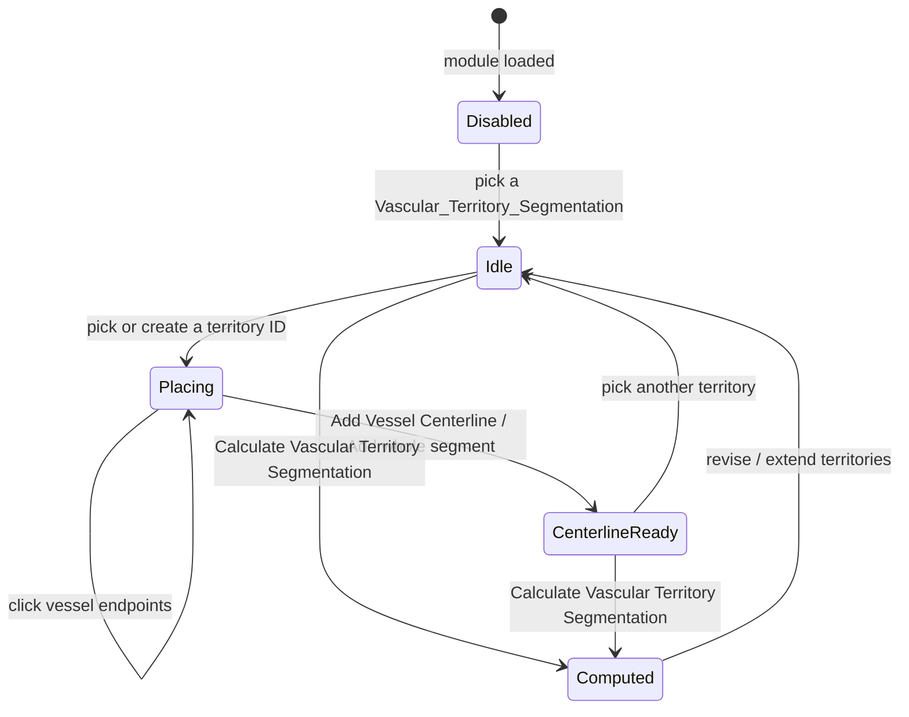

# LiverSegments — current-state user workflow

Snapshot of the vascular-territory-segmentation user workflow as it
exists today on `preview`.  Documents *what is*, not what should be.
See [`adr/0009-ux-and-design-discipline.md`](../../adr/0009-ux-and-design-discipline.md)
for why these diagrams matter.

LiverSegments is a *hidden* scripted module (`parent.hidden = True`) —
it does not appear standalone in the Slicer module menu and is loaded
only from inside the **Liver** module's setup, wrapped in a
`qMRMLWidget` container.  The module title shown in code metadata is
"Extract Vascular segments" but the visible collapsible button reads
"Liver Vascular Territories".

## What this module does for the user

The user partitions a liver into vascular territories by selecting an
input liver-surface segmentation, picking the parenchyma segment, then
iteratively building per-territory centerlines.  For each territory
the user (1) picks or creates a "Vascular Territory" identifier in a
combo box, (2) places vessel-endpoint fiducials inside the liver,
(3) clicks **Add Vessel Centerline** (which calls into SlicerVMTK's
`ExtractCenterline` to compute a centerline polyline) or **Add whole
segment** (which uses the entire input vessel-segment polydata
directly).  When all territories are seeded, **Calculate Vascular
Territory Segmentation** runs a nearest-centerline labelling pass that
writes a labelmap-backed multi-segment vascular-territory segmentation.
The resulting segmentation is what `LiverVolumetry` and the Resectogram
later consume.

## Workflow diagram

Notes on the flow:

- The Vascular Territory combo box uses index 0 as a sentinel labelled
  "Create new territory ID"; selecting index 0 triggers
  `onVascularTerritoryIdChanged` which appends a new combo entry and a
  new empty segment to the segmentation, then leaves the user with the
  fiducial-place widget already in place-mode.  The same code path
  re-fires `onSegmentChanged` to attach the right attributes
  (`LiverSegments.SegmentationId`, `LiverSegments.VascTerrId`) to a
  freshly-allocated `vtkMRMLMarkupsFiducialNode`.
- `Add Vessel Centerline` requires the **SlicerVMTK** extension's
  `ExtractCenterline` module; the handler checks
  `check_module_Extract_Centerline_installed()` and pops a
  `slicer.util.errorDisplay` modal if absent.
- `Calculate Vascular Territory Segmentation` requires at least two
  centerline points and the *first* `vtkMRMLScalarVolumeNode` in the
  scene as a reference grid — picked by
  `slicer.mrmlScene.GetFirstNodeByClass(...)`, not a user-selectable
  combo.
- The widget owns a colour table (`SlicerLiverColorMap.ctbl`) loaded
  on setup; territory colours map to that table by combo-box index.

## State machine

LiverSegments does not own a state-machine-style enum on any MRML node;
its user-visible state is the conjunction of:

- whether a vascular-territory segmentation has been picked
  (`vascular_territory_segmentationNodeSelected` enables / disables the
  whole control block via `enableWidgetButtons`),
- which territory index is currently selected in the combo box, and
- whether fiducial place-mode is active.

A coarse state diagram captures the gating behaviour:

Reading guide:

- The `enableWidgetButtons(False/True)` call at the top of
  `vascular_territory_segmentationNodeSelected` is the only gate
  between `Disabled` and the rest of the graph.  A subtle additional
  guard: the function checks that `'Vascular_Territory_Segmentation'`
  is a substring of the picked segmentation node's name — otherwise
  it disables the controls again.  This baked-in name is not surfaced
  in the .ui or in user-visible tooltips.
- The transition Placing → CenterlineReady can fail silently if VMTK
  is not installed (an error modal pops and the state stays in
  Placing).

## Known gaps / pain points observed during survey

- **Hidden module + nested wrapper.**  `LiverSegments` is set
  `parent.hidden = True` and surfaces only when the Liver module
  embeds it inside a `qMRMLWidget` wrapper.  A user who imports the
  Liver module from a Python console will not see this widget unless
  they call `Liver.LiverWidget.setup()` end-to-end.
- **Magic node-name gate.**  `enableWidgetButtons` requires the
  selected segmentation's name to contain the literal substring
  `'Vascular_Territory_Segmentation'`; otherwise the buttons silently
  disable.  No tooltip explains this.
- **`Reference Volume` is implicit.**  Vascular-territory computation
  uses `slicer.mrmlScene.GetFirstNodeByClass('vtkMRMLScalarVolumeNode')`
  to find a grid — there is no UI for the user to choose which volume
  serves as the reference.  Surprising when a scene holds multiple
  scalar volumes.
- **`SlicerVMTK` dependency is run-time-only.**  The
  `ExtractCenterline` module is checked for at click-time; nothing in
  the module's `parent.dependencies` advertises it.  A clean install
  without SlicerVMTK will not warn the user until they click "Add
  Vessel Centerline".
- **"Create new territory ID" combo sentinel.**  Index 0 of the
  combo-box is a creation affordance, not a real selection; clicking
  it has a side effect (adds a row).  A user expecting a passive
  drop-down will trigger node creation unintentionally.
- **`firstSegmentName` hard-coded to `'Vascular Territory ID 1'`.**
  If the user renames the first segment outside this widget, the
  initialisation branch in
  `vascular_territory_segmentationNodeSelected` treats it as missing
  and re-adds an empty segment with that exact name.
- **Show/Hide button text uses raw QIcon paths** (`Icons/VisibleOn.png`)
  evaluated relative to the working directory, not the module
  resource path.  Visual icons therefore do not render in practice;
  only the text toggles.
- **`updateGUIFromParameterNode` is double-guarded incorrectly.**  Two
  consecutive `if self._parameterNode is None or self._updatingGUIFromParameterNode:`
  checks straddle the parameter-node-bound assignment block, then the
  function exits without removing its own re-entrancy flag if the
  scene was just torn down.  Cosmetic but confusing.
- **`vtkMRMLSegmentationNode` colour-map coupling.**  Territory colours
  live in a side-table (`SlicerLiverColorMap.ctbl`) keyed by combo-box
  index, not in the segmentation node's own per-segment colour.  The
  two can drift if the user edits colours in the segmentation editor.
- **No undo affordance.**  Adding centerlines and territories mutates
  the scene directly; Slicer's scene-undo stack is not engaged.
- **`self.developerMode` referenced without being defined.**
  `onCalculateVascularTerritoryMapButton` wraps timing measurements in
  `if self.developerMode is True:` but no `developerMode` attribute is
  set on `LiverSegmentsWidget`; the access would raise
  `AttributeError` if the branch ever evaluated.  Currently dead code
  but fragile.
