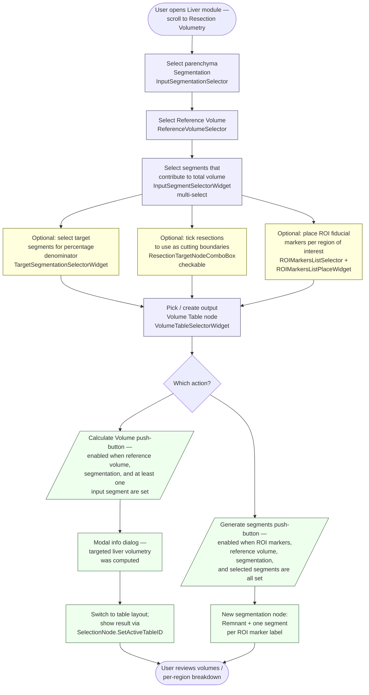

# LiverVolumetry — current-state user workflow

Snapshot of the volumetry user workflow as it exists today on
`preview`.  Documents *what is*, not what should be.  See
[`adr/0009-ux-and-design-discipline.md`](../../adr/0009-ux-and-design-discipline.md)
for why these diagrams matter.

LiverVolumetry, like LiverSegments, is a *hidden* scripted module
(`parent.hidden = True`) that surfaces only when the **Liver** module
embeds its widget at the bottom of the resection-planning panel.  The
collapsible button label reads "Resection Volumetry".

## What this module does for the user

The user computes liver volumes — total, per-segment, per-territory,
and (most importantly) the resection *remnant* / *resected* volumes
implied by a planned resection.  A typical session: (1) pick the
parenchyma segmentation, (2) pick the reference scalar volume that
defines the voxel grid, (3) select which segments contribute to the
total volume in the multi-select widget, (4) optionally tick one or
more `vtkMRMLLiverResectionNode`s in the checkable combo box to use
their Bezier surfaces as cutting boundaries, (5) optionally place ROI
fiducial markers to drive per-region accounting, and (6) click
**Calculate Volume**.  The results land in a user-selectable
`vtkMRMLTableNode` and the application layout switches to a
table-visible layout so the user sees the result immediately.  A
second push-button, **Generate segments based on selected resections
and ROI markers**, takes the same inputs but writes the per-region
labelmap out as a new segmentation node ("Remnant" + one segment per
ROI marker) instead of (or in addition to) the table.

## Workflow diagram

Notes on the flow:

- The branching at *Which action?* is not a UI element — both push
  buttons live next to each other and either can be clicked from the
  same configured state.  The diagram splits the path to surface that
  the two outputs (table vs. new segmentation node) are distinct.
- The set of inputs that gate each button is asymmetric:
  `Calculate Volume` requires reference volume + segmentation + at
  least one input segment; `Generate segments` additionally requires
  ROI markers and a (visible) resection list.  Both checks live in
  separate handlers (`onVolumetryParameterChanged`,
  `onGenerateSegmentsParameterChanged`).
- Resections are read from the checkable combo box via
  `noneChecked()` / `checkedNodes()`; when nothing is checked the
  volumetry path falls through to the simpler
  `SegmentStatistics`-based code that just sums segment volumes
  without using cutting surfaces.
- `Calculate Volume` builds two transient labelmap nodes
  (`segmentVolumeNode`, `targetSegmentVolumeNode`) by exporting
  segments to a labelmap against the reference volume, then deletes
  them at the end of the handler.

## State machine

LiverVolumetry has no MRML-node-level state machine; user state is
the cross-product of {*has parameter node*, *has segmentation*, *has
segments selected*, *has reference volume*, *has resections checked*,
*has ROI markers*}.  Because there are no mode transitions — only
gating of the two action buttons — a state-machine diagram does not
add information beyond the gating notes above.  Following ADR-0009
§1 this section is therefore intentionally minimal:

> **No multi-state interactive widget present.**  The two action
> buttons are stateless push-buttons whose `enabled` flag is computed
> from the current selectors.

If a future refactor adds a "preview vs. commit" flow or any
progressive disclosure (e.g. an explicit "configure → run → review"
wizard) this section becomes review-blocked content per ADR-0009.

## Known gaps / pain points observed during survey

- **Two buttons, overlapping inputs.**  `Calculate Volume` and
  `Generate segments based on selected resections and ROI markers`
  consume nearly the same input set but produce different outputs
  (table vs. new segmentation node).  Their relationship is not
  surfaced in the UI — a first-time user cannot tell which to click
  to "get the volume of my plan".
- **Implicit layout takeover.**  `Calculate Volume` calls
  `setLayout(layoutWithTable)` on success, rearranging the user's
  workspace without confirmation.  Users mid-edit on a 3D view lose
  that view until they switch the layout back.
- **Modal confirmation dialog.**  `QMessageBox.information(None,
  "Information", "The targeted liver volumetry was computed.")` blocks
  on completion; same surgical-workstation multi-monitor concern as in
  LiverResections.
- **Hidden side-effect on segmentation display.**  Selecting an input
  segmentation iterates *all* currently-visible segments on its
  display node and turns them off via
  `SetSegmentVisibility(..., False)` (in `segmentationNodeSelected`).
  The user-driven visibility of unrelated segments is silently
  modified.
- **`segmentVolumeNode` / `targetSegmentVolumeNode` naming reuse.**
  Both transient labelmaps are created with hard-coded names
  (`segmentVolumeNode`, `targetSegmentVolumeNode`).  A second invocation
  picks up the *first existing* node with that name via
  `GetFirstNodeByName`, *and skips re-exporting the labelmap*
  (`if not segmentsVolumeNode:` guards the export).  Result: stale
  labelmaps from a previous run silently feed into the next
  computation.  TBD — confirm with maintainer whether this is
  intentional caching.
- **`Total Volume:` label exists in the .ui but is never written
  to.**  The widget exposes a label captioned "Total Volume:" but no
  Python handler updates a sibling value label; the output goes
  exclusively to the volume table.
- **Resection list is checkable but unsorted.**  When multiple
  resections exist they appear in MRML insertion order; no display of
  which resection corresponds to which physical plan.
- **`InputSegmentSelectorWidget` and `TargetSegmentationSelectorWidget`
  both reference the same `inputSegmentation` parameter-node key.**
  The `updateGUIFromParameterNode` handler sets both selectors to the
  same `InputSegmentID` value — meaning the "target" denominator
  cannot in practice be set independently via parameter-node
  round-trip, only through direct UI interaction.  TBD — clarify with
  maintainer whether this is the intended coupling.
- **No undo for "Generate segments".**  The new segmentation node is
  added directly to the scene.  Repeat invocations accumulate
  duplicate "Remnant" segmentation nodes with appended numeric
  suffixes.
