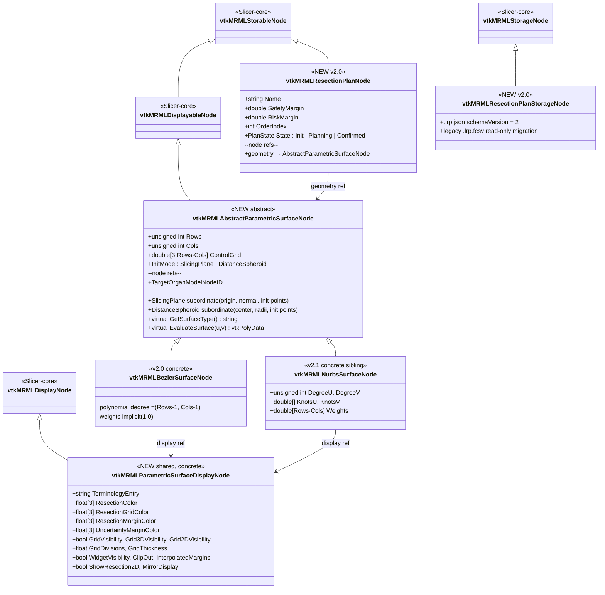
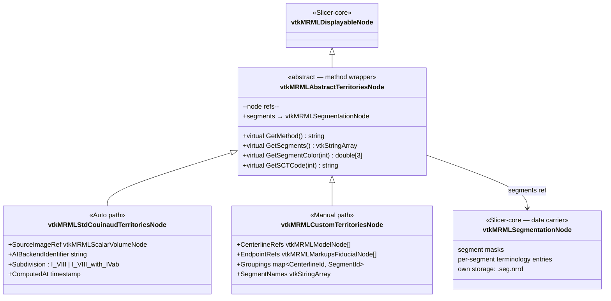

# 01 — Class hierarchy

The new MRML class hierarchy splits the resection concept into three
layers (clinical / geometry / display) and introduces a polymorphic
abstract base for parametric surfaces so that Bezier and NURBS are
substitutable. The **display side stays flat**: both surface
subclasses share a single concrete `vtkMRMLParametricSurfaceDisplayNode`
(mirrors the Slicer Markups pattern where 8+ markup data subclasses
share one display class).

## Key invariants

- `vtkMRMLResectionPlanNode` is storable; its storage emits `.lrp.json`.
- `vtkMRMLAbstractParametricSurfaceNode` is **not** storable — no
  default storage node. Its bulk data is persisted by the referencing
  plan's storage.
- `vtkMRMLAbstractParametricSurfaceNode` is `vtkAbstractTypeMacro`
  (non-instantiable). Concrete subclasses use `vtkStandardNewMacro`.
- `vtkMRMLResectionPlanNode` does **not** reference territories or
  volumetry partitions — those are independent scene-level concepts
  with their own MRML nodes.
- `vtkMRMLParametricSurfaceDisplayNode` is **shared** by all concrete
  surface subclasses (one class, multiple data-side users). Mirrors
  `vtkMRMLMarkupsDisplayNode` — 8+ markup subclasses share that one
  display class. If NURBS ever needs type-specific display fields
  (knot multiplicity, weight visualisation), a `vtkMRMLNurbsSurfaceDisplayNode`
  subclass is added **at that point**, not pre-emptively.

## Why the display side stays flat

The data side abstracts because Bezier and NURBS **diverge in
geometry** (polynomial vs rational, no-knots vs knot-vectors). The
display side does **not** diverge today — every Bezier display field
applies equally to NURBS. Abstracting where there is no divergence is
ceremony without payoff. Defer the abstraction until divergence is
real, per the Slicer-core convention.

This decision aligns with the symmetric T5.2-a verdict (PR #425) for
territories: abstract *only* when polymorphic dispatch is real.

## Parallel: territories follow the same wrap pattern

The same wrapper-vs-carrier split applies on the Stage 3 side. The
territories class hierarchy that landed in PR #425 should be tightened
to wrap a canonical `vtkMRMLSegmentationNode` (which ADR-0024 §"Stage
2 publishes one canonical Segmentation" already establishes as the
data carrier).

### What changes from PR #425's territories design

| Today (PR #425) | Proposed (tightened) |
|---|---|
| `GetLabelMap()` + `GetSegmentationNode()` in interface — duality unsettled | **Drop `GetLabelMap()`** (or forward to segmentation's binary labelmap rep) |
| `+LabelMap vtkImageData` field on both concrete subclasses | **Removed** — segment masks live in the referenced `vtkMRMLSegmentationNode` |
| No typed `segments` reference role | **Add** typed `segments` node reference on the abstract base |
| Custom path centerlines + groupings on the territories node | **Unchanged** — Manual-path inputs (not segmentation data) stay on the wrapper |

This matches the resection-plan pattern: the wrapper carries
*method-specific inputs and metadata*; the wrapper does not carry the
bulk segmentation/geometry that has its own canonical Slicer node type.
