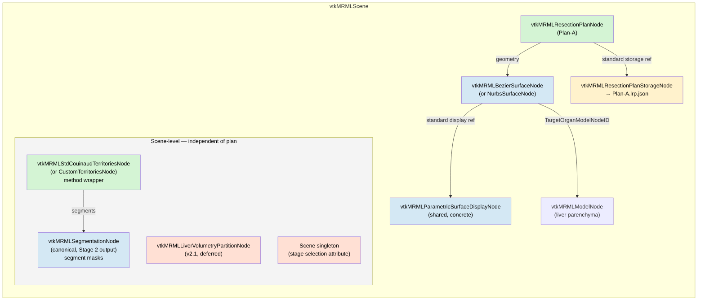
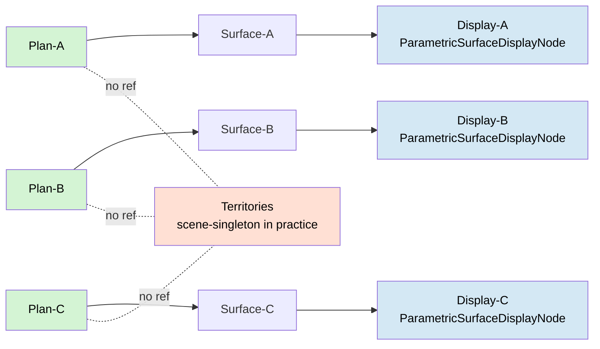

# 02 — Node-reference graph in scene

Shows how the nodes are wired together at runtime via standard
`SetAndObserveNodeReferenceID` roles. The key principle: the resection
plan **references** the surface (polymorphic), but does **not**
reference territories or volumetry partitions (no semantic link beyond
visual co-existence in the scene).

Note: the Territories node ↔ Segmentation pair mirrors the Plan ↔
Surface pair (same green wrapper / blue carrier colouring). Both pairs
are instances of the wrapper-vs-carrier pattern articulated in
[document 06](06-pattern-and-audit.md).

## What references what

| Source | Role | Target | Slicer mechanism |
|---|---|---|---|
| `ResectionPlanNode` | `geometry` | `AbstractParametricSurfaceNode` | new node-reference role |
| `ResectionPlanNode` | storage | `ResectionPlanStorageNode` | standard `SetAndObserveStorageNodeID` |
| `AbstractParametricSurfaceNode` | display | `ParametricSurfaceDisplayNode` (shared by all subclasses) | standard `SetAndObserveDisplayNodeID` |
| `AbstractParametricSurfaceNode` | `TargetOrganModelNodeID` | `vtkMRMLModelNode` | existing on the Bezier node today |

## What does **not** reference what

- Plan ⇏ Territories. No reference role. **Reason**: only visual
  co-existence in the surgeon's view; no computational coupling.
- Plan ⇏ Volumetry partitions. Same reason; deferred to v2.1.
- Plan ⇏ Stage selection. UI state belongs to a scene-singleton, not
  to any specific plan.

## Multiple plans in scene

Multiple `ResectionPlanNode` instances coexist. Each owns its own
surface (one-to-one) and its own storage. The territories /
partitions / stage state are shared scene-level state visible to all
plans. Each surface has its own display node — multiple instances of
the **same shared class** `vtkMRMLParametricSurfaceDisplayNode`.

