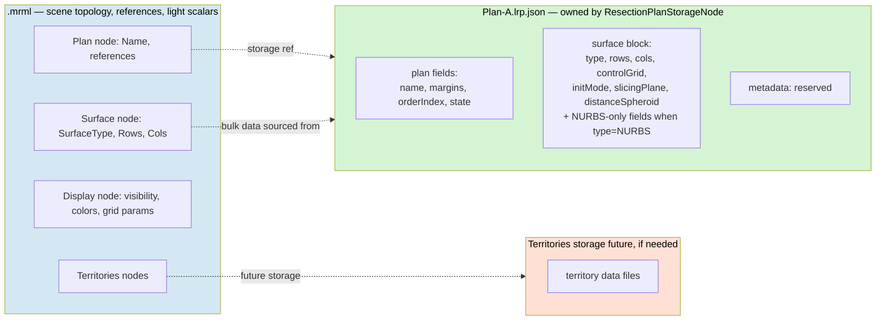

# 03 — Storage ownership and the .mrml / .lrp.json split

The principle adopted from the Slicer-core Markups convention:
**`WriteXML` carries node-level identity metadata only; the storage
file carries the data**. Applied to the new model, this places the
bulk of every storable concept in the storage file and keeps `.mrml`
slim.

## What lives where

### Plan node (`vtkMRMLResectionPlanNode`)

| Field | `.mrml` (WriteXML) | `.lrp.json` (storage) |
|---|---|---|
| `Name` (MRML primitive) | ✓ (Superclass) | ✓ (mirrored for standalone-load) |
| `SafetyMargin` |   | ✓ |
| `RiskMargin` |   | ✓ |
| `OrderIndex` | ✓ (lightweight scalar, scene-relevant) | ✓ |
| `State` | ✓ (lightweight scalar) | ✓ |
| Node refs (`geometry`, storage) | ✓ (Superclass) |   |

### Surface node (`vtkMRMLAbstractParametricSurfaceNode` + subclasses)

| Field | `.mrml` (WriteXML) | `.lrp.json` (storage, via plan) |
|---|---|---|
| `SurfaceType` | ✓ (polymorphic discriminator) | ✓ |
| `Rows`, `Cols` | ✓ (scene-relevant for tooltip) | ✓ |
| `ControlGrid` (heavy) |   | ✓ |
| `InitMode` |   | ✓ |
| `SlicingPlane.*` |   | ✓ |
| `DistanceSpheroid.*` |   | ✓ |
| NURBS-only (`Degree*`, `Knots*`, `Weights`) |   | ✓ (only when `SurfaceType=NURBS`) |
| `TargetOrganModelNodeID` | ✓ (Superclass node ref) |   |

### Display node (`vtkMRMLParametricSurfaceDisplayNode`)

Standard Slicer display-node serialization. The display node has its
own `WriteXML` carrying visibility, colors, grid params. **Not
written to `.lrp.json`** — display state is per-machine/per-session,
not part of the plan's portable representation.

**Single concrete class shared by all surface subclasses** (Markups
precedent: `vtkMRMLMarkupsDisplayNode` serves 8+ markup data
subclasses). No abstract base; no Bezier/NURBS-specific display
subclasses until a type-specific field actually appears.

## Storability matrix

| Node class | Has default storage node? | Saved on scene save? |
|---|---|---|
| `vtkMRMLResectionPlanNode` | Yes — `vtkMRMLResectionPlanStorageNode` | Yes → `.lrp.json` |
| `vtkMRMLAbstractParametricSurfaceNode` | **No** (`CreateDefaultStorageNode()` returns `nullptr`) | No own file; data flows via plan storage |
| `vtkMRMLParametricSurfaceDisplayNode` | No (display nodes are non-storable in core convention) | No own file |
| `vtkMRMLAbstractTerritoriesNode` (+ subclasses) | **No** — territories are a method wrapper; segment masks live in the referenced `vtkMRMLSegmentationNode` | Method metadata in `.mrml`; segments in the referenced segmentation's storage |
| `vtkMRMLSegmentationNode` (Slicer-core) | Yes — `vtkMRMLSegmentationStorageNode` | Yes → `.seg.nrrd` |

The territories row mirrors the surface row: a method wrapper that
does not own the bulk data. Both lean on a canonical Slicer-core
carrier (Segmentation for territories; the surface itself, as a new
hierarchy, for plans).

## Why surface is non-storable

A plan-less surface in the scene has no canonical save path. Three
arguments support this:

1. **Mental model**: "saving a resection" = saving one `.lrp.json`
   file. Decoupled surface saves break this.
2. **No surgical workflow** that I can see requires a surface without
   an associated plan; if one appears, an optional fallback storage
   can be added without disturbing the canonical path.
3. **Precedent (Segmentations)**: segment data lives in the
   segmentation's `.seg.nrrd`; segments are not independently
   storable. We extend the pattern to "surface lives in the plan's
   `.lrp.json`; surfaces are not independently storable" — with the
   twist that the surface IS a first-class MRML node (so it can be
   polymorphic and have display nodes), unlike segments.
