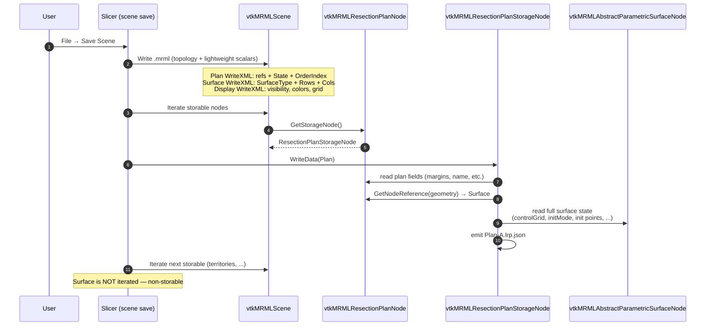
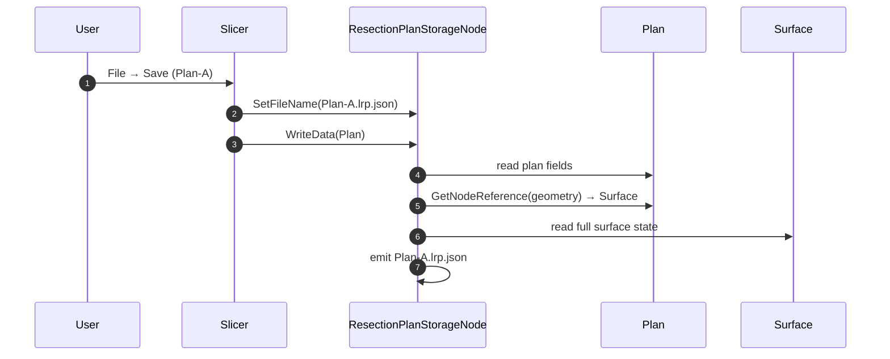
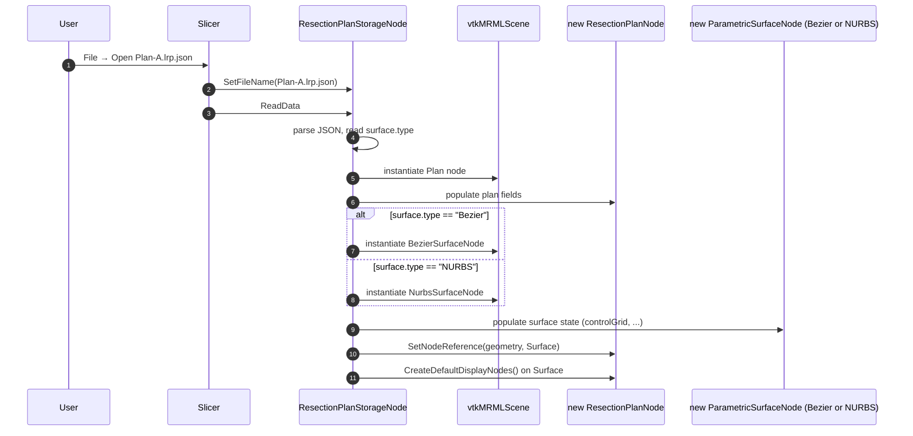

# 04 — Save / load sequence flows

Three flows matter:

1. **Save scene** — File → Save Scene saves `.mrml` plus one
   `.lrp.json` per plan.
2. **Save plan only** — File → Save (a specific plan) writes one
   `.lrp.json`.
3. **Load `.lrp.json`** standalone — opening a `.lrp.json` instantiates
   plan + surface nodes (and their display node) in the current
   scene.

## Flow 1 — Save scene

## Flow 2 — Save single plan

The single-plan save is the inner loop of the scene save — same code
path, just invoked directly.

## Flow 3 — Load standalone .lrp.json

Scene reload (loading `.mrml` first, then `.lrp.json` files) follows
flow 3 inside the per-plan loop, with the additional context that
`.mrml` instantiation has already created the Plan + Surface nodes
with lightweight scalars; the storage step then overwrites/populates
the heavy fields.

## Failure modes

| Scenario | Behaviour |
|---|---|
| `.lrp.json` missing at scene load | Plan + Surface exist with WriteXML scalars only; control grid is zero-default; surgeon sees degraded but non-crashing plan |
| `.lrp.json` schemaVersion outside `[2, 2]` | Reader rejects with `vtkErrorMacro`; plan is not populated |
| `.lrp.json` has `surface.type = "NURBS"` but NURBS module not loaded | Reader rejects; explicit error pointing to v2.1 NURBS module |
| Plan node exists but `geometry` ref is null at save time | Storage emits warning, writes plan-only `.lrp.json` (no `surface` block) |
| Surface exists in scene without a plan referencing it | Not saved (non-storable). Lost on scene reload |
