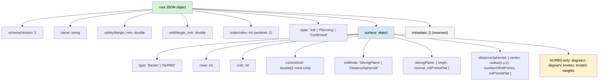

# 05 — `.lrp.json` v2 schema shape (trimmed)

The shipped v2 schema (PR #430) was reshaped after the 2026-05-25
maintainer review. Two refinements landed:

1. **Plan-level fields** (was `resection.*`) move to the root — the
   document **is** the plan.
2. **`scene.*` block removed entirely** — no territories, no volumetry
   partitions, no stage selection. Those are scene-level concepts
   with their own MRML storage paths; they do not belong in a portable
   plan file.
3. **Surface fields** move under `surface.*` and gain a `type`
   discriminator for polymorphic Bezier-or-NURBS persistence.

## Trimmed shape



## What changed vs PR #430's shipped v2

```
PR #430 v2                              proposed v2 (trimmed)
────────────────────────                ───────────────────────
schemaVersion: 2                        schemaVersion: 2
state                                   state                 (root)
initMode                                                      → moved into surface.initMode
rows, cols, controlGrid                                       → moved into surface.{rows,cols,controlGrid}
slicingPlane                                                  → moved into surface.slicingPlane
distanceSpheroid                                              → moved into surface.distanceSpheroid
metadata: {}                            metadata: {}          (reserved)

resection: {                            name                  (root — plan IS the resection)
  name, safetyMargin_mm,                safetyMargin_mm
  riskMargin_mm, orderIndex             riskMargin_mm
}                                       orderIndex

scene: {                                ─────────────────────  REMOVED
  classification: { nodeId, subtype },     no plan→territories ref
  volumetryPartitions: [...],              no plan→partitions ref
  stageSelection: { ... }                  no plan→UI-state coupling
}
```

## Why the JSON document is the plan

- The root carries the **clinical state** the surgeon-to-surgeon
  message communicates: name, margins, surgical sequence ordering,
  state.
- The `surface` block is the **geometric instantiation** of that
  plan — Bezier today, NURBS in v2.1 — and is **substitutable** via
  the `type` discriminator.
- The `metadata` block is reserved for future richer metadata
  (timestamps, surgeon ID, version of the planning module that
  authored it).

## Cross-machine transfer impact

The trim makes the `.lrp.json` self-contained: no scene-node-ID
references survive to break across machines. v2.1's stable-ID
resolution problem (#415) is reduced from "transfer plans + maintain
ID stability for classification/partitions" to "transfer plans alone."

The scene-level state (territories, partitions, stage UI) is
transferred — when it needs transferring — via its own files,
authored by the respective modules.

## Reader / writer behaviour

- **Reader** rejects `schemaVersion < 2` or `> 2`.
- Reader **ignores** any unknown fields (e.g. an old test fixture
  that still carries `scene.*` blocks loads cleanly; the block is
  silently dropped).
- **Writer** emits the trimmed shape only; never the old `scene.*`
  block.

## v2.1 polymorphic extension preview

```json
{
  "schemaVersion": 2,
  "name": "Right hemihepatectomy",
  "safetyMargin_mm": 10.0,
  "riskMargin_mm": 5.0,
  "orderIndex": 0,
  "state": "Planning",
  "surface": {
    "type": "NURBS",
    "rows": 6, "cols": 6,
    "controlGrid": [/* 108 doubles */],
    "initMode": "SlicingPlane",
    "slicingPlane": { /* ... */ },
    "distanceSpheroid": { /* ... */ },
    "degreeU": 3, "degreeV": 3,
    "knotsU": [/* 10 doubles */], "knotsV": [/* 10 doubles */],
    "weights": [/* 36 doubles */]
  },
  "metadata": {}
}
```

Bezier files omit the NURBS-only fields; NURBS files include them.
Schema version stays at 2 — the polymorphism is structural inside
the `surface` block, not a version bump.
