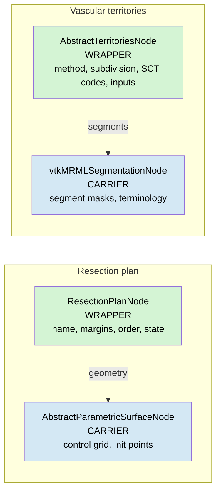

# 06 — Pattern articulation + ADR / architecture-doc audit

## The pattern: wrapper-vs-carrier

Two MRML node classes participating in a v2.0 surgical-planning
concept play complementary roles:

- **Wrapper node** — carries *method* or *clinical* metadata (name,
  margins, ordering; method discriminator, subdivision enum, SCT codes;
  inputs specific to the production path). Has its own subclass
  hierarchy when methods diverge (`StdCouinaud` vs `Custom`; *no*
  surface-side analog because Bezier vs NURBS divergence is on the
  carrier).
- **Carrier node** — holds the *bulk data* (segment masks, control
  grid, init points). Either a Slicer-core class (`vtkMRMLSegmentationNode`)
  or a new abstract+concrete hierarchy when no core class fits
  (`vtkMRMLAbstractParametricSurfaceNode` + subclasses).
- **Wrapper → Carrier via typed node reference**. Standard Slicer
  `SetAndObserveNodeReferenceID` role; one-to-one cardinality.

Properties this pattern guarantees:

1. **Cross-method invariance**: switching the carrier's concrete type
   (Bezier ↔ NURBS; AI-labelmap ↔ centerline-derived) does not touch
   the wrapper's clinical state. The pattern survives v2.1 NURBS
   without re-plumbing.
2. **Layered storage**: bulk data persists through the carrier's own
   storage (`.lrp.json` if the carrier is the surface; `.seg.nrrd` if
   it's a segmentation). The wrapper's storage carries only metadata
   + reference IDs.
3. **Polymorphic dispatch concentrated at the wrapper**: downstream
   consumers (Stage 4 overlay, Stage 5 volumetry, sidebar widget) hit
   the wrapper's abstract base; method discrimination happens once.
4. **No conflation of layers**: ADR-0014's "data vs display vs
   storage" split now extends to "wrapper vs carrier"; the four
   layers are independently mutable.

## Two instances of the pattern in v2.0

## Audit findings per document

Each row identifies a specific text or diagram element that contradicts
the pattern (or its consequences), with the recommended amendment.

### ADR-0023 — Unified GUI / six-stage surgeon workflow

| Item | Today | Amendment |
|---|---|---|
| §"Class abstraction for territories" — polymorphic interface | Lists both `GetLabelMap()` and `GetSegmentationNode()` | Drop `GetLabelMap()` from interface (or document as forwarder). `vtkMRMLSegmentationNode` is canonical per ADR-0024 |
| §"Persistence — `.lrp.json` schema v2" — content roster | Lists "Classification node reference", "Volumetry partition node references", "Per-stage last-selection" | Remove all three from `.lrp.json` content. They are scene-level state with their own MRML persistence paths. `.lrp.json` carries plan + surface only |
| §"Persistence" — sidecar-only stance | "References are scene-local node IDs … one scene, one `.lrp.json`" | Restated: `.lrp.json` carries no scene-node-ID references at all (because no `scene.*` block). Cross-machine transfer (#415) becomes trivially correct |
| §"Class abstraction for territories" — surface side | Silent on surface-side abstraction | Add a §"Class abstraction for surfaces" paragraph naming `vtkMRMLAbstractParametricSurfaceNode` + subclasses. Mirrors the territories framing. Cross-reference ADR-0018 |
| §"Cross-stage dependencies" — Plan ↔ Territories link | No explicit "Plan does not reference Territories" statement | Add explicit non-reference statement: territories and partitions are scene-level state; the plan does not own them |

### ADR-0024 — Segmentation orchestration

| Item | Today | Amendment |
|---|---|---|
| §"Stage 2 publishes one canonical Segmentation" — downstream consumer pattern | "Downstream stages reference the canonical node via Slicer's standard node-reference role" | **Consistent with the new pattern.** The wrapper-vs-carrier articulation extends this: Stage 3 wraps it with `vtkMRMLAbstractTerritoriesNode`; Stage 4/5 read through the wrapper. One-line cross-reference to ADR-0023 §"Class abstraction for territories" |

### ADR-0014 — LiverMarkups dissolution

| Item | Today | Amendment |
|---|---|---|
| §"Decision" 1-5 — three primitives become data + display + storage trios | No "clinical/method wrapper" layer named | New §"Decision 6 — Method wrapper as fourth layer" (or amend §1) naming `vtkMRMLResectionPlanNode` as the clinical-layer wrapper that the v1 `vtkMRMLLiverResectionNode` partially carried before retirement. Restores what T2.7's retirement otherwise orphans |
| §"Migration steps" | Retires the legacy resection node | Add migration note: surgeon-facing fields (name, margins, ordering, state) migrate to `vtkMRMLResectionPlanNode` rather than being absorbed into the display node. T2.5 storage path becomes plan-rooted, not surface-rooted |

### ADR-0011 — SCT terminology dispatch

| Item | Today | Amendment |
|---|---|---|
| Territories binding | No specific text on where SCT codes live | Add cross-reference to `vtkMRMLAbstractTerritoriesNode::GetSCTCode(int)` as the dispatch entry point per ADR-0023 §"Class abstraction for territories" |

No structural changes; just a cross-reference for completeness.

### Docs/architecture/territories-class-hierarchy.md

| Item | Today | Amendment |
|---|---|---|
| Class diagram, lines 30-44 | `+LabelMap vtkImageData` on both concrete subclasses | **Remove the field**. Segment masks live in the referenced `vtkMRMLSegmentationNode` |
| Class diagram | No reference role drawn | Add `vtkMRMLAbstractTerritoriesNode --> vtkMRMLSegmentationNode : segments ref` edge |
| Polymorphic interface table, Stage 5 consumer | "uses `GetSegments()`, `GetLabelMap()`" | "uses `GetSegments()`, `GetSegmentationNode()` (caller resolves to binary labelmap representation)" |
| §"Persistence" entire section, lines 110-118 | ".lrp.json stores only a reference (scene-local node ID + subtype discriminator), not the full content" | Replace: ".lrp.json does not store any territories reference. Territories persist via the scene's standard MRML mechanism; segment masks persist via the referenced `vtkMRMLSegmentationNode`'s storage (`.seg.nrrd`). Territories' own per-subtype storage is small (method metadata only)" |
| Polymorphic interface table, .lrp.json writer row | "reference + GetMethod()" | **Delete the row entirely**. The .lrp.json writer no longer reads anything from territories |

### Docs/architecture/target-mrml-node-hierarchy.md

| Item | Today | Amendment |
|---|---|---|
| Diagram scope | Surface trio only (Bezier + NURBS) | **Expand** to include `vtkMRMLResectionPlanNode` (with `geometry` ref to the abstract surface) + `vtkMRMLAbstractTerritoriesNode` family (with `segments` ref to `vtkMRMLSegmentationNode`). Cross-reference territories-class-hierarchy.md but show the references in this diagram too |
| §"Notes" line 127 — legacy resection retirement | "Legacy `vtkMRMLLiverResection*` nodes are retired by T2.7. They do not appear here." | Add follow-up: "Their clinical-layer fields (name, margins, ordering, state) move to the new `vtkMRMLResectionPlanNode`, which appears in the diagram above" |
| Surface display field roster | `vtkMRMLBezierSurfaceDisplayNode` with `+double ResectionMargin` / `+double UncertaintyMargin` | Rename class to `vtkMRMLParametricSurfaceDisplayNode` (shared across Bezier + NURBS) and **remove** the scalar margin fields (those move to `vtkMRMLResectionPlanNode`). Display node retains margin **colors** only |

### Docs/architecture/gui-stage-flow.md

| Item | Today | Amendment |
|---|---|---|
| Stage 2 → Stage 3 hand-off | Stage 2 produces a Segmentation; Stage 3 produces Territories | Add explicit "Stage 3's Territories node references the Stage 2 canonical Segmentation via the `segments` role" |
| Stage 4 / Stage 5 → Plan hand-off | Plans referenced as "the surface node" | Update to "the `vtkMRMLResectionPlanNode`, which itself references the surface via its `geometry` role" |
| Sidebar widget data source | TBD | Specify: `GetNodesByClass("vtkMRMLResectionPlanNode")` for the plan list. Sidebar does not iterate surfaces directly |

## Suggested amendment sequence

1. **ADR-0014 amendment + new sub-decision** authoring the clinical-
   layer wrapper. *Or* a new ADR-0030 if the maintainer prefers a
   fresh ADR over an amendment. (Personal lean: amend; the pattern
   is a fourth-layer extension of ADR-0014's existing three-layer
   split, not a new decision.)
2. **ADR-0023 amendments** — drop `scene.*` from `.lrp.json`
   persistence; add §"Class abstraction for surfaces"; add Plan ↔
   Territories non-reference statement; clean up the territories
   polymorphic interface duality.
3. **ADR-0024 cross-reference** — single line; trivial.
4. **ADR-0011 cross-reference** — single line; trivial.
5. **`territories-class-hierarchy.md` rewrite** — material changes:
   drop `LabelMap` field, add `segments` reference, restate
   Persistence section, delete .lrp.json writer row.
6. **`target-mrml-node-hierarchy.md` expansion** — add plan + territories
   to the diagram; restate the legacy retirement note; rename and
   trim the display-node field roster.
7. **`gui-stage-flow.md` updates** — minor edits to hand-off language
   to use the new wrapper class names.

## What this audit is **not**

- **Not** a commit of the pattern to all four layers retroactively
  for the existing display-node and storage-node decisions in v1.
  Those are baked into shipped releases; we extend the pattern
  forward.
- **Not** a vote to retire `vtkMRMLAbstractTerritoriesNode` or to
  fold it into `vtkMRMLSegmentationNode`. The wrapper provides real
  value (method discrimination + Auto/Manual input asymmetry + SCT
  alphabet); the audit only tightens its relationship to the carrier.
- **Not** a scope expansion for v2.0. The ResectionPlanNode work is
  net-new; the territories tightening is a *cleanup* of code that
  just landed in PR #425 and can ride in the same refactor PR if it
  fits, or land separately as a small follow-up.
