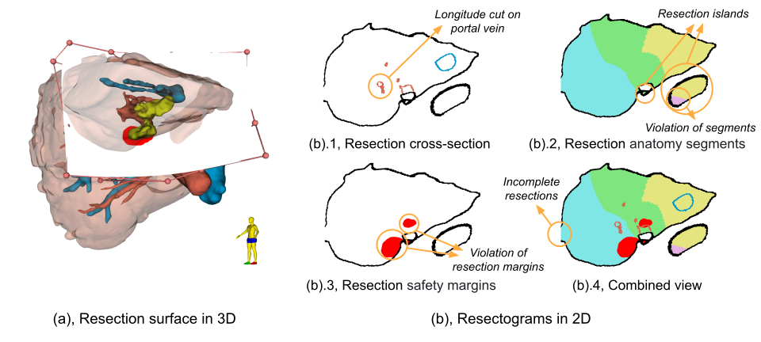

# Summary

This article introduces Slicer-Liver, an extension for the 3D Slicer image computing platform [@Kikinis:2013] ([https://slicer.org](https://slicer.org)). The software aims to address challenges in liver surgery planning by leveraging geometric modeling and visualization techniques. More specifically, Slicer-Liver enables integral liver surgery plans, including virtual resections, vascular territories, as well as volumetry analysis. Progress and preliminary results obtained with Slicer-Liver show the potential of the software to be used for improving the state-of-the-art approaches in the definition of virtual resections, visualization of resection plans, as well as classification of the liver segments. These contributions hold promise on enhancing liver surgery planning and potentially improving liver surgery outcomes. Slicer-Liver is intended for research use within the fields of biomedicine and computer science.

# Statement of need

Liver cancer, both primary and metastatic (e.g., from colorectal cancer), is a global health concern with increasing incidence rates [@Siegel:2023] and surgical resection remains the most potentially curative treatment for some of these patients [@Petrowsky2020]. The evolution of computer-assisted surgical systems over the past two decades has significantly improved tumor localization and surgeons' confidence during surgery [@Hansen:2014; @Lamata:2010]. Despite these advances, systematic use of computer-assisted systems for planning liver resections remains a challenge. 

Recent innovations in artificial intelligence have brought 3D patient-specific models closer to routine clinical use. However, surgical planning with the use of these models remains a complex and manual process. Planning of surgery is particularly important for complex cases (e.g., those presenting multiple tumors or those where the location and size of the tumor pose a challenge for the surgical practice). Furthermore, precise surgical planning should not only account for the liver geometry, but also for the blood supply to various liver regions (segments) [@Warmann:2016; @Bismuth:2013]. Furthermore, visualization of 3D liver models and resections is a difficult task, where occlusions can prevent the effective understanding of the surgical plan. In addition, there is no broad consensus on the definition of a good resection plan, which is partly due to the lack of formal methods to specify and communicate resection plans, and partly due to the different surgery cultures and practices in different hospitals.

All these challenges support the advancement of the integration of computer-aided systems for surgical planning into the clinical reality. In response to these challenges, Slicer-Liver provides functionality for modeling of resections and vascular territories, visualization of virtual resections in lower dimensions, and volumetry analysis. In addition, Slicer-Liver serves as a research sandbox for integration of new liver therapy planning methods (e.g., liver ablations) and can be extended to planning of therapies in organs other than the liver. This work aims to bridge the gap between technological advancements and clinical adoption, benefiting both clinicians (e.g., surgeons and medical professionals involved in liver cancer treatment) and medical students, as well as researchers focused on medical technology development, particularly in computer-assisted surgery.

# Overview of Slicer-Liver

Slicer-Liver is a 3D Slicer extension that can be installed directly through the 3D Slicer Extension Manager [@3DSlicerExtensionsManager:2024]. Slicer-Liver is intended for research purposes and is distributed through an MIT license. The software architecture is based on 3D Slicer modules (both C++ and Python) and follows common patterns found in other 3D Slicer extensions. The software provides four bodies of functionality that can be used independently or in conjunction, as described in the following. 

**Definition of Virtual Resections**
Slicer-Liver has integrated different geometric modeling techniques to model virtual resections: Deformable Bézier with planar initialization [@Palomar:2017], NURBS (Non-Uniform Rational B-Spline), and contour-initialized resections. The implementation of these methods includes visualization of the resection margin, adaptive grid visualization, and clipping of the resection excess. Thanks to the computation of distance maps between anatomical structures, resection margin visualization operates in real-time as the user modifies the resection.

**Resectograms**
As an additional visualization object, Slicer-Liver implements the use of resectograms [@Meng:2023], which benefit from the computation of distance maps to extend the real-time visualization of the information along the resection trajectory. Resectograms help the user understand information subject to occlusions in the 3D Scene, as well as serve as an indicator of the validity of resections (e.g., making it possible to detect malformed resections or violations of margins).

**Liver Segments Classification**
Slicer-Liver leverages the method for computing liver vascular territories and segments classification utilized in [@{d'Albenzio:2023}]. The method uses the liver morphology, the interior vascular network, and user-defined landmarks to provide enhanced flexibility in marker placement, distinguishing it from other methods. One of the advantages of this approach is that vascular territories participated by both the portal and hepatic vessel systems can be computed. The liver segments computed can be visualized and processed as segmentation objects or 3D models, by the rest of the tools provided in 3D Slicer.

**Resection Volumetry**
Slicer-Liver offers a versatile tool for liver resection volumetry analysis, allowing the integration of resection plans with liver parenchyma and liver segments data. Users can interactively select and calculate the volumes of individual or combined regions of interest (ROIs).

# Preliminary results

**Definition of Virtual Resections**
Slicer-Liver provides computer-aided preoperative planning systems, streamlining the resection planning process and introducing real-time 3D cutting path visualization [@Aghayan:2023], shown in \autoref{fig:resection_specification}. The presented approach empowers users to make informed decisions based on individual patient needs, enhancing outcomes for both atypical and anatomical resections as represented in \autoref{fig:atypical_vs_anatomical}. Notably, the proposed new resection methods aim to obtain better liver remnant preservation compared to existing methods.

**Visualization of Virtual Resections Using Resectograms**
Adding resectograms to Slicer-Liver, allows a real-time 2D representation of resections as shown in \autoref{fig:resection_resectogram}, where the resectogram provides an intuitive and occlusion-free visualization of the virtual resection with three components: resection intersection with liver, vessels and anatomical segments, as well as safety margins. The use of resectograms enables an effective identification and characterization of invalid resection types due to inadequate visualization in the 3D view during planning. 

{ width=100% }

**Classification of Liver Segments**
By departing from the standardized Couinaud classification of the liver in segments, the implemented approach enables a more individualized representation of liver segmental distribution [@{d'Albenzio:2023}]. Particularly noteworthy is the method’s estimation of segments 8 and 5, resulting in a classification that is more applicable to real-world surgical scenarios[@Bismuth:1982], as shown in \autoref{fig:couinaud_segments}.  While improvements, particularly in automating the landmark marking process, are needed, the approach holds promise for improving liver surgery planning and has the potential to optimize surgical outcomes.

# Acknowledgements
This work was conducted as part of the ALive project, funded by the Research Council of Norway under the IKTPLUSS research program (grant nr. 311393).

# References
