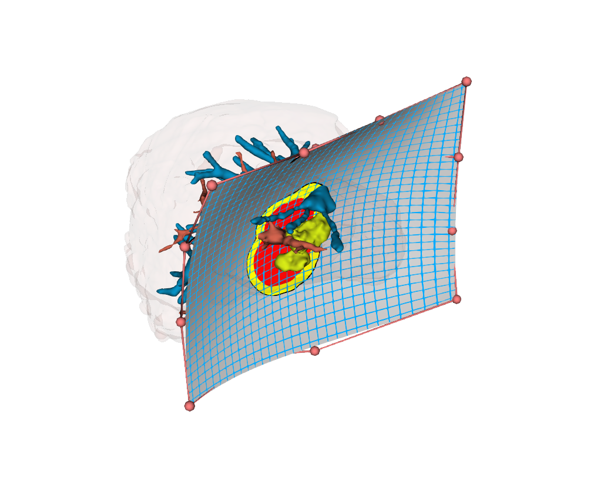
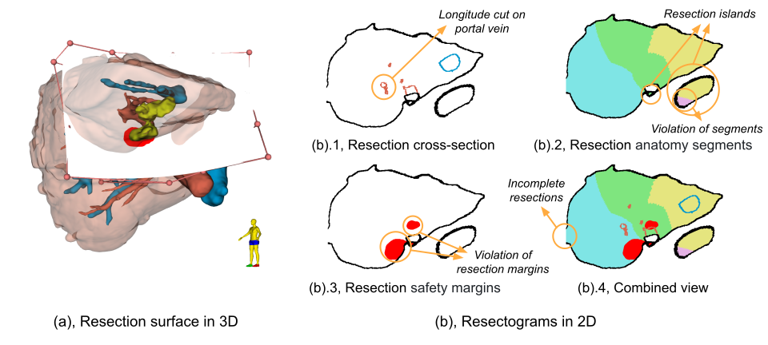
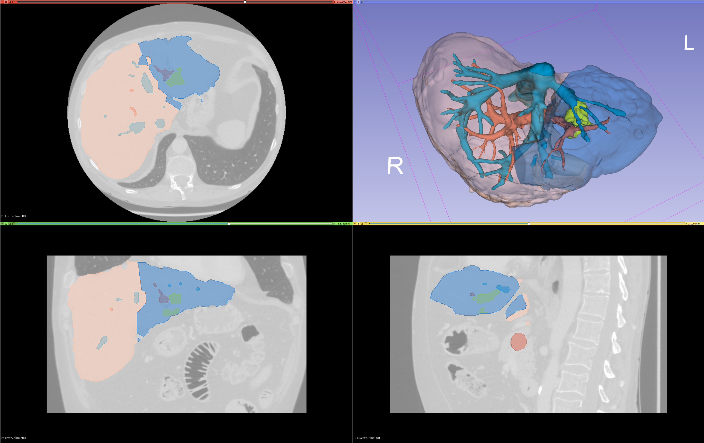

# Summary

This article introduces SlicerLiver, an extension for the 3D Slicer (https://slicer.org) image computing platform [@Kikinis:2013]. The software aims to address challenges in liver surgery planning by applying geometric modeling and visualization techniques. More specifically, SlicerLiver includes functionality for computing integral liver surgery plans with virtual resections, vascular territories and surgery volumetry analysis. Progress and preliminary results show the potential of the software to improve state-of-the-art approaches in definition of virtual resections, visualization of resection plans, as well as classification of liver in segments. These contributions hold promise in enhancing liver surgery planning and potentially improving liver surgery outcomes. The software is intended for research use within the fields of biomedicine and computer science.

# Statement of need

Liver cancer, both primary and metastatic (i.e,. from colorectal cancer), is a global health concern with increasing incidence rates [@Siegel:2023]. Surgical resection is the most effective treatment for some of the cases [@Simmonds:2006], and the evolution of computer-assisted surgical systems over the past two decades has significantly improved tumor localization and surgeons confidence during surgery [@Hansen:2014, @Lamata:2010]. Despite these advances, systematic use of computer-assisted systems for planning liver resections remains a challenge.

Thanks to the latest advances in artificial intelligence, generation of 3D ptient-specific models for surgical planning is increasingly becoming a reality in the clinical routine, however, surgical planning with the use of these models remains a complex and  manual process. Planning of surgery is particularly important for complex cases (i.e., those presenting multiple tumors or those where the location and size of the tumor poses a challenge for the surgery practice). Furthermore, precise surgical planning should not only account for the liver geometry, but also for the blood supply to various liver regions (segments) [@Warmann:2016, @Bismuth:2013]. Furthermore, visualization of 3D liver models and resections a difficult task, where occlusions can prevent the effective understanding of the surgical plan. In addition, there is no broad consensus on the definition of a good resection plan, which is partly due to the lack of formal methods to specify and communicate resection plans, and partly due to the different surgery cultures and practices in different hospitals.

All these challenges

In response to these challenges, the SlicerLiver project aims to support
three research objectives:
1) Apply geometric modeling and artificial intelligence to
generate resection plans suitable for complex cases, such
as those involving multiple metastases with multiple
resections. Visualization of resection margins will also be included.
2) Generate parameterized patient-specific vascular territory segments
that include both portal and hepatic vessels systems,
allowing for the calculation of diverse liver vascular
territories.
3) Develop computational methods for the visualization of
resections in lower dimensions. This should result in a
set of 2D diagrams suitable for use during planning.

# Overview of SlicerLiver

SlicerLiver is separated into the following five sections:

- Distance Map Computation
- Resections
- Resctogram
- Liver Segments
- Resection Volumetry

Each section is oriented towards one part of the liver resection planning workflow but, 
if desired, can work independently of the other ones.

**Distance Map Computation**
Calculate a distance map used for creating safety margins in the resectogram.

**Resections**
Generate an initial resection surface which can be subsequently modified through 16 control points.
The distance map from the previous section is used to project safety and uncertanty margins 
in real-time into the resection surface. This allows the user to modify the resection proposal 
intil the safety margins are met.

**Resectogram**
Use the resection surface from the previous section to calculate a flat 2D visualization of the resection margin.

**Liver Segments**
The user can define different vascular territories based on segmented patient-specific vessel systems for the liver 
(portal and hepatic).
These vascular territories with corresponding vessel segments are then used to calculate 
and visuzalize different liver segments.

**Resection Volumetry**
A tool for calculating segment sizes.

# Preliminary results

**Improved Definition of Virtual Resections**
SlicerLiver contain computer-aided preoperative planning systems,
streamlining the resection planning process and introducing
real-time 3D cutting path visualization [@Aghayan:2023], shown in \autoref{fig:1}. 
Our approach empowers surgeons to make decisions based on individual patient
needs, enhancing outcomes for both atypical and anatomical
resections. Notably, our proposed new resection method
aims to obtain better parenchyma preservation compared to
existing methods.

**Improved Visualization of Virtual Resections**
The Resectograms method is also implemented in SlicerLiver,
a real-time 2D representation of resections [@Meng:2023], see example in \autoref{fig:2}. 
The Resectogram provides an intuitive and occlusionfree visualization of virtual liver resection plans, with three
components: resection cross-section, resection anatomy segments, and resection safety margins. Notably, Resectograms
effectively identify and characterize invalid resection types due
to inadequate visualization during virtual planning, thus improving surgical accuracy and decision-making. Resectograms
enhance the liver surgery workflow, empowering surgeons with
valuable insights for optimized liver resection strategies and
improved patient outcomes.

{ width=100% }

**Improved Classification of Liver Segments**
The functionality of SlicerLiver also includes a novel approach to
segment liver functional segments [@{d'Albenzio:2023}], see \autoref{fig:3}. The method
uses the liver morphology, the interior vascular network,
and user-defined landmarks to provide enhanced flexibility in
marker placement, distinguishing it from existing methods. By
departing from the standardized Couinaud classification, our
approach enables a more individualized representation of liver
segmental distribution. Particularly noteworthy is the method’s
accurate estimation of the challenging Segment 1, resulting in
a comprehensive and precise segmentation of the caudate lobe.
While improvements, particularly in automating the landmark
marking process, are needed, our approach holds significant
promise for improving liver surgery planning and has the
potential to optimize surgical outcomes.

# Acknowledgements
This work was conducted as part of the ALive project, funded by the Research Council of Norway under IKTPLUSS (grant nr. 311393).

# References
