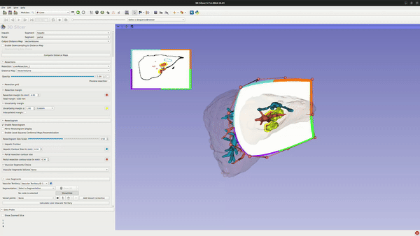

## Table of content
- [Introduction](#introduction)
    - [Installing the extension](#installing-the-extension)
    - [Sample Data](#sample-data)
- [Slicer-Liver Extension Usage](#slicer-liver-extension-usage)
    - [Distance Map Computation](#distance-map-computation)
    - [Resections](#resections)
    - [Resectogram](#resectogram)
    - [Liver Segments](#liver-segments)
    - [Resection Volumetry](#resection-volumetry)
    - [Video Tutorial](#video-tutorial)
- [Developers](#developers)
    - [Compilation](#compilation)
    - [Testing](#testing)
    - [Contributing](#Contributing)
    
## Introduction

SlicerLiver is an extension for the medical research software [3D Slicer](https://slicer.org "3D Slicer") providing tools for analysis, quantification and therapy planning for hepatic interventions.

The extension provides a fast and accurate solution for:

- Definition of surgical resection in 3D using deformable surfaces, as well as the visualization of resection margins (risk areas).
- Computation and visualization of liver vascular territories (liver segments).
- Liver volumetry analysis.

### Installing the extension

1. Download and install 3D Slicer according to your operating system from here : https://download.slicer.org/.
2. Open Slicer.
3. Press Ctrl+4 to open the extension manager.
4. Once the Extension Manager pops up, make sure to select the `Install Extensions` tab.
5. On the upper-right search box write *"slicerliver"*
6. Click `Install` and give okay to install other extensions if asked.


7. Restart Slicer.
8. Once 3D Slicer restarts, click the search icon on the left of the module selector and write 'Liver'. Click `Switch to module`.


### Sample Data

To test the extension, the LiverVolume and LiverSementation data can be loaded from the Sample Data module, after installing Slicer-Liver. To properly load the data in the plugin, it is advised to first open the extension and afterwards to navigate to the Sample module and to load the data.


## Slicer-Liver Extension Usage

The extension is separated in the following five sections:

- Distance Map Computation: projection of the safety margins in real-time onto the resection surface, which allows the user to modify the resection proposal until the safety requirement are met.
- Resections: computation of the first approximation (planar Bézier) of the resection surface which can be subsequently modified through 16 control points.
- Resectogram: visualization of the resection plan in a 2D view.
- Liver Segments: calculation and visualization of liver vascular territories (liver segments).
- Resection Volumetry: computation of the volume of the resection and the remaining liver.

Each section is oriented towards one part of the liver resection planning workflow but, if desired, can work independently of the other ones.
At the end of the workflow, the distance map, resection plan, liver segments and volumetry tables can be saved to a given output directory.

### Distance Map Computation

Follow these steps to compute the Distance Map:

1. **Reference Volume**:
   - Select the CT data from the dropdown menu.
2. **Segmentation**:
   - Choose the binary labelmap representing the segmentation of the liver, tumor, and vascular territories.
3. **Tumor**:
   - Select the tumor segmentation node.
4. **Liver**:
   - Select the liver segmentation node.
5. **Hepatic** (if applicable):
   - Select the hepatic segmentation node.
6. **Portal** (if applicable):
   - Select the portal segmentation node.
7. **Output Distance Map**:
   - Create a new `VectorVolume` for the output distance map.
8. **Downsampling Rate** (optional):
   - Adjust the downsampling rate if needed (default is 1.00).
9. **Compute Distance Map**:
   - Click the `Compute Distance Maps` button to start the computation.
   
Ensure all required fields are filled; otherwise, the `Compute Distance Maps` button will remain inactive.

### Resections

The liver resection can be planned through the following process:

1. *Create a new LiverResection* for `Resection`.
2. Choose the labelmap used in step 2 of the Distance Map Computation for `Liver Segmentation`.
3. Select the `Liver` segmentation from the dropdown.
4. Choose the [contour initialization method](#contour-initialization-method): `Flat`, `Curved`, or `MarkupClosedCurve`.
5. *(Optional)* Select the *Distance Map* from the first section using the `Distance Map` collapsible button.
6. In the 3D View, when selecting the `Flat` or `Curved` methods, use the guiding stick to adjust the contour around the liver. Alternatively, you can draw a closed curve using the `MarkupClosedCurve` method. (see [contour initialization method](#contour-initialization-method))
7. Release the mouse to display the initial resection plane.
8. Adjust the resection using the control points. Modify the `Resection grid`, `Resection margin`, and `Uncertainty margin` as needed.
9. Check the `Preview resection` box to visualize the final plan.


There are multiple options to create visualizations for the resection (color, opacity, configurable grid, etc).
<p float="left">
  
  
</p>

#### *Contour Initialization Method*

As introduced before, we have three contour initialization methods: `Flat`, `Curved`, or `MarkupClosedCurve`.

- The initialization process for both `Flat` and `Curved` methods is similar in usage. In both cases, a guiding stick and a white cutting contour are displayed on the liver model. By moving the guiding stick, the contour’s position can be adjusted to align with the desired operation area. 

   The key difference lies in the type of resection surface generated:

   - In the `Flat` method, a flat resection surface is created. The displayed contour represents the intersection of this flat surface with the liver model. Users must manually adjust the flat surface to achieve a curved resection that meets their needs.
   - In the `Curved` method, users can select a starting point (e.g., targeting different liver segments). The contour is inherently curved, generating a curved resection surface, which reduces the need for manual modifications compared to the Flat method.

- `MarkupClosedCurve` offers a more flexible approach for defining the initial cutting position. Users can place a series of points that automatically connect to form a closed loop around the desired cutting area, outlining the initial cutting contour. Based on these points, the software then generates a curved initial resection surface.

<table>
  <tr>
    <td align="center">
      <br>Flat
    </td>
    <td align="center">
      <br>Curved
    </td>
    <td align="center">
      <br>MarkupClosedCurve
    </td>
  </tr>
</table>


### Resectogram
The Resectogram section in Slicer-Liver allows users to configure various options for visualizing the resectogram. Below are the available settings and their descriptions:

1. **Enable Resectogram:** 
   - Check this box to enable the resectogram visualization.
2. **Mirror Resectogram Display**:
   - Check this box to mirror the display of the resectogram.
3. **Enable Flexible Boundary:** 
   - Check this box to enable a flexible boundary for the resectogram.
4. **Resectogram Size Scale:** 
   - Use the slider or the input box to adjust the size scale of the resectogram. The value can be set between 0 and 1.
5. **Hepatic Contour Size (in mm):** 
   - Adjust the size of the hepatic contour by using the input box. The size can be configured in millimeters.
6. **Color Picker:** 
   - Click on the color box to choose a different color for the hepatic contour.
7. **Portal resection contour size (in mm):** 
   - Adjust the size of the portal resection contour by using the input box. The size can be configured in millimeters.
8. **Color Picker:** 
   - Click on the color box to choose a different color for the portal resection contour.
9. **Vascular Segments Volume:**
   - Use the dropdown menu to select the vascular segments volume. The available options depend on the pre-loaded volumes in the software.

The resectogram can only be used after distance maps have been calculated and uploaded.
The following GIF demonstrates the usage of the Resectogram section in Slicer-Liver:



### Liver Segments

Our method for liver segment classification involves defining segments using centerlines created from user-specified points. These centerlines serve as the foundation for computing liver segments within the image space. The computation leverages shortest-distance mapping

1. **Vascular Territory Segmentation**:
   - Create or Select a vascular territory segmentation from the dropdown menu.
2. **Vascular Territory**:
   - Create a new territory ID.
3. **Segmentation**:
   - Select the segmentation node representing the hepatic/portal vessels, and a new Point List for marking `Vessel points` will be created automatically.
4. **Hide Unnecessary Segments**:
   - Use the `Show/Hide` button to hide the liver and/or tumor segmentation nodes if they obstruct the view. This step is not required for creating centerlines on vessel branches but can improve visibility.
5. **Vessel Points**:
   - Place landmark points on the hepatic/portal segmentation. These points will be added to `Vessel points` and used to extract the centerlines of user-defined vessel branches.
6. **Add Vessel Centerline**:
   - After placing the points, click `Add Vessel Centerline` to generate the centerlines.
7. **Create multiple Vascular Territories**
   - Repeat step 1-6 to create multiple Vascular Territories.
8. **Calculate Vascular Territory Segmentation**:
   - Once all points are placed and centerlines are added, click `Calculate Vascular Territory Segmentation` to compute the liver segments.


### Resection Volumetry
1. **Volumetry Output Table:** 
   - Select or create an output table. You can rename the table or switch between different tables.
2. **Reference Volume:** 
   - Select a liver volume node.
3. **Segmentation:** 
   - Select a liver segmentation node (Labelmap node). This can be liver segmentation (vessel, tumor, liver), liver anatomy segments, or self-defined liver segments (adapted from the vessel segments module). You can select all segments in the dataset or only those of interest.
4. **Total Volume:** 
   - Define the total volume by selecting the segments you wish to count (optional; by default, it is the sum of all segments in the data).
5. **ROI Marker List:** 
   - Select or create a points list. You can place points onto 2D slices or 3D models to mark the area you want to measure. If no point list is provided, the volume of all segments will be calculated.
6. **Resection (Optional):** 
   - Choose one or more resections for the same liver model and calculate the remnant/resected volume by placing marker points onto these areas.
   - This can be combined with liver anatomy segments or self-defined liver segments to gain a deeper understanding of liver volumetry after different resection approaches (anatomical, atypical, etc.).
   - It can also be used to compare different resection plans for the same tumor or to provide a combined view for one surgery with multiple resections.
7. **Export segments (Optional):**
   - Press the button "Generate segments based on selected resections and ROI markers" to export a new segmentation node including segmentations marked by ROI points and the unmarked area will be treated as one segmentation


 
## Video Tutorial
[Slicer-Liver tutorial](https://www.youtube.com/watch?v=oRu624mtQZE)

## Developers

### Compilation

Slicer-Liver follows the [3D SLicer extension building process](https://slicer.readthedocs.io/en/latest/developer_guide/extensions.html):
```
SLICER_BUILD_DIR=/path/to/Slicer-SuperBuild`
```
```
git clone https://github.com/ALive-research/Slicer-Liver.git
cmake -DSlicer_DIR:PATH=SLICER_BUILD_DIR/Slicer-build -S ../Slicer-Liver
make -j5
make package
```
Slicer-Liver depends on the VMTK, it can be installed in Slicer3D using the [extension manager]( https://slicer.readthedocs.io/en/latest/user_guide/extensions_manager.html#install-extensions) or [built from source code](https://github.com/vmtk/SlicerExtension-VMTK#for-developers).

### Testing

-  To enable the developer mode go to :
    - Edit > Application Settings > Developer
    
- Then check the `Enable developer mode` check box. The application may need to be restarted for this modification to be taken into account.
    
- To run the unit tests, open the Slicer-Liver extension, expand the `Reload & Test` menu and click on the `Reload and Test` button.
    
- To visualize the test results, open the Python console by going to: View > Python Interactor.
    
- The number and the result of the tests will be displayed in the console. Should any of the test fail, please don't hesitate to [open an issue](https://github.com/ALive-research/Slicer-Liver/issues/new/choose) or contact us through the [Slicer forum](https://discourse.slicer.org).

### Contributing

Slicer-Liver welcomes any and all contributions in the way of new tools/scripts, bug fixes or documentation. In the [contributing](CONTRIBUTING.md) page you will find information to help you get started.
    
## Authors

- Rafael Palomar (Oslo University Hospital / NTNU, Norway)
- Ole Vegard Solberg (SINTEF, Norway)
- Geir Arne Tangen (SINTEF, Norway)
- Gabriella D'Albenzio (Oslo University Hospital)
- Ruoyan Meng (NTNU)

Contact: [rafael.palomar@ous-research.no](mailto:rafael.palomar@ous-research.no)

## License

 This software is open source distributed under the [3-Clause BSD License](https://github.com/ALive-research/Slicer-Liver/blob/31278dadf0f0f8351c82eb8f7c548ee4f9da1397/LICENSE "3-Clause BSD License")

## Acknowledgements

This software has partially been funded by The Research Council of Norway through the ALive project (grant nr. 311393).
