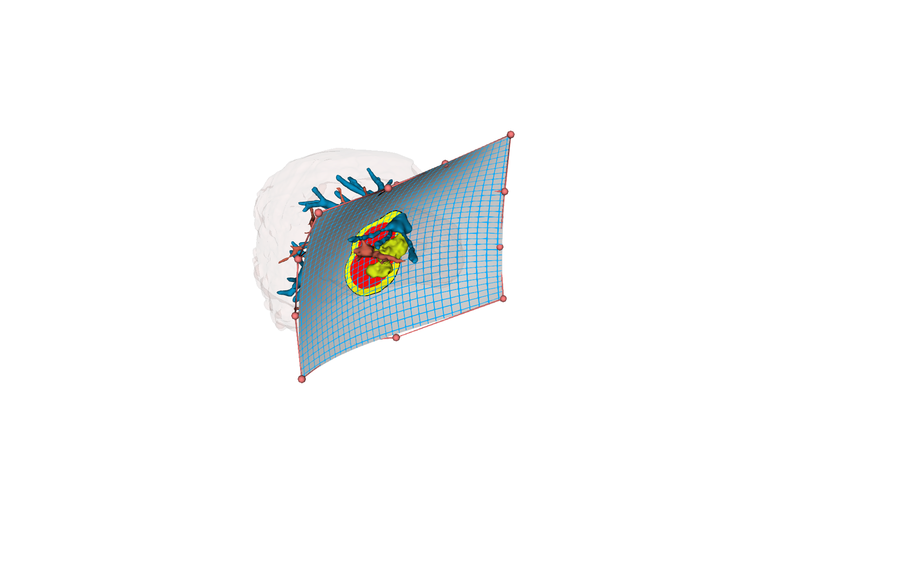
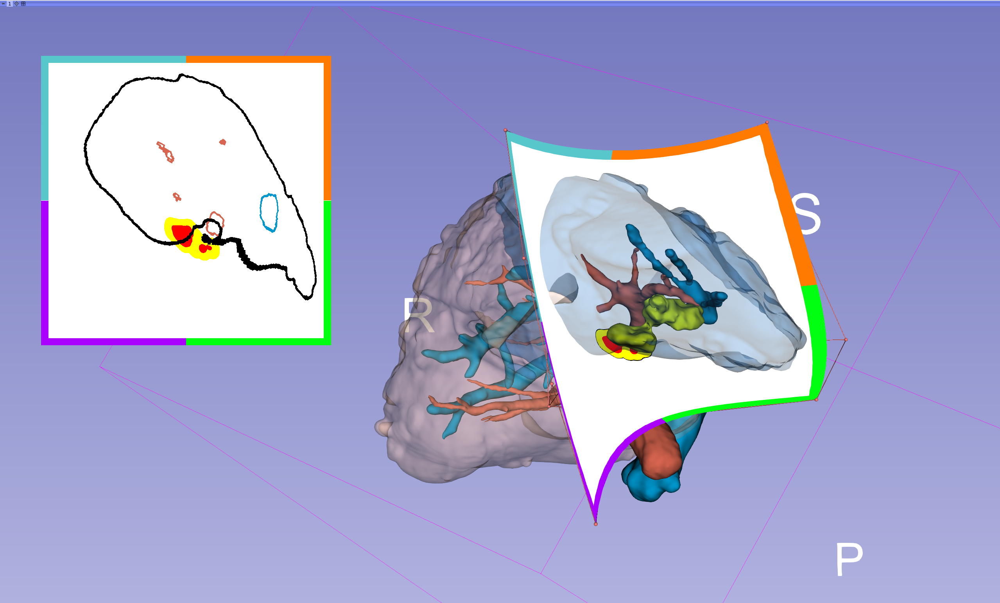
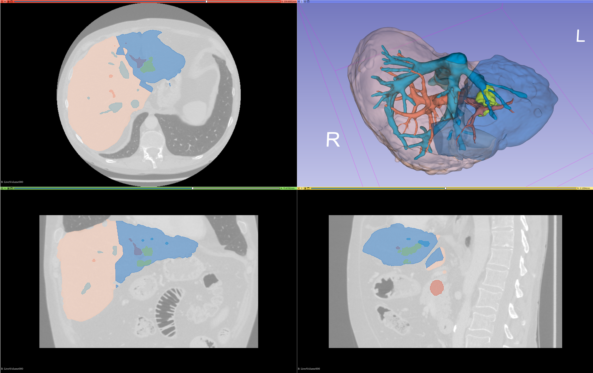

# Summary

This paper introduces SlicerLiver, a software extension to the [3D Slicer](https://slicer.org "3D Slicer")
image computing platform [@Kikinis:2013]. The software address challenges in liver surgery planning by 
applying geometric modeling and artificial intelligence to generate liver tumor 
resection plans for complex cases, developing parameterized patient-specific 
vascular models, and creating computational methods for resection visualization 
in 2D. Progress and preliminary results show improvements in defining virtual 
resections, visualizing resections using Resectograms and classifying liver 
segments accurately. These contributions hold promise in enhancing liver surgery 
planning and potentially improving patient outcomes.

# Statement of need

Liver cancer, both primary and secondary types, is a global health concern with 
increasing incidence rates [1]. Surgical resection is the most effective treatment 
for some of these cancers [@Simmonds:2006], and the evolution of computer-assisted surgical systems 
over the past two decades has significantly improved tumor localization and surgeons 
confidence during surgery [@Hansen:2014], [@Lamata:2010]. However, despite these advances, several challenges 
remain in liver surgical practice.

While patient-specific 3D models are systematically generated for surgical planning 
and guidance, surgery planning remains a manual process. This is particularly problematic 
for patients with multiple metastases, where manual surgery planning becomes intricate. 
The current techniques for planning virtual resections, namely, drawing-on-slices and 
deformable surfaces [@Preim:2013], [@Palomar:2017], have shown limitations. Therefore, there is a pressing 
need for new algorithms capable of generating precise, rapid, and straightforward 
resection plans, even in complex cases.

Furthermore, blood supply to various liver regions or vascu-
lar territories is crucial for liver resection planning. The estab-
lished anatomical division of the liver, such as the Couinaud
division is under question [@Warmann:2016], [@Bismuth:2013]. This calls for innovative
liver analytics methods that can enable the calculation of
various types of vascular territories.

Another challenge is the absence of a broad consensus on
the definition of a good resection, which is partly due to the
lack of formal methods to specify and communicate resection
plans. Existing methods, such as subjective descriptions, hand-
drawings, and pictures, often result in biased and imprecise
descriptions of surgical plans. The complexity of 3D models
also hampers their inclusion in 2D media such as medical
records and scientific journals. Therefore, visualization tech-
niques that can capture and communicate critical information
from a resection plan in a compact form, interpretable by
clinical experts, are needed.

In response to these challenges, the SLiverLiver project aims to support
three research objectives:
1) Apply geometric modeling and artificial intelligence to
generate resection plans suitable for complex cases, such
as those involving multiple metastases with multiple
resections.
2) Generate parameterized patient-specific vascular models
that include both portal and hepatic vessels systems,
allowing for the calculation of diverse liver vascular
territories.
3) Develop computational methods for the visualization of
resections in lower dimensions. This should result in a
set of 2D diagrams suitable for use during planning.

# Overview of SlicerLiver

SlicerLiver is separated into the following four sections:

- Distance Map Computation
- Resections
- Resctogram
- Liver Segments

Each section is oriented towards one part of the liver resection planning workflow but, 
if desired, can work independently of the other ones.

**Distance Map Computation**
Calculate a distance map used for creating safety margins in the resectogram.

**Resections**
Generate an initial resection surface which can be subsequently modified through 16 control points.
The distance map from the previous section is used to project safety and uncertanty margins 
in real-time into the resection surface. This allows the user to modify the resection proposal 
intil the safety margins are met.

**Resectogram**
Use the resection surface from the previous section to calculate a flat 2D visualization of the resection margin.

**Liver Segments**
The user can define different vascular territories and one or more vessel segments 
in the different vessel systems in these territories.
These vascular territories with corresponding vessel segments are then used to calculate 
and visuzalize different liver segments.

# Prelinimary results

**Improved Definition of Virtual Resections**
We developed computer-aided preoperative planning systems \autoref{fig:1},
streamlining the resection planning process and introducing
real-time 3D cutting path visualization [@Aghayan:2023]. Our approach empowers surgeons to make decisions based on individual patient
needs, enhancing outcomes for both atypical and anatomical
resections. Notably, our proposed new resection method
aims to obtain better parenchyma preservation compared to
existing methods.

**Improved Visualization of Virtual Resections**
We successfully implemented the Resectograms method \autoref{fig:2},
a real-time 2D representation of resections into SlicerLiver [@Meng:2023]. 
The Resectogram provides an intuitive and occlusionfree visualization of virtual liver resection plans, with three
components: resection cross-section, resection anatomy segments, and resection safety margins. Notably, Resectograms
effectively identify and characterize invalid resection types due
to inadequate visualization during virtual planning, thus improving surgical accuracy and decision-making. Resectograms
enhance the liver surgery workflow, empowering surgeons with
valuable insights for optimized liver resection strategies and
improved patient outcomes.

**Improved Classification of Liver Segments**
The functionality of SlicerLiver also includes a novel approach to
segment liver functional segments [@{d'Albenzio:2023}] \autoref{fig:3}. The method
uses the liver morphology, the interior vascular network,
and user-defined landmarks to provide enhanced flexibility in
marker placement, distinguishing it from existing methods. By
departing from the standardized Couinaud classification, our
approach enables a more individualized representation of liver
segmental distribution. Particularly noteworthy is the method’s
accurate estimation of the challenging Segment 1, resulting in
a comprehensive and precise segmentation of the caudate lobe.
While improvements, particularly in automating the landmark
marking process, are needed, our approach holds significant
promise for improving liver surgery planning and has the
potential to optimize surgical outcomes.

# Acknowledgements
This work was conducted as part of the ALive project, funded by the Research Council of Norway under IKTPLUSS (grant nr. 311393).

# References
