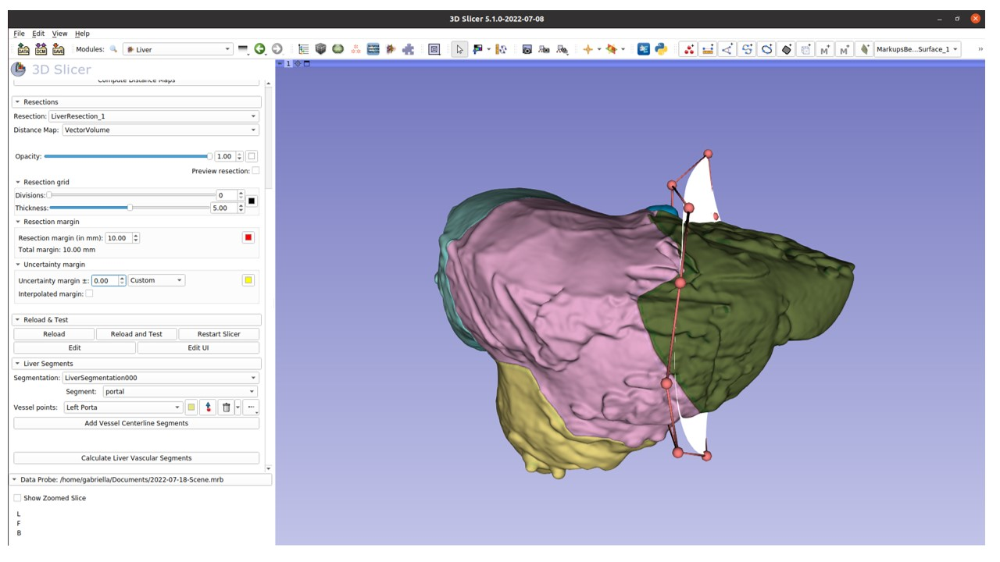

# Summary

This paper introduces SlicerLiver, a software extension to the [3D Slicer](https://slicer.org "3D Slicer")
image computing platform [@Kikinis:2013]. The software address challenges in liver surgery planning by 
applying geometric modeling and artificial intelligence to generate liver tumor 
resection plans for complex cases, developing parameterized patient-specific 
vascular models, and creating computational methods for resection visualization 
in 2D. Progress and preliminary results show improvements in defining virtual 
resections, visualizing resections using Resectograms and classifying liver 
segments accurately. These contributions hold promise in enhancing liver surgery 
planning and potentially improving patient outcomes.

# Statement of need

Liver cancer, both primary and secondary types, is a global health concern with 
increasing incidence rates [1]. Surgical resection is the most effective treatment 
for some of these cancers [@Simmonds:2006], and the evolution of computer-assisted surgical systems 
over the past two decades has significantly improved tumor localization and surgeons 
confidence during surgery [@Hansen:2014], [@Lamata:2010]. However, despite these advances, several challenges 
remain in liver surgical practice.
While patient-specific 3D models are systematically generated for surgical planning 
and guidance, surgery planning remains a manual process. This is particularly problematic 
for patients with multiple metastases, where manual surgery planning becomes intricate. 
The current techniques for planning virtual resections, namely, drawing-on-slices and 
deformable surfaces [@Preim:2013], [@Palomar:2017], have shown limitations. Therefore, there is a pressing 
need for new algorithms capable of generating precise, rapid, and straightforward 
resection plans, even in complex cases.

# Implementation

# Results

**Improved Definition of Virtual Resections**
We developed computer-aided preoperative planning systems \autoref{fig:1},
streamlining the resection planning process and introducing
real-time 3D cutting path visualization. Our approach empowers surgeons to make decisions based on individual patient
needs, enhancing outcomes for both atypical and anatomical
resections. Notably, our proposed a new resection method
aiming to obtain better parenchyma preservation compared to
existing methods.
**Improved Visualization of Virtual Resections**
We successfully implemented the Resectograms method (Fig. 1.b),
a real-time 2D representation of resections within the ALive
project. The Resectogram provides an intuitive and occlusionfree visualization of virtual liver resection plans, with three
components: resection cross-section, resection anatomy segments, and resection safety margins. Notably, Resectograms
effectively identify and characterize invalid resection types due
to inadequate visualization during virtual planning, thus improving surgical accuracy and decision-making. Resectograms
enhance the liver surgery workflow, empowering surgeons with
valuable insights for optimized liver resection strategies and
improved patient outcomes.
**Improved Classification of Liver Segments**
As part of the ALive project, our study introduces a novel approach to
segmenting liver functional segments \autoref{fig:3}. The method
uses the liver morphology, the interior vascular network,
and user-defined landmarks to provide enhanced flexibility in
marker placement, distinguishing it from existing methods. By
departing from the standardized Couinaud classification, our
approach enables a more individualized representation of liver
segmental distribution. Particularly noteworthy is the method’s
accurate estimation of the challenging Segment 1, resulting in
a comprehensive and precise segmentation of the caudate lobe.
While improvements, particularly in automating the landmark
marking process, are needed, our approach holds significant
promise for improving liver surgery planning and has the
potential to optimize surgical outcomes within the broader
context of the ALive project.

# Figures

Figures can be included like this:

and referenced from text using \autoref{fig:example}.

Figure sizes can be customized by adding an optional second parameter:
{ width=20% }

# Acknowledgements
This work was conducted as part of the ALive project, funded by the Research Council of Norway under IKTPLUSS (grant nr. 311393).

# References
